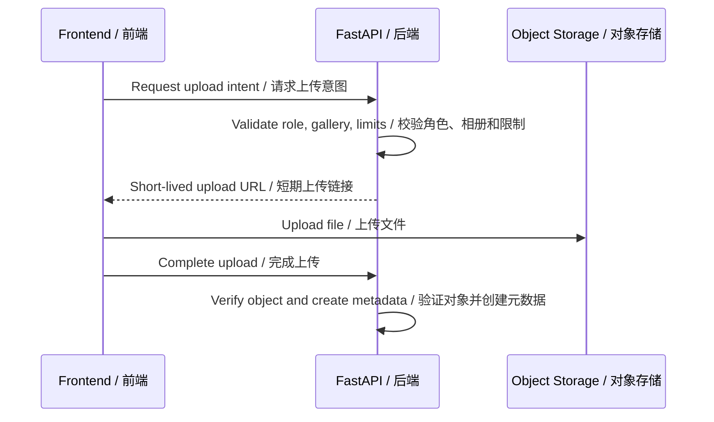

# API Contract Draft / API 契约草案

## Document Purpose / 文档目的

This document drafts the first API contract for the future DARIA STUDIO platform. It defines how the Next.js frontend should communicate with the Python FastAPI backend.

本文档草拟未来 DARIA STUDIO 正式平台的第一版 API 契约，定义 Next.js 前端如何与 Python FastAPI 后端通信。

This is not implementation code. It does not finalize database table names, storage paths, authentication provider, deployment server type, or every request field. It should guide private-repository development in `daria-studio-platform`.

本文档不是实现代码。它不最终确定数据库表名、存储路径、认证服务商、部署服务器类型或每一个请求字段。它用于指导私有仓库 `daria-studio-platform` 的后续开发。

## Confirmed Technical Context / 已确认技术背景

- Frontend: Next.js + React + light TypeScript.
- Backend: Python FastAPI.
- Architecture: front-end/back-end separation.
- Production cloud direction: Tencent Cloud.
- Object storage candidate: Tencent Cloud COS.
- Database candidate: managed PostgreSQL, such as TencentDB for PostgreSQL or TDSQL-C for PostgreSQL.
- Public booking, payment, deposit, and calendar scheduling are out of scope.

- 前端：Next.js + React + 轻量 TypeScript。
- 后端：Python FastAPI。
- 架构：前后端分离。
- 生产云方向：腾讯云。
- 对象存储候选：腾讯云 COS。
- 数据库候选：托管 PostgreSQL，例如 TencentDB for PostgreSQL 或 TDSQL-C for PostgreSQL。
- 公开预约、支付、定金和日历排期不在当前范围。

## API Goals / API 目标

- Provide stable contracts between the frontend and backend.
- Keep public website content, pricing content, client gallery delivery, staff operations, and owner operations separated.
- Enforce role permissions on the backend.
- Keep private photo file access temporary and permission-checked.
- Support bilingual customer-facing content without duplicating business values by language.
- Support future photo delivery flows even if the first milestone only implements login.

- 为前端和后端提供稳定契约。
- 将公开网站内容、价格内容、客户相册交付、员工操作和老板操作分离。
- 在后端执行角色权限。
- 私有照片文件访问必须是临时的，并经过权限校验。
- 支持客户可见内容双语，同时不按语言重复业务值。
- 即使第一阶段只实现登录，也要为后续照片交付流程预留。

## API Style / API 风格

The first API should use REST-style JSON endpoints under a versioned path.

第一版 API 建议使用版本化路径下的 REST 风格 JSON 接口。

Base path:

基础路径：

```text
/api/v1
```

General rules:

通用规则：

- Requests and responses use JSON unless the endpoint explicitly creates an upload or download link.
- JSON field names use `camelCase` for frontend friendliness. The Python backend can map these fields to internal `snake_case` models.
- Timestamps use ISO 8601 UTC strings.
- Money values use integer cents, not floating point numbers.
- Currency is `AUD` unless a later product decision changes it.
- Public read endpoints can be cached.
- Authenticated and staff endpoints should not be publicly cached.
- Mutations must be idempotent where practical or use an idempotency key when retries can cause duplicate side effects.

- 除非接口明确生成上传或下载链接，请求和响应使用 JSON。
- JSON 字段名使用 `camelCase`，方便前端使用。Python 后端可以映射到内部 `snake_case` 模型。
- 时间戳使用 ISO 8601 UTC 字符串。
- 金额使用整数分，避免浮点数。
- 货币默认为 `AUD`，除非后续产品决策改变。
- 公开读取接口可以缓存。
- 认证接口和工作人员接口不应公开缓存。
- 写操作应尽量幂等；重试可能造成重复副作用时，应使用幂等键。

## Authentication and Session Model / 认证与会话模型

The API contract should remain auth-provider-neutral until the authentication implementation is selected.

在认证实现方式确定前，API 契约应保持认证服务商中立。

Recommended contract shape:

推荐契约形态：

- Client accounts self-register by email.
- Staff accounts do not self-register.
- Client profile and staff profile are separate.
- A staff profile has a fixed role: `owner` or `employee`.
- The frontend should call authenticated endpoints with a secure session mechanism, such as an HTTP-only cookie or another server-validated token.
- Backend endpoints must not rely on frontend route protection alone.

- 客户账号通过邮箱自主注册。
- 工作人员账号不自主注册。
- 客户资料和工作人员资料分离。
- 工作人员资料只有固定角色：`owner` 或 `employee`。
- 前端应使用安全会话机制调用认证接口，例如 HTTP-only cookie 或其他服务端可校验 token。
- 后端接口不能只依赖前端路由保护。

Session response shape:

会话响应结构：

```json
{
  "authenticated": true,
  "accountType": "staff",
  "client": null,
  "staff": {
    "id": "staff_123",
    "role": "owner",
    "displayName": "Daria"
  }
}
```

## Shared Request Conventions / 共享请求约定

### Locale / 语言

Supported locale values:

支持的语言值：

```text
zh-CN
en
```

The frontend may pass locale through query parameters or headers. The first draft uses an explicit query parameter for clarity.

前端可以通过查询参数或请求头传递语言。第一版草案为清晰起见使用显式查询参数。

```text
GET /api/v1/public/gallery/categories?locale=zh-CN
```

Rules:

规则：

- Public browsing endpoints may return localized display fields for the requested locale.
- Owner editing endpoints should return both Chinese and English editable fields.
- Dynamic values such as prices, counts, statuses, and deadlines should stay canonical, then be formatted by frontend or backend display helpers.
- Client-entered notes are never auto-translated.

- 公开浏览接口可以按请求语言返回本地化展示字段。
- 老板编辑接口应返回中英双语可编辑字段。
- 价格、数量、状态和截止时间等动态值应保持标准值，再由前端或后端展示工具格式化。
- 客户填写的备注永远不自动翻译。

### IDs / ID

IDs are opaque strings.

ID 是不透明字符串。

```json
{
  "id": "gallery_cat_01JABC"
}
```

Rules:

规则：

- The frontend must not infer type, creation time, owner, or storage path from an ID.
- API examples use readable placeholder IDs only for documentation.

- 前端不能从 ID 推断类型、创建时间、所属对象或存储路径。
- API 示例中的可读 ID 仅用于文档说明。

### Money / 金额

Money values should use cents.

金额应使用分作为单位。

```json
{
  "amountCents": 26000,
  "currency": "AUD"
}
```

### Time and Countdowns / 时间与倒计时

The backend is the source of truth for workflow timestamps and expiry.

后端是流程时间戳和过期判断的事实来源。

Responses that drive countdowns should include `serverNow`.

驱动倒计时的响应应包含 `serverNow`。

```json
{
  "serverNow": "2026-08-07T10:00:00Z",
  "retouchSelectionDeadline": "2026-08-14T10:00:00Z",
  "storageExpiresAt": "2026-11-07T10:00:00Z"
}
```

Rules:

规则：

- The frontend may display live countdowns based on server timestamps.
- The backend decides whether retouch selection or download is still allowed.
- Expired private files should not receive download links.

- 前端可以基于服务端时间戳显示实时倒计时。
- 后端决定是否仍允许选片或下载。
- 已过期的私有文件不应生成下载链接。

### Pagination / 分页

List endpoints should use cursor pagination when records can grow or change frequently.

记录可能增长或频繁变化的列表接口应使用 cursor 分页。

Request:

请求：

```text
GET /api/v1/staff/clients?limit=50&cursor=cursor_abc
```

Response:

响应：

```json
{
  "items": [],
  "pageInfo": {
    "nextCursor": null,
    "hasMore": false
  }
}
```

Rules:

规则：

- `limit` should have a server-defined maximum.
- Ordered content management endpoints should use explicit reorder endpoints rather than relying on pagination order.

- `limit` 应有服务端最大值。
- 可排序内容管理接口应使用明确的排序接口，而不是依赖分页顺序。

### Error Response / 错误响应

All errors should use a consistent shape.

所有错误应使用统一结构。

```json
{
  "error": {
    "code": "permission_denied",
    "message": "You do not have permission to perform this action.",
    "details": {
      "requiredRole": "owner"
    },
    "requestId": "req_01JABC"
  }
}
```

Common status codes:

常见状态码：

| Status | Meaning |
| --- | --- |
| `200` | Successful read or update |
| `201` | Resource created |
| `202` | Accepted for async processing |
| `204` | Successful deletion or no-content response |
| `400` | Invalid request shape or unsupported operation |
| `401` | Not authenticated |
| `403` | Authenticated but not allowed |
| `404` | Resource not found or hidden by permission boundary |
| `409` | Lifecycle conflict, duplicate mutation, or stale update |
| `410` | Expired or deleted resource |
| `422` | Validation error |
| `429` | Rate limited |
| `500` | Unexpected server error |

| 状态码 | 含义 |
| --- | --- |
| `200` | 读取或更新成功 |
| `201` | 资源已创建 |
| `202` | 已接受异步处理 |
| `204` | 删除成功或无内容响应 |
| `400` | 请求结构无效或操作不支持 |
| `401` | 未登录 |
| `403` | 已登录但无权限 |
| `404` | 资源不存在，或因权限边界隐藏 |
| `409` | 生命周期冲突、重复写入或版本过旧 |
| `410` | 资源已过期或已删除 |
| `422` | 校验错误 |
| `429` | 请求被限流 |
| `500` | 未预期服务端错误 |

Common error codes:

常见错误码：

| Code | Meaning |
| --- | --- |
| `authentication_required` | User must log in |
| `permission_denied` | User role does not allow the action |
| `validation_failed` | Request payload failed validation |
| `not_found` | Resource does not exist or is hidden |
| `quota_exceeded` | Photo or retouch count limit exceeded |
| `selection_locked` | Retouch selection was already submitted |
| `selection_expired` | 7-day retouch window has expired |
| `storage_expired` | 3-month download/storage window has expired |
| `file_not_available` | File is missing, deleted, or not ready |
| `translation_missing` | Required bilingual content is incomplete |
| `confirmation_required` | Staff action requires explicit confirmation |

| 错误码 | 含义 |
| --- | --- |
| `authentication_required` | 用户必须登录 |
| `permission_denied` | 用户角色不允许该操作 |
| `validation_failed` | 请求数据校验失败 |
| `not_found` | 资源不存在或被权限隐藏 |
| `quota_exceeded` | 照片或精修数量超过限制 |
| `selection_locked` | 精修选择已经提交并锁定 |
| `selection_expired` | 7 天精修选择期已过 |
| `storage_expired` | 3 个月下载和存储期已过 |
| `file_not_available` | 文件缺失、已删除或未准备好 |
| `translation_missing` | 必填双语内容不完整 |
| `confirmation_required` | 工作人员操作需要明确确认 |

## Role-Based API Access / 基于角色的 API 访问

| API Group | Visitor | Client | Employee | Owner |
| --- | --- | --- | --- | --- |
| Public read APIs | Yes | Yes | Yes | Yes |
| Pricing estimate APIs | Yes | Yes | Yes | Yes |
| Client account APIs | No | Own account | No | No |
| Staff delivery APIs | No | No | Yes | Yes |
| Owner content APIs | No | No | No | Yes |
| Owner staff-account APIs | No | No | No | Yes |
| Internal job APIs | No | No | No | System only |

| API 分组 | 访客 | 客户 | 员工 | 老板 |
| --- | --- | --- | --- | --- |
| 公开读取 API | 是 | 是 | 是 | 是 |
| 价格估算 API | 是 | 是 | 是 | 是 |
| 客户账号 API | 否 | 仅自己账号 | 否 | 否 |
| 工作人员交付 API | 否 | 否 | 是 | 是 |
| 老板内容 API | 否 | 否 | 否 | 是 |
| 老板工作人员账号 API | 否 | 否 | 否 | 是 |
| 内部任务 API | 否 | 否 | 否 | 仅系统 |

## Public Website APIs / 公开网站 API

Public APIs are readable without login. They must only expose published customer-facing content.

公开 API 无需登录即可读取。它们只能暴露已发布的客户可见内容。

### Get Site Content / 获取站点内容

```text
GET /api/v1/public/site-content?locale=zh-CN
```

Purpose:

用途：

- Load customer-facing page copy, public policy copy, and public empty-state copy.

- 加载客户可见页面文案、公开政策文案和公开空状态文案。

Response:

响应：

```json
{
  "locale": "zh-CN",
  "content": {
    "homeIntro": "DARIA STUDIO...",
    "galleryEmptyState": "暂无展示内容",
    "retouchPolicySummary": "底片上传后 7 天内可选择免费精修..."
  }
}
```

### List Public Gallery Categories / 获取公开作品分类

```text
GET /api/v1/public/gallery/categories?locale=zh-CN
```

Response:

响应：

```json
{
  "items": [
    {
      "id": "gallery_cat_normal_01",
      "type": "normal",
      "name": "毕业照",
      "sortOrder": 10,
      "imageCount": 12,
      "empty": false
    },
    {
      "id": "gallery_cat_studio_01",
      "type": "studioShoot",
      "name": "棚拍",
      "sortOrder": 20,
      "displaySetCount": 3,
      "empty": false
    }
  ]
}
```

Rules:

规则：

- Normal categories can have 0 to 20 public images.
- If a normal category has 0 images, the frontend displays the selected-language empty state.
- The special studio shoot category can have 0 to many display sets.

- 普通作品分类可有 0 到 20 张公开图片。
- 普通分类 0 张图片时，前端显示当前语言的空状态。
- 特殊的棚拍分类可有 0 到多个展示集。

### Get Public Gallery Images / 获取公开作品图片

```text
GET /api/v1/public/gallery/categories/{categoryId}/images?locale=zh-CN
```

Response:

响应：

```json
{
  "categoryId": "gallery_cat_normal_01",
  "categoryType": "normal",
  "items": [
    {
      "id": "public_img_001",
      "displayUrl": "https://cdn.example.com/public/public_img_001.jpg",
      "altText": "毕业照样片",
      "sortOrder": 10
    }
  ]
}
```

Rules:

规则：

- Only published public images are returned.
- Public image URLs may be CDN-readable.
- Private client gallery files must never appear in public gallery APIs.

- 只返回已发布公开图片。
- 公开图片 URL 可以通过 CDN 读取。
- 私有客户相册文件绝不能出现在公开作品 API 中。

### List Studio Shoot Display Sets / 获取棚拍展示集

```text
GET /api/v1/public/gallery/studio-sets?locale=zh-CN
```

Response:

响应：

```json
{
  "items": [
    {
      "id": "studio_set_001",
      "name": "极简白底",
      "coverImageUrl": "https://cdn.example.com/public/studio_set_001_cover.jpg",
      "imageCount": 6,
      "sortOrder": 10
    }
  ]
}
```

### Get Studio Shoot Display Set / 获取棚拍展示集详情

```text
GET /api/v1/public/gallery/studio-sets/{setId}?locale=zh-CN
```

Response:

响应：

```json
{
  "id": "studio_set_001",
  "name": "极简白底",
  "images": [
    {
      "id": "public_img_010",
      "displayUrl": "https://cdn.example.com/public/public_img_010.jpg",
      "altText": "棚拍样片",
      "sortOrder": 10
    }
  ],
  "layout": {
    "maxColumns": 3,
    "maxRows": 3,
    "centered": true
  }
}
```

Rules:

规则：

- A published studio shoot display set must have 1 to 9 images.
- The frontend modal must never exceed a 3 by 3 image layout.
- Images should be visually centered regardless of image count.

- 已发布棚拍展示集必须有 1 到 9 张图片。
- 前端弹窗图片布局最多不超过 3 乘 3。
- 不论图片数量多少，都应在弹窗中居中展示。

## Public Pricing APIs / 公开价格 API

Pricing APIs support estimate and inquiry-copy flows only. They do not create bookings, payments, deposits, or calendar events.

价格 API 只支持估价和咨询信息复制流程。它们不创建预约、付款、定金或日历事件。

### Get Pricing Catalog / 获取价格目录

```text
GET /api/v1/public/pricing/catalog?locale=zh-CN
```

Response:

响应：

```json
{
  "locale": "zh-CN",
  "currency": "AUD",
  "serviceAreas": [
    {
      "id": "area_sydney",
      "name": "悉尼",
      "sortOrder": 10,
      "available": true
    }
  ],
  "serviceTypes": [
    {
      "id": "service_graduation",
      "areaId": "area_sydney",
      "name": "毕业照",
      "description": "适用于毕业典礼、校园和朋友合照。",
      "sortOrder": 10,
      "available": true
    }
  ],
  "schools": [],
  "sceneTypes": [],
  "packages": [],
  "addOnGroups": [],
  "addOnItems": []
}
```

Rules:

规则：

- Returns only available or customer-visible pricing content.
- Scene type is a reusable general entity and can relate to schools.
- Package included original photo count is numeric when applicable.
- Add-on retouch count is optional.

- 只返回可用或客户可见的价格内容。
- 场景类型是可复用通用实体，可以关联学校。
- 如适用，套餐包含底片数量使用数字字段。
- 加购项精修数量是可选字段。

### Calculate Pricing Estimate / 计算估价

```text
POST /api/v1/public/pricing/estimate
```

Request:

请求：

```json
{
  "locale": "zh-CN",
  "serviceAreaId": "area_sydney",
  "serviceTypeId": "service_graduation",
  "schoolId": "school_unsw",
  "sceneTypeId": "scene_campus",
  "packageId": "package_basic",
  "addOnItemIds": ["addon_extra_person"],
  "clientNotes": "想要自然一点的风格"
}
```

Response:

响应：

```json
{
  "currency": "AUD",
  "subtotalCents": 26000,
  "addOnTotalCents": 4000,
  "estimatedTotalCents": 30000,
  "summary": {
    "readonlyText": "服务地区：悉尼\n服务类型：毕业照\n套餐：Basic\n加购：Extra person\n备注：想要自然一点的风格\n预估总价：AUD 300.00"
  }
}
```

Rules:

规则：

- This endpoint does not create a booking or inquiry record.
- The summary is generated from selected options, dynamic values, and optional notes.
- The summary text is read-only in the frontend.
- Client-entered notes are preserved exactly as entered.

- 此接口不创建预约或咨询记录。
- 汇总内容由已选选项、动态值和可选备注生成。
- 前端中的汇总文本只读。
- 客户填写的备注按原文保留。

## Auth APIs / 认证 API

### Register Client Account / 注册客户账号

```text
POST /api/v1/auth/client/register
```

Request:

请求：

```json
{
  "email": "client@example.com",
  "password": "example-password"
}
```

Response:

响应：

```json
{
  "clientId": "client_123",
  "email": "client@example.com",
  "emailVerificationRequired": true
}
```

Rules:

规则：

- Creates a client account only.
- Does not grant staff workspace access.
- Staff accounts cannot be created through this endpoint.

- 只创建客户账号。
- 不授予工作人员端访问权限。
- 工作人员账号不能通过此接口创建。

### Log In / 登录

```text
POST /api/v1/auth/login
```

Request:

请求：

```json
{
  "email": "user@example.com",
  "password": "example-password"
}
```

Response:

响应：

```json
{
  "authenticated": true,
  "accountType": "client",
  "client": {
    "id": "client_123",
    "email": "client@example.com"
  },
  "staff": null
}
```

Rules:

规则：

- The backend identifies whether the authenticated user has a client profile, staff profile, or both if that is later allowed.
- Staff workspace access still requires a valid staff profile.
- Client-only accounts must be denied from staff endpoints.

- 后端识别认证用户是否拥有客户资料、工作人员资料，或在后续允许时同时拥有两者。
- 访问工作人员端仍然必须有有效工作人员资料。
- 仅客户账号必须被工作人员接口拒绝。

### Get Current Session / 获取当前会话

```text
GET /api/v1/auth/me
```

### Log Out / 退出登录

```text
POST /api/v1/auth/logout
```

### Request Password Reset / 请求密码重置

```text
POST /api/v1/auth/password-reset/request
```

### Confirm Password Reset / 确认密码重置

```text
POST /api/v1/auth/password-reset/confirm
```

## Client Account APIs / 客户账号 API

Client endpoints require a logged-in client account. A client can only access their own account and galleries.

客户接口要求客户账号已登录。客户只能访问自己的账号和相册。

### Get Client Account State / 获取客户账号状态

```text
GET /api/v1/client/account
```

Response:

响应：

```json
{
  "client": {
    "id": "client_123",
    "email": "client@example.com"
  },
  "gallerySummary": {
    "hasGalleries": true,
    "activeGalleryCount": 1
  }
}
```

### List Own Galleries / 获取自己的相册

```text
GET /api/v1/client/galleries?limit=20&cursor=
```

Response:

响应：

```json
{
  "items": [
    {
      "id": "client_gallery_001",
      "status": "selectionOpen",
      "retouchQuota": 6,
      "originalPhotoCount": 120,
      "finalPhotoCount": 0,
      "serverNow": "2026-08-07T10:00:00Z",
      "retouchSelectionDeadline": "2026-08-14T10:00:00Z",
      "storageExpiresAt": "2026-11-07T10:00:00Z"
    }
  ],
  "pageInfo": {
    "nextCursor": null,
    "hasMore": false
  }
}
```

Rules:

规则：

- Client gallery title does not need to be displayed to the client.
- The response should include status and countdown timestamps.
- The frontend hides the 7-day countdown after retouch selection is submitted.

- 客户相册不需要向客户显示标题。
- 响应应包含状态和倒计时时间戳。
- 客户提交精修选择后，前端隐藏 7 天倒计时。

### Get Own Gallery Detail / 获取自己的相册详情

```text
GET /api/v1/client/galleries/{galleryId}
```

Response:

响应：

```json
{
  "id": "client_gallery_001",
  "status": "selectionOpen",
  "retouchQuota": 6,
  "selectionSubmitted": false,
  "serverNow": "2026-08-07T10:00:00Z",
  "retouchSelectionDeadline": "2026-08-14T10:00:00Z",
  "storageExpiresAt": "2026-11-07T10:00:00Z",
  "downloadAvailability": {
    "originals": true,
    "finals": false
  }
}
```

### List Original Photos / 获取底片

```text
GET /api/v1/client/galleries/{galleryId}/original-photos?limit=60&cursor=
```

Response:

响应：

```json
{
  "items": [
    {
      "id": "original_photo_001",
      "thumbnailUrl": "https://signed.example.com/thumb.jpg",
      "previewUrl": "https://signed.example.com/preview.jpg",
      "sortOrder": 10,
      "selectedForRetouch": false
    }
  ],
  "pageInfo": {
    "nextCursor": null,
    "hasMore": false
  }
}
```

Rules:

规则：

- URLs for private files must be temporary and permission-checked.
- Expired or deleted photos must not be returned as downloadable assets.

- 私有文件 URL 必须是临时的，并经过权限校验。
- 已过期或已删除照片不能作为可下载资产返回。

### Submit Retouch Selection / 提交精修选择

```text
POST /api/v1/client/galleries/{galleryId}/retouch-selection
```

Request:

请求：

```json
{
  "selectedPhotos": [
    {
      "originalPhotoId": "original_photo_001",
      "note": "请保留自然肤色，不要过度磨皮。"
    }
  ]
}
```

Response:

响应：

```json
{
  "selectionId": "retouch_selection_001",
  "submittedAt": "2026-08-08T10:00:00Z",
  "locked": true,
  "selectedCount": 1
}
```

Rules:

规则：

- Submission is allowed only within the 7-day retouch selection window.
- Submission is allowed only once.
- Submitted selections cannot be edited or unlocked through the product flow.
- Selected photo count cannot exceed the package retouch quota.
- Each selected original photo can have one note.
- Each note is limited to 500 characters.
- Notes may include Simplified Chinese, Traditional Chinese, English, mixed text, numbers, and matching punctuation.
- The backend should reject control characters or unsafe payloads.

- 只能在 7 天精修选择期内提交。
- 只能提交一次。
- 提交后不能通过产品流程修改或解锁。
- 已选照片数量不能超过套餐精修额度。
- 每张已选底片可以有一条备注。
- 每条备注最多 500 字。
- 备注可包含简体中文、繁体中文、英文、混合文本、数字和对应标点。
- 后端应拒绝控制字符或不安全数据。

### Get Retouch Selection / 获取精修选择

```text
GET /api/v1/client/galleries/{galleryId}/retouch-selection
```

### List Final Retouched Photos / 获取最终精修图

```text
GET /api/v1/client/galleries/{galleryId}/final-photos?limit=60&cursor=
```

### Request Download Package / 请求下载压缩包

```text
POST /api/v1/client/galleries/{galleryId}/download-packages
```

Request:

请求：

```json
{
  "kind": "originals"
}
```

Response when ready:

准备好时的响应：

```json
{
  "packageId": "download_pkg_001",
  "kind": "originals",
  "status": "ready",
  "downloadUrl": "https://signed.example.com/originals.zip",
  "expiresAt": "2026-08-07T10:30:00Z"
}
```

Response when processing:

处理中时的响应：

```json
{
  "packageId": "download_pkg_001",
  "kind": "originals",
  "status": "processing",
  "pollUrl": "/api/v1/client/download-packages/download_pkg_001"
}
```

Rules:

规则：

- `kind` can be `originals` or `finals`.
- Originals and finals use the same 3-month download window.
- Download package links must be temporary.
- No download package can be created after storage expiry.
- Generated packages should be deleted together with originals and finals at the 3-month expiry.

- `kind` 可以是 `originals` 或 `finals`。
- 底片和最终精修图使用同一个 3 个月下载窗口。
- 压缩包下载链接必须是临时链接。
- 存储过期后不能再创建下载压缩包。
- 已生成压缩包应在 3 个月到期时与底片和最终图一起删除。

### Get Download Package Status / 获取下载压缩包状态

```text
GET /api/v1/client/download-packages/{packageId}
```

## Staff Delivery APIs / 工作人员交付 API

Staff delivery APIs require a staff profile. Employee and owner can use these endpoints unless an endpoint explicitly says owner-only.

工作人员交付 API 要求用户拥有工作人员资料。除非接口明确要求仅老板可用，否则员工和老板都可以使用。

### Get Staff Session / 获取工作人员会话

```text
GET /api/v1/staff/me
```

Response:

响应：

```json
{
  "staff": {
    "id": "staff_001",
    "role": "employee",
    "displayName": "Staff Member"
  }
}
```

### List Clients for Delivery / 获取交付客户列表

```text
GET /api/v1/staff/clients?limit=50&cursor=
```

Response:

响应：

```json
{
  "items": [
    {
      "clientId": "client_123",
      "email": "client@example.com",
      "activeGalleryCount": 1,
      "latestGalleryStatus": "selectionOpen",
      "latestStorageExpiresAt": "2026-11-07T10:00:00Z"
    }
  ],
  "pageInfo": {
    "nextCursor": null,
    "hasMore": false
  }
}
```

Rules:

规则：

- Employees can see all clients.
- The response must include only minimum delivery-needed client information.
- Non-delivery personal information should not be included.

- 员工可以看到所有客户。
- 响应只能包含交付所需的最少客户信息。
- 不应包含与交付无关的个人信息。

### Create Client Gallery / 创建客户相册

```text
POST /api/v1/staff/clients/{clientId}/galleries
```

Request:

请求：

```json
{
  "packageId": "package_basic",
  "retouchQuota": 6
}
```

Response:

响应：

```json
{
  "galleryId": "client_gallery_001",
  "clientId": "client_123",
  "status": "noPhotos"
}
```

Rules:

规则：

- Client gallery uses an internal identifier.
- Gallery title does not need to be displayed to the client.
- Retouch quota can come from package data and should not be hand-written unless staff needs an approved override.

- 客户相册使用内部识别信息。
- 相册标题不需要向客户显示。
- 精修额度可来自套餐数据；除非工作人员有批准的覆盖需求，否则不应手写。

### Get Staff Gallery Detail / 获取工作人员相册详情

```text
GET /api/v1/staff/galleries/{galleryId}
```

### Create Original Photo Upload Intent / 创建底片上传意图

```text
POST /api/v1/staff/galleries/{galleryId}/original-photos/upload-intents
```

Request:

请求：

```json
{
  "files": [
    {
      "fileName": "DSC001.jpg",
      "contentType": "image/jpeg",
      "sizeBytes": 10485760
    }
  ]
}
```

Response:

响应：

```json
{
  "uploadBatchId": "upload_batch_001",
  "items": [
    {
      "clientUploadId": "upload_001",
      "uploadUrl": "https://cos.example.com/signed-upload-url",
      "uploadToken": "upload_token_001",
      "expiresAt": "2026-08-07T10:15:00Z"
    }
  ]
}
```

Rules:

规则：

- Upload intent must validate staff permission.
- Upload intent must validate file type, size, and count limits.
- The exact production file size limit is still a technical decision.
- Upload URLs must be short-lived.

- 上传意图必须校验工作人员权限。
- 上传意图必须校验文件类型、大小和数量限制。
- 生产文件大小上限仍属于待确认技术决策。
- 上传 URL 必须短期有效。

### Complete Original Photo Upload / 完成底片上传

```text
POST /api/v1/staff/galleries/{galleryId}/original-photos/complete-upload
```

Request:

请求：

```json
{
  "uploadBatchId": "upload_batch_001",
  "uploadedItems": [
    {
      "clientUploadId": "upload_001",
      "uploadToken": "upload_token_001"
    }
  ]
}
```

Response:

响应：

```json
{
  "createdPhotos": [
    {
      "id": "original_photo_001",
      "sortOrder": 10,
      "status": "available"
    }
  ],
  "gallery": {
    "id": "client_gallery_001",
    "status": "selectionOpen",
    "originalUploadStartedAt": "2026-08-07T10:00:00Z",
    "retouchSelectionDeadline": "2026-08-14T10:00:00Z",
    "storageExpiresAt": "2026-11-07T10:00:00Z"
  }
}
```

Rules:

规则：

- The first available original upload starts the 7-day retouch selection timer.
- The same timing source starts the 3-month storage window.
- If upload completion happens after the client has submitted retouch selections, staff edit confirmation rules may apply.

- 第一批可用底片上传后，开始计算 7 天精修选择期。
- 同一个时间来源开始计算 3 个月存储期。
- 如果上传完成发生在客户已提交精修选择后，应适用工作人员编辑确认规则。

### Reorder Original Photos / 调整底片顺序

```text
PATCH /api/v1/staff/galleries/{galleryId}/original-photos/order
```

Request:

请求：

```json
{
  "orderedPhotoIds": ["original_photo_002", "original_photo_001"],
  "confirmAfterSubmission": false
}
```

Rules:

规则：

- Employees can reorder original photos at any time.
- If the client has already submitted retouch selection, the request must include `confirmAfterSubmission: true`.
- If confirmation is missing, return `409 confirmation_required`.

- 员工可以随时调整底片顺序。
- 如果客户已提交精修选择，请求必须包含 `confirmAfterSubmission: true`。
- 缺少确认时返回 `409 confirmation_required`。

### Delete Original Photo / 删除底片

```text
DELETE /api/v1/staff/galleries/{galleryId}/original-photos/{photoId}
```

Query:

查询参数：

```text
?confirmAfterSubmission=true
```

Rules:

规则：

- Employees can edit original galleries at any time.
- After client submission, destructive edits require confirmation.
- Deleting an original that was selected for retouch should require extra backend validation and audit logging.

- 员工可以随时编辑底片相册。
- 客户提交后，破坏性编辑需要确认。
- 删除已被选择精修的底片，应有额外后端校验和审计记录。

### Get Submitted Retouch Selection / 获取已提交精修选择

```text
GET /api/v1/staff/galleries/{galleryId}/retouch-selection
```

### Create Final Photo Upload Intent / 创建最终精修图上传意图

```text
POST /api/v1/staff/galleries/{galleryId}/final-photos/upload-intents
```

Request:

请求：

```json
{
  "files": [
    {
      "originalPhotoId": "original_photo_001",
      "fileName": "DSC001-final.jpg",
      "contentType": "image/jpeg",
      "sizeBytes": 12582912
    }
  ]
}
```

Rules:

规则：

- Final photos should map to selected original photos where applicable.
- Final photos use the same storage expiry as originals.
- Final photos do not create an additional gallery completed status.

- 最终精修图应在适用时映射到已选底片。
- 最终精修图使用与底片相同的存储过期时间。
- 最终精修图不产生额外的相册已完成状态。

### Complete Final Photo Upload / 完成最终精修图上传

```text
POST /api/v1/staff/galleries/{galleryId}/final-photos/complete-upload
```

## Owner Public Content APIs / 老板公开内容 API

Owner APIs require staff role `owner`. Employees must receive `403 permission_denied`.

老板 API 要求工作人员角色为 `owner`。员工应收到 `403 permission_denied`。

### Site Content Management / 站点内容管理

```text
GET   /api/v1/owner/site-content
PATCH /api/v1/owner/site-content
```

Patch request:

修改请求：

```json
{
  "homeIntro": {
    "zh": "DARIA STUDIO...",
    "en": "DARIA STUDIO..."
  },
  "galleryEmptyState": {
    "zh": "暂无展示内容",
    "en": "No display content yet"
  },
  "retouchPolicySummary": {
    "zh": "底片上传后 7 天内可选择免费精修...",
    "en": "After originals are uploaded, included retouched photos can be selected within 7 days..."
  }
}
```

Rules:

规则：

- Site content values are bilingual when customer-visible.
- Owner can edit customer-facing page copy, public empty states, and policy copy.
- Employees cannot edit site content.
- Required published copy should have both Chinese and English values.

- 客户可见站点内容使用双语字段。
- 老板可以编辑客户可见页面文案、公开空状态和政策文案。
- 员工不能编辑站点内容。
- 发布所需文案应同时具备中文和英文。

### Gallery Category Management / 作品分类管理

```text
GET    /api/v1/owner/gallery-categories
POST   /api/v1/owner/gallery-categories
GET    /api/v1/owner/gallery-categories/{categoryId}
PATCH  /api/v1/owner/gallery-categories/{categoryId}
DELETE /api/v1/owner/gallery-categories/{categoryId}
PATCH  /api/v1/owner/gallery-categories/order
```

Create request:

创建请求：

```json
{
  "type": "normal",
  "name": {
    "zh": "毕业照",
    "en": "Graduation"
  },
  "sortOrder": 10,
  "publishStatus": "draft"
}
```

Rules:

规则：

- Category names are bilingual.
- Category type can be `normal` or `studioShoot`.
- Normal categories support 0 to 20 images.
- The studio shoot category manages display sets instead of a flat 0 to 20 image list.
- Owner can create, edit, delete, reorder, publish, and hide categories.

- 分类名称是双语字段。
- 分类类型可以是 `normal` 或 `studioShoot`。
- 普通分类支持 0 到 20 张图片。
- 棚拍分类管理展示集，而不是普通的 0 到 20 图片列表。
- 老板可以新增、编辑、删除、排序、发布和隐藏分类。

### Public Gallery Image Management / 公开作品图片管理

```text
POST   /api/v1/owner/gallery-categories/{categoryId}/images/upload-intents
POST   /api/v1/owner/gallery-categories/{categoryId}/images/complete-upload
PATCH  /api/v1/owner/gallery-categories/{categoryId}/images/order
PATCH  /api/v1/owner/gallery-images/{imageId}
DELETE /api/v1/owner/gallery-images/{imageId}
```

Rules:

规则：

- Owner can add, delete, edit, and freely reorder public display images.
- Normal category image count must stay between 0 and 20.
- A 0-image normal category is allowed and should produce the public empty state.
- Public images should support bilingual alt text.

- 老板可以添加、删除、编辑和自由调整公开展示图片顺序。
- 普通分类图片数量必须保持在 0 到 20。
- 普通分类 0 张图片是允许的，并应产生公开空状态。
- 公开图片应支持双语替代文本。

### Studio Shoot Display Set Management / 棚拍展示集管理

```text
GET    /api/v1/owner/studio-sets
POST   /api/v1/owner/studio-sets
GET    /api/v1/owner/studio-sets/{setId}
PATCH  /api/v1/owner/studio-sets/{setId}
DELETE /api/v1/owner/studio-sets/{setId}
PATCH  /api/v1/owner/studio-sets/order
POST   /api/v1/owner/studio-sets/{setId}/images/upload-intents
POST   /api/v1/owner/studio-sets/{setId}/images/complete-upload
PATCH  /api/v1/owner/studio-sets/{setId}/images/order
DELETE /api/v1/owner/studio-sets/{setId}/images/{imageId}
```

Rules:

规则：

- Studio shoot display set names are bilingual and owner-editable.
- The studio shoot category can contain 0 to many display sets.
- A published display set must contain 1 to 9 images.
- Images can be added, deleted, and freely reordered.

- 棚拍展示集名称是双语字段，并由老板编辑。
- 棚拍分类可包含 0 到多个展示集。
- 已发布展示集必须包含 1 到 9 张图片。
- 展示集图片可以添加、删除和自由排序。

### Pricing Content Management / 价格内容管理

```text
GET    /api/v1/owner/pricing/service-areas
POST   /api/v1/owner/pricing/service-areas
PATCH  /api/v1/owner/pricing/service-areas/{areaId}
DELETE /api/v1/owner/pricing/service-areas/{areaId}
PATCH  /api/v1/owner/pricing/service-areas/order

GET    /api/v1/owner/pricing/service-types
POST   /api/v1/owner/pricing/service-types
PATCH  /api/v1/owner/pricing/service-types/{serviceTypeId}
DELETE /api/v1/owner/pricing/service-types/{serviceTypeId}
PATCH  /api/v1/owner/pricing/service-types/order

GET    /api/v1/owner/pricing/schools
POST   /api/v1/owner/pricing/schools
PATCH  /api/v1/owner/pricing/schools/{schoolId}
DELETE /api/v1/owner/pricing/schools/{schoolId}
PATCH  /api/v1/owner/pricing/schools/order

GET    /api/v1/owner/pricing/scene-types
POST   /api/v1/owner/pricing/scene-types
PATCH  /api/v1/owner/pricing/scene-types/{sceneTypeId}
DELETE /api/v1/owner/pricing/scene-types/{sceneTypeId}
PATCH  /api/v1/owner/pricing/scene-types/order

GET    /api/v1/owner/pricing/packages
POST   /api/v1/owner/pricing/packages
PATCH  /api/v1/owner/pricing/packages/{packageId}
DELETE /api/v1/owner/pricing/packages/{packageId}
PATCH  /api/v1/owner/pricing/packages/order

GET    /api/v1/owner/pricing/add-on-groups
POST   /api/v1/owner/pricing/add-on-groups
PATCH  /api/v1/owner/pricing/add-on-groups/{groupId}
DELETE /api/v1/owner/pricing/add-on-groups/{groupId}
PATCH  /api/v1/owner/pricing/add-on-groups/order

GET    /api/v1/owner/pricing/add-on-items
POST   /api/v1/owner/pricing/add-on-items
PATCH  /api/v1/owner/pricing/add-on-items/{itemId}
DELETE /api/v1/owner/pricing/add-on-items/{itemId}
PATCH  /api/v1/owner/pricing/add-on-items/order
```

Rules:

规则：

- Service areas, service types, schools, scene types, packages, add-on groups, and add-on items are owner-managed.
- Owner can add, modify, delete, and reorder service areas and service types.
- Scene type is a reusable general class; owner can edit its specific information.
- Price fields use `amountCents` and `currency`.
- Package included original photo count is numeric when applicable.
- Package included retouch count is numeric and drives future client selection limits.
- Add-on retouch count is optional.
- Required customer-visible names should have both Chinese and English values before publish.

- 服务地区、服务类型、学校、场景类型、套餐、加购分组和加购项由老板管理。
- 老板可以添加、修改、删除和排序服务地区与服务类型。
- 场景类型是可复用通用类，老板可以编辑其具体信息。
- 价格字段使用 `amountCents` 和 `currency`。
- 如适用，套餐包含底片数量使用数字字段。
- 套餐包含精修数量使用数字字段，并驱动未来客户选片上限。
- 加购项精修数量是可选字段。
- 客户可见必填名称发布前应同时具备中文和英文。

### Staff Account Management / 工作人员账号管理

```text
GET   /api/v1/owner/staff-accounts
POST  /api/v1/owner/staff-accounts
PATCH /api/v1/owner/staff-accounts/{staffId}
POST  /api/v1/owner/staff-accounts/{staffId}/disable
POST  /api/v1/owner/staff-accounts/{staffId}/enable
```

Rules:

规则：

- Owner can manage employee accounts.
- Staff role can be `owner` or `employee`.
- Custom permission configuration is out of scope.
- Employees cannot manage staff accounts.

- 老板可以管理员工账号。
- 工作人员角色可以是 `owner` 或 `employee`。
- 自定义权限配置不在当前范围。
- 员工不能管理工作人员账号。

## Storage APIs / 文件存储 API

Storage APIs should avoid exposing permanent private file URLs.

文件存储 API 应避免暴露永久私有文件 URL。

Storage flow:

存储流程：



Rules:

规则：

- Public gallery images may become public or CDN-readable after owner publish.
- Client originals, final retouched photos, and generated packages are private.
- Private uploads use scoped short-lived upload links.
- Private downloads use short-lived signed download links.
- Database records store logical object references, not permanent public private-file URLs.
- Client-visible upload completion should use upload tokens or upload IDs instead of requiring the frontend to manage real storage paths.
- Storage deletion must be coordinated with database lifecycle state.

- 公开作品图片在老板发布后可以公开或 CDN 可读。
- 客户底片、最终精修图和已生成压缩包是私有文件。
- 私有上传使用有范围限制的短期上传链接。
- 私有下载使用短期签名下载链接。
- 数据库记录保存逻辑对象引用，而不是永久公开的私有文件 URL。
- 客户端可见的上传完成流程应使用上传 token 或上传 ID，不要求前端管理真实存储路径。
- 存储删除必须与数据库生命周期状态协同。

## Internal Job APIs / 内部任务 API

Internal job endpoints are not called by the public frontend. They should be protected by internal secrets, network policy, cloud scheduler identity, or another production-safe mechanism.

内部任务接口不由公开前端调用。它们应通过内部密钥、网络策略、云定时任务身份或其他生产安全机制保护。

```text
POST /api/v1/internal/jobs/retouch-selection-expiry
POST /api/v1/internal/jobs/storage-expiry-deletion
POST /api/v1/internal/jobs/download-package-cleanup
POST /api/v1/internal/jobs/zip-generation-retry
```

Rules:

规则：

- Jobs must be idempotent.
- Jobs should process records in batches.
- Deletion jobs should record success, failure, and retry state.
- Expired private files should become inaccessible immediately at the product layer, even if physical deletion retries later.

- 任务必须幂等。
- 任务应分批处理记录。
- 删除任务应记录成功、失败和重试状态。
- 私有文件到期后应在产品层立即不可访问，即使物理删除需要稍后重试。

## Lifecycle Status Values / 生命周期状态值

Client gallery status values:

客户相册状态值：

| Value | Meaning |
| --- | --- |
| `noPhotos` | Gallery exists but originals are not uploaded yet |
| `selectionOpen` | Originals are available and 7-day retouch selection is open |
| `selectionSubmitted` | Client submitted retouch selection and it is locked |
| `selectionExpired` | Client did not submit within 7 days and free retouch right is lost |
| `retouching` | Staff is working on final retouched photos |
| `finalsUploaded` | Final retouched photos are available |
| `originalsDownloadOnly` | Free retouch right was lost but originals remain downloadable until storage expiry |
| `expiredDeleted` | 3-month window expired and files are deleted from product storage |

| 值 | 含义 |
| --- | --- |
| `noPhotos` | 相册存在，但底片尚未上传 |
| `selectionOpen` | 底片可用，7 天精修选择期开放 |
| `selectionSubmitted` | 客户已提交精修选择，并已锁定 |
| `selectionExpired` | 客户 7 天内未提交，失去免费精修权利 |
| `retouching` | 工作人员正在处理最终精修图 |
| `finalsUploaded` | 最终精修图已可用 |
| `originalsDownloadOnly` | 免费精修权利已失效，但底片在存储期内仍可下载 |
| `expiredDeleted` | 3 个月期限已过，文件已从产品存储删除 |

Rules:

规则：

- There is no separate `completed` gallery status.
- Final retouched photos represent delivered files, not an additional completed state.

- 不设置单独的 `completed` 相册状态。
- 最终精修图表示已交付文件，不产生额外完成状态。

## API Coverage by User Story / 按用户故事对应 API 覆盖

| User Stories | API Coverage |
| --- | --- |
| `US-001` to `US-002` | Locale handling, localized public reads, owner bilingual edit responses |
| `US-003` to `US-005` | Public gallery categories, images, studio shoot display sets |
| `US-006` to `US-009` | Pricing catalog and estimate summary |
| `US-010` to `US-011` | Auth and client account APIs |
| `US-012` to `US-013` | Staff session and role enforcement |
| `US-014` to `US-017` | Owner public content and pricing management APIs |
| `US-018` to `US-021` | Staff client list, gallery, upload, retouch review, final upload APIs |
| `US-022` to `US-029` | Client gallery, retouch selection, downloads, countdown, expiry, deletion APIs |
| `US-030` | No booking or payment APIs are defined |

| 用户故事 | API 覆盖 |
| --- | --- |
| `US-001` 到 `US-002` | 语言处理、本地化公开读取、老板双语编辑响应 |
| `US-003` 到 `US-005` | 公开作品分类、图片、棚拍展示集 |
| `US-006` 到 `US-009` | 价格目录和估价汇总 |
| `US-010` 到 `US-011` | 认证和客户账号 API |
| `US-012` 到 `US-013` | 工作人员会话和角色执行 |
| `US-014` 到 `US-017` | 老板公开内容和价格管理 API |
| `US-018` 到 `US-021` | 工作人员客户列表、相册、上传、精修查看、最终图上传 API |
| `US-022` 到 `US-029` | 客户相册、精修选择、下载、倒计时、过期、删除 API |
| `US-030` | 不定义预约或支付 API |

## Validation Rules Summary / 校验规则摘要

- Normal public gallery category images: 0 to 20.
- Studio shoot display sets: 0 to many sets.
- Published studio shoot display set images: 1 to 9.
- Studio shoot modal layout: max 3 by 3, centered in frontend.
- Retouch notes: max 500 characters.
- Retouch selection: one submission only.
- Retouch selection window: 7 days after originals are available.
- Download/storage window: 3 months after originals are available.
- Originals, finals, and generated packages: deleted together after the 3-month window.
- Employee public content edits: forbidden.
- Employee client list: full list, minimum delivery-needed fields only.
- Owner public content and pricing edits: allowed.
- Custom staff permissions: not supported.

- 普通公开作品分类图片：0 到 20 张。
- 棚拍展示集：0 到多个。
- 已发布棚拍展示集图片：1 到 9 张。
- 棚拍弹窗布局：前端最多 3 乘 3，并居中。
- 修图备注：最多 500 字。
- 精修选择：只能提交一次。
- 精修选择期：底片可用后 7 天。
- 下载和存储期：底片可用后 3 个月。
- 底片、最终图和已生成压缩包：3 个月后一起删除。
- 员工编辑公开内容：禁止。
- 员工客户列表：完整列表，但只包含交付所需最少字段。
- 老板编辑公开内容和价格内容：允许。
- 自定义工作人员权限：不支持。

## Open API Decisions / 待确认 API 决策

- Should auth use secure HTTP-only cookies, bearer tokens, or a hybrid approach between Next.js and FastAPI?
- Should public pricing estimate be fully calculated by the backend, or should the frontend calculate simple totals while the backend provides validation?
- What are the exact file type and file size limits for public display images, originals, finals, and generated zip packages?
- Should upload completion verify file presence synchronously against COS, or accept completion and verify asynchronously?
- Should generated zip packages be created immediately on request, pre-generated after upload, or queued only when the client requests download?
- Should owner content publishing be save-and-publish or draft-review-publish?
- Should staff-created client galleries allow retouch quota overrides, or always derive quota from package data?
- Should APIs expose deleted audit metadata to owner, or keep deletion records internal only?

- 认证应使用安全 HTTP-only cookie、bearer token，还是 Next.js 与 FastAPI 之间的混合方式？
- 公开价格估算应完全由后端计算，还是前端计算简单总价、后端只提供校验？
- 公开展示图、底片、最终图和压缩包的准确文件类型与大小限制是什么？
- 上传完成时是否同步向 COS 校验文件存在，还是先接受完成并异步校验？
- 压缩包应在请求时立即生成、上传后预生成，还是仅在客户请求下载时排队生成？
- 老板内容发布流程是保存即发布，还是草稿-复核-发布？
- 工作人员创建客户相册时是否允许覆盖精修额度，还是始终从套餐数据推导？
- API 是否向老板暴露删除审计元数据，还是删除记录仅内部可见？
