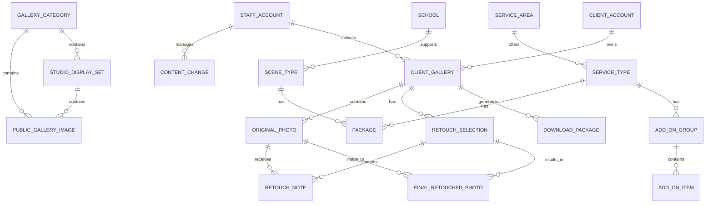

# Data Model Draft / 数据模型草案

## Document Purpose / 文档目的

This document drafts the business data model for the DARIA STUDIO product. It describes entities, relationships, constraints, and lifecycle rules derived from the product scope, roles, user flows, user stories, and content model.

本文档草拟 DARIA STUDIO 产品的业务数据模型，描述从产品范围、角色、用户流程、用户故事和内容模型中推导出的实体、关系、约束和生命周期规则。

This is not a production database schema. It intentionally avoids database engine, table naming, indexes, migrations, file storage paths, authentication provider, and API implementation details.

本文档不是生产数据库表结构，刻意不决定数据库引擎、表名、索引、迁移、文件存储路径、认证服务商或 API 实现细节。

## Model Principles / 建模原则

- Model business concepts before technical tables.
- Keep customer-facing public content separate from client gallery delivery content.
- Keep client accounts separate from staff accounts.
- Keep employee and owner as fixed staff roles in the first product scope.
- Store one canonical business value for shared fields, then localize display.
- Store bilingual customer-facing text where content is editable.
- Treat image and file storage location as a later technical decision.
- Treat countdowns and expiration as rules derived from workflow timestamps.

- 先建模业务概念，再决定技术表结构。
- 客户可见公开内容与客户相册交付内容保持分离。
- 客户账号与工作人员账号保持分离。
- 第一阶段工作人员角色固定为员工和老板。
- 共享字段保存一个标准业务值，再按语言展示。
- 可编辑客户可见文本保存双语字段。
- 图片和文件存储位置作为后续技术决策。
- 倒计时和过期时间由流程时间戳推导。

## High-level Entity Map / 高层实体关系图

## Localization Value Pattern / 本地化值模式

Many entities need localized customer-facing fields.

很多实体需要客户可见的本地化字段。

Localized text pattern:

本地化文本模式：

| Field | Meaning |
| --- | --- |
| zh | Simplified Chinese value |
| en | English value |

| 字段 | 含义 |
| --- | --- |
| zh | 简体中文值 |
| en | 英文值 |

Examples:

示例：

- Gallery category name.
- Studio display set name.
- Service area name.
- Package name.
- Package detail lines.
- Add-on name.
- Image alt text.

- 作品分类名称。
- 棚拍展示集名称。
- 服务地区名称。
- 套餐名称。
- 套餐详情行。
- 加购项名称。
- 图片替代文本。

Shared business fields should not use this pattern:

共享业务字段不应使用该模式：

- Price.
- Sort order.
- Availability status.
- Publish status.
- File reference.
- Expiration timestamp.
- Retouch quota.

- 价格。
- 排序。
- 可用状态。
- 发布状态。
- 文件引用。
- 过期时间。
- 精修数量。

## Identity and Account Entities / 身份与账号实体

### Client Account / 客户账号

Purpose:

用途：

- Represents a self-registered customer account.
- 表示客户自主注册的账号。

Core data:

核心数据：

- Client account ID.
- Email.
- Display name or client identifier.
- Account status.
- Created timestamp.
- Last login timestamp if needed later.

- 客户账号 ID。
- 邮箱。
- 显示名称或客户识别信息。
- 账号状态。
- 创建时间。
- 后续如需要可记录最近登录时间。

Relationships:

关系：

- One client account can own many client galleries.
- Client account does not relate to staff permissions.

- 一个客户账号可以拥有多个客户相册。
- 客户账号不关联工作人员权限。

Rules:

规则：

- Client accounts are created through email self-registration.
- Client accounts cannot access the staff workspace.
- Client can only access own galleries.

- 客户账号通过邮箱自主注册创建。
- 客户账号不能访问工作人员端。
- 客户只能访问自己的相册。

### Staff Account / 工作人员账号

Purpose:

用途：

- Represents an employee or owner account for staff workspace access.
- 表示用于访问工作人员端的员工或老板账号。

Core data:

核心数据：

- Staff account ID.
- Email or staff login identifier.
- Role: employee or owner.
- Account status.
- Created timestamp.

- 工作人员账号 ID。
- 邮箱或工作人员登录识别信息。
- 角色：员工或老板。
- 账号状态。
- 创建时间。

Relationships:

关系：

- Staff account can create or update content if owner.
- Staff account can handle client gallery delivery if employee or owner.

- 如果是老板，工作人员账号可以创建或更新内容。
- 如果是员工或老板，工作人员账号可以处理客户相册交付。

Rules:

规则：

- Roles are fixed as employee and owner.
- Employee cannot edit customer-facing website content.
- Owner can manage website content and employee accounts.
- Permission configuration is out of scope.

- 角色固定为员工和老板。
- 员工不能编辑客户可见网站内容。
- 老板可以管理网站内容和员工账号。
- 权限配置不在当前范围内。

## Public Content Entities / 公开内容实体

### Site Content / 站点内容

Purpose:

用途：

- Stores owner-managed brand and page copy.
- 存储老板管理的品牌和页面文案。

Core data:

核心数据：

- Content key.
- Localized title or value.
- Content area.
- Publish status.
- Updated by staff account.

- 内容键。
- 本地化标题或值。
- 内容区域。
- 发布状态。
- 更新者工作人员账号。

Relationships:

关系：

- Updated by owner staff account.
- Referenced by public pages.

- 由老板工作人员账号更新。
- 被公开页面引用。

### Gallery Category / 作品分类

Purpose:

用途：

- Groups public gallery content.
- 组织公开作品内容。

Core data:

核心数据：

- Gallery category ID.
- Localized name.
- Category type: normal or studio shoot.
- Sort order.
- Publish status.
- Visibility status.

- 作品分类 ID。
- 本地化名称。
- 分类类型：普通或棚拍。
- 排序。
- 发布状态。
- 可见状态。

Relationships:

关系：

- Normal category has 0 to 20 public gallery images.
- Studio shoot category has 0 to many studio display sets.

- 普通分类有 0 到 20 张公开作品图片。
- 棚拍分类有 0 到多个棚拍展示集。

Rules:

规则：

- Normal category with 0 images displays empty state.
- Studio shoot category uses display sets.
- Owner manages gallery categories.

- 普通分类 0 张图片时显示空状态。
- 棚拍分类使用展示集。
- 老板管理作品分类。

### Public Gallery Image / 公开作品图片

Purpose:

用途：

- Represents a public image shown in galleries.
- 表示作品展示中显示的公开图片。

Core data:

核心数据：

- Public image ID.
- File reference.
- Localized alt text.
- Sort order.
- Publish status.

- 公开图片 ID。
- 文件引用。
- 本地化替代文本。
- 排序。
- 发布状态。

Relationships:

关系：

- Belongs to one normal gallery category or one studio display set.

- 属于一个普通作品分类或一个棚拍展示集。

Rules:

规则：

- File storage location is a later technical detail.
- Image reference is shared across languages.
- Alt text is bilingual.

- 文件存储位置是后续技术细节。
- 图片引用跨语言共享。
- 替代文本双语。

### Studio Display Set / 棚拍展示集

Purpose:

用途：

- Groups studio shoot public images into named sets.
- 将棚拍公开图片组织成命名展示集。

Core data:

核心数据：

- Studio display set ID.
- Localized name.
- Sort order.
- Publish status.

- 棚拍展示集 ID。
- 本地化名称。
- 排序。
- 发布状态。

Relationships:

关系：

- Belongs to studio shoot gallery category.
- Contains 1 to 9 public gallery images when published.

- 属于棚拍作品分类。
- 发布时包含 1 到 9 张公开作品图片。

Rules:

规则：

- Modal layout supports up to 3 by 3 images.
- Modal content remains centered regardless of image count.

- 弹窗布局最多支持 3 乘 3 图片。
- 无论图片数量多少，弹窗内容保持居中。

## Pricing and Service Entities / 价格与服务实体

### Service Area / 服务地区

Core data:

核心数据：

- Service area ID.
- Localized name.
- Sort order.
- Availability status.

- 服务地区 ID。
- 本地化名称。
- 排序。
- 可用状态。

Relationships:

关系：

- Has 0 to many service types.

- 拥有 0 到多个服务类型。

### Service Type / 服务类型

Core data:

核心数据：

- Service type ID.
- Localized name.
- Optional localized description.
- Sort order.
- Availability status.

- 服务类型 ID。
- 本地化名称。
- 可选本地化说明。
- 排序。
- 可用状态。

Relationships:

关系：

- Belongs to a service area.
- Can have packages.
- Can have add-on groups.
- Graduation service can relate to schools and scene types.

- 属于一个服务地区。
- 可以拥有套餐。
- 可以拥有加购分组。
- 毕业照服务可以关联学校和场景类型。

### School / 学校

Core data:

核心数据：

- School ID.
- Localized name.
- Sort order.
- Availability status.

- 学校 ID。
- 本地化名称。
- 排序。
- 可用状态。

Relationships:

关系：

- Has 0 to many scene types.

- 拥有 0 到多个场景类型。

### Scene Type / 场景类型

Core data:

核心数据：

- Scene type ID.
- Localized name.
- Localized description.
- Preview image reference.
- Sort order.
- Availability status.

- 场景类型 ID。
- 本地化名称。
- 本地化说明。
- 预览图引用。
- 排序。
- 可用状态。

Relationships:

关系：

- Belongs to one or more schools depending on later design.
- Has 0 to many packages, or uses a fixed package.

- 根据后续设计，可属于一个或多个学校。
- 拥有 0 到多个套餐，或使用固定套餐。

### Package / 套餐

Core data:

核心数据：

- Package ID.
- Localized name.
- Localized detail lines.
- Price amount.
- Currency: AUD.
- Included original photo count if applicable.
- Included retouched photo count if applicable.
- Sort order.
- Availability status.

- 套餐 ID。
- 本地化名称。
- 本地化详情行。
- 价格金额。
- 货币：AUD。
- 如适用，包含底片数量。
- 如适用，包含精修数量。
- 排序。
- 可用状态。

Relationships:

关系：

- Belongs to a service type or scene type.
- Can be linked to client galleries for retouch quota.

- 属于服务类型或场景类型。
- 可以关联客户相册，用于精修数量。

Rules:

规则：

- Price is shared across languages.
- Included retouched photo count drives client selection limit later.

- 价格跨语言共享。
- 包含精修数量后续用于驱动客户选片上限。

### Add-on Group / 加购分组

Core data:

核心数据：

- Add-on group ID.
- Localized name.
- Sort order.
- Availability status.

- 加购分组 ID。
- 本地化名称。
- 排序。
- 可用状态。

Relationships:

关系：

- Belongs to a service type, package context, or pricing flow context.
- Contains add-on items.

- 属于服务类型、套餐上下文或价格流程上下文。
- 包含加购项。

### Add-on Item / 加购项

Core data:

核心数据：

- Add-on item ID.
- Localized name.
- Localized description.
- Price amount.
- Currency: AUD.
- Preview image reference.
- Additional retouch count if applicable.
- Sort order.
- Availability status.

- 加购项 ID。
- 本地化名称。
- 本地化说明。
- 价格金额。
- 货币：AUD。
- 预览图引用。
- 如适用，额外精修数量。
- 排序。
- 可用状态。

Relationships:

关系：

- Belongs to an add-on group.
- Can be selected in pricing flow.

- 属于加购分组。
- 可以在价格流程中被选择。

## Inquiry Selection Entities / 咨询选择实体

### Inquiry Selection / 咨询选择

Purpose:

用途：

- Represents the user's current pricing selections before copying the inquiry summary.
- 表示用户复制咨询信息前的当前价格选择。

Core data:

核心数据：

- Selected language.
- Selected service area.
- Selected service type.
- Selected school if applicable.
- Selected scene type if applicable.
- Selected package.
- Selected add-ons.
- Notes.
- Estimated total.

- 当前语言。
- 已选服务地区。
- 已选服务类型。
- 如适用，已选学校。
- 如适用，已选场景类型。
- 已选套餐。
- 已选加购项。
- 备注。
- 估算总价。

Rules:

规则：

- Inquiry summary is generated from selections.
- Summary is read-only.
- Notes are not translated.
- This does not create booking or payment.

- 咨询信息汇总由选择项生成。
- 汇总只读。
- 备注不翻译。
- 该流程不创建预约或支付。

## Client Gallery Delivery Entities / 客户相册交付实体

### Client Gallery / 客户相册

Purpose:

用途：

- Represents one delivery workspace for a client.
- 表示某个客户的一次交付工作区。

Core data:

核心数据：

- Client gallery ID.
- Client account relationship.
- Gallery title or identifier.
- Related package or retouch quota.
- Original upload timestamp.
- Retouch selection deadline.
- Download and deletion deadline.
- Delivery status.

- 客户相册 ID。
- 关联客户账号。
- 相册标题或识别信息。
- 关联套餐或精修数量。
- 底片上传时间。
- 精修选择截止时间。
- 下载和删除截止时间。
- 交付状态。

Relationships:

关系：

- Belongs to one client account.
- Has many original photos.
- Has zero or one submitted retouch selection in normal flow.
- Has many final retouched photos after delivery.
- Has generated download packages.

- 属于一个客户账号。
- 拥有多张底片。
- 正常流程中拥有 0 或 1 个已提交精修选择。
- 交付后拥有多张最终精修图。
- 拥有已生成下载压缩包。

Rules:

规则：

- Employee can access galleries for delivery work.
- Client can only access own galleries.
- Original upload starts the 7-day and 3-month timers.
- 3-month expiration deletes original photos, final retouched photos, and generated packages.

- 员工可以为了交付工作访问相册。
- 客户只能访问自己的相册。
- 底片上传开始计算 7 天和 3 个月计时。
- 3 个月过期后删除底片、最终精修图和已生成压缩包。

### Original Photo / 底片

Core data:

核心数据：

- Original photo ID.
- Client gallery relationship.
- File reference.
- Sort order.
- Upload timestamp.
- Visibility status.

- 底片 ID。
- 关联客户相册。
- 文件引用。
- 排序。
- 上传时间。
- 可见状态。

Relationships:

关系：

- Belongs to one client gallery.
- Can be selected in a retouch selection.
- Can map to one final retouched photo if selected and completed.

- 属于一个客户相册。
- 可以被精修选择引用。
- 如果被选择并完成交付，可以映射到一张最终精修图。

Rules:

规则：

- Employee can add, replace, remove, and reorder at any time.
- If retouch selection was submitted, edit requires confirmation message.
- Deleted after 3-month window expires.

- 员工可以随时新增、替换、移除和调整顺序。
- 如果精修选择已提交，编辑前需要确认提示。
- 3 个月期限结束后删除。

### Retouch Selection / 精修选择

Core data:

核心数据：

- Retouch selection ID.
- Client gallery relationship.
- Client account relationship.
- Submitted timestamp.
- Status: draft, submitted, expired.
- Lock status.

- 精修选择 ID。
- 关联客户相册。
- 关联客户账号。
- 提交时间。
- 状态：草稿、已提交、已过期。
- 锁定状态。

Relationships:

关系：

- Belongs to one client gallery.
- References selected original photos.
- Contains retouch notes.

- 属于一个客户相册。
- 引用已选底片。
- 包含修图备注。

Rules:

规则：

- One submitted retouch selection per gallery in normal flow.
- Submitted selection is locked.
- No unlock flow.
- If 7-day deadline passes without submission, included free retouch right is lost.

- 正常流程中每个相册只有一次已提交精修选择。
- 已提交选择锁定。
- 不提供解锁流程。
- 7 天截止前未提交时，套餐包含免费精修权利失效。

### Retouch Note / 修图备注

Core data:

核心数据：

- Retouch note ID.
- Retouch selection relationship.
- Original photo relationship.
- Note text.
- Character count.

- 修图备注 ID。
- 关联精修选择。
- 关联底片。
- 备注文本。
- 字数。

Rules:

规则：

- One note per selected original photo.
- Maximum 500 characters.
- Text can include Simplified Chinese, Traditional Chinese, English, mixed text, and matching punctuation.
- Text is not translated.

- 每张已选底片一条备注。
- 最多 500 字。
- 文本可包含简体、繁体、英文、混合文本和对应标点符号。
- 文本不翻译。

### Final Retouched Photo / 最终精修图

Core data:

核心数据：

- Final photo ID.
- Client gallery relationship.
- Original photo relationship.
- File reference.
- Upload timestamp.
- Visibility status.

- 最终精修图 ID。
- 关联客户相册。
- 关联底片。
- 文件引用。
- 上传时间。
- 可见状态。

Relationships:

关系：

- Belongs to one client gallery.
- Maps to a selected original photo.

- 属于一个客户相册。
- 映射到一张已选底片。

Rules:

规则：

- Uploaded by employee or owner.
- Downloadable within the 3-month window.
- Deleted at the same time as original photos.

- 由员工或老板上传。
- 可在 3 个月窗口内下载。
- 与底片同时删除。

### Download Package / 下载压缩包

Core data:

核心数据：

- Download package ID.
- Client gallery relationship.
- Package type: originals or finals.
- File reference.
- Generated timestamp.
- Expiration timestamp.

- 下载压缩包 ID。
- 关联客户相册。
- 压缩包类型：底片或最终精修图。
- 文件引用。
- 生成时间。
- 过期时间。

Rules:

规则：

- Available only within 3-month window.
- Deleted when 3-month window expires.

- 仅在 3 个月窗口内可用。
- 3 个月期限结束时删除。

## Lifecycle Rules / 生命周期规则

### Public Content Lifecycle / 公开内容生命周期

States:

状态：

- Draft.
- Published.
- Hidden.
- Deleted.

- 草稿。
- 已发布。
- 隐藏。
- 已删除。

Rules:

规则：

- Draft content is not visible to customers.
- Published content is visible to customers.
- Hidden content is not visible to customers.
- Deleted content is removed from normal management views.

- 草稿内容客户不可见。
- 已发布内容客户可见。
- 隐藏内容客户不可见。
- 已删除内容从正常管理视图中移除。

### Client Gallery Lifecycle / 客户相册生命周期

States:

状态：

- No gallery yet.
- Originals uploaded.
- Retouch selection open.
- Retouch selection submitted.
- Retouch selection expired.
- Retouching.
- Finals uploaded.
- Completed.
- Expired and deleted.

- 暂无相册。
- 底片已上传。
- 精修选择开放中。
- 精修选择已提交。
- 精修选择已过期。
- 精修中。
- 最终精修图已上传。
- 已完成。
- 已过期并删除。

Rules:

规则：

- Original upload starts 7-day retouch selection countdown.
- Original upload starts 3-month download and deletion countdown.
- Retouch submission hides the 7-day countdown.
- 3-month expiration deletes original photos, final retouched photos, and generated packages.

- 底片上传开始 7 天精修选择倒计时。
- 底片上传开始 3 个月下载和删除倒计时。
- 精修提交后隐藏 7 天倒计时。
- 3 个月过期后删除底片、最终精修图和已生成压缩包。

## Business Constraints / 业务约束

- Normal gallery category image count: 0 to 20.
- Studio display set image count: 1 to 9 when published.
- Studio display set modal layout: maximum 3 by 3.
- Retouch note length: maximum 500 characters.
- Retouch selection window: 7 days after original upload.
- Download and deletion window: 3 months after original upload.
- Currency: AUD.
- Client can submit retouch selection once.
- Submitted retouch selection cannot be unlocked in normal flow.
- Employee can edit original photo galleries at any time, with confirmation after client submission.

- 普通作品分类图片数量：0 到 20。
- 棚拍展示集发布时图片数量：1 到 9。
- 棚拍展示集弹窗布局：最多 3 乘 3。
- 修图备注长度：最多 500 字。
- 精修选择窗口：底片上传后 7 天。
- 下载和删除窗口：底片上传后 3 个月。
- 货币：AUD。
- 客户只能提交一次精修选择。
- 已提交精修选择正常流程中不能解锁。
- 员工可以随时编辑底片相册，客户提交后编辑需确认提示。

## Data Access Summary / 数据访问摘要

| Entity area | Visitor | Client | Employee | Owner |
| --- | --- | --- | --- | --- |
| Public site content | Read published | Read published | Read published | Manage |
| Public gallery content | Read published | Read published | Read published | Manage |
| Pricing content | Read published | Read published | Read published | Manage |
| Client account | None | Own account | Minimum delivery info | Manage as needed |
| Client gallery | None | Own galleries | All galleries for delivery | All galleries |
| Original photos | None | Own galleries within window | Manage for delivery | Manage |
| Retouch selections | None | Own submitted/draft | View submitted | View submitted |
| Final retouched photos | None | Own galleries within window | Upload/manage for delivery | Manage |

| 实体区域 | 访客 | 客户 | 员工 | 老板 |
| --- | --- | --- | --- | --- |
| 公开站点内容 | 读取已发布 | 读取已发布 | 读取已发布 | 管理 |
| 公开作品内容 | 读取已发布 | 读取已发布 | 读取已发布 | 管理 |
| 价格内容 | 读取已发布 | 读取已发布 | 读取已发布 | 管理 |
| 客户账号 | 无 | 自己账号 | 最少交付信息 | 按需管理 |
| 客户相册 | 无 | 自己相册 | 全部交付相关相册 | 全部相册 |
| 底片 | 无 | 自己相册有效期内 | 为交付管理 | 管理 |
| 精修选择 | 无 | 自己草稿/提交 | 查看已提交 | 查看已提交 |
| 最终精修图 | 无 | 自己相册有效期内 | 为交付上传/管理 | 管理 |

## Open Questions / 待确认问题

- Should scene types be reusable across schools, or should each school own separate scene type records?
- Should package included original photo count be modeled as a strict number, a descriptive text line, or both?
- Should add-ons that include extra retouched photos always store a numeric retouch count?
- Should client gallery title be manually editable, automatically generated, or both?
- Should final retouched photos require a one-to-one match with every selected original before the gallery can be marked completed?

- 场景类型是否应在学校之间复用，还是每个学校拥有独立场景类型记录？
- 套餐包含底片数量应建模为严格数字、描述文本，还是两者都需要？
- 包含额外精修数量的加购项是否必须存储数字型精修数量？
- 客户相册标题应允许手动编辑、自动生成，还是两者都支持？
- 最终精修图是否必须与每张已选底片一一对应后，才能将相册标记为完成？
