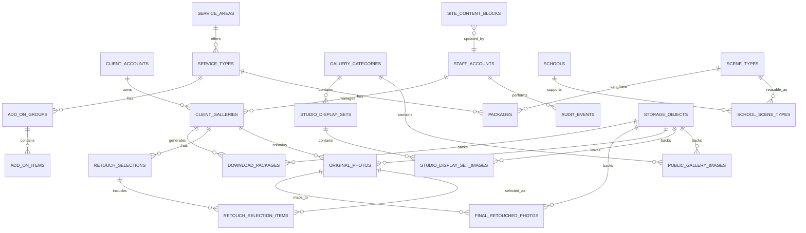

# Database Schema Draft / 数据库 Schema 草案

## Document Purpose / 文档目的

This document drafts a PostgreSQL-oriented schema for the future DARIA STUDIO platform. It translates the product scope, role model, content model, data model draft, technical architecture draft, and API contract draft into a near-implementation database plan.

本文档草拟未来 DARIA STUDIO 正式平台的 PostgreSQL 方向数据库 Schema。它把产品范围、角色模型、内容模型、数据模型草案、技术架构草案和 API 契约草案转化为接近实现层的数据库规划。

This is not a production migration file. It does not finalize every table name, index, storage key format, authentication library, or ORM model. Real migrations should be created later in the private `daria-studio-platform` repository.

本文档不是生产迁移文件。它不最终确定每一个表名、索引、存储 key 格式、认证库或 ORM 模型。真实迁移应后续在私有仓库 `daria-studio-platform` 中创建。

## Confirmed Technical Context / 已确认技术背景

- Frontend: Next.js + React + light TypeScript.
- Backend: Python FastAPI.
- Architecture: front-end/back-end separation.
- Database direction: managed PostgreSQL.
- Authentication direction: FastAPI-managed email/password auth with server-side cookie sessions.
- Cloud direction: Tencent Cloud.
- Object storage candidate: Tencent Cloud COS.
- Public inquiry flow does not create booking, payment, deposit, or calendar records.

- 前端：Next.js + React + 轻量 TypeScript。
- 后端：Python FastAPI。
- 架构：前后端分离。
- 数据库方向：托管 PostgreSQL。
- 认证方向：FastAPI 管理的邮箱密码认证和服务端 cookie 会话。
- 云服务方向：腾讯云。
- 对象存储候选：腾讯云 COS。
- 公开咨询流程不创建预约、付款、定金或日历记录。

## Schema Principles / Schema 原则

- Keep authentication identity separate from business profiles.
- Keep client accounts and staff accounts separate.
- Use fixed staff roles: `owner` and `employee`.
- Store customer-facing editable text as bilingual values.
- Store shared business values once, not once per language.
- Store file metadata in the database, but store actual photo files in object storage.
- Store server timestamps for lifecycle rules; the frontend only displays countdowns.
- Enforce critical constraints in the database where practical and in the FastAPI backend everywhere else.
- Do not model booking, payment, deposit, or calendar scheduling in the current schema.

- 认证身份与业务资料分开。
- 客户账号和工作人员账号分开。
- 工作人员角色固定为 `owner` 和 `employee`。
- 客户可见可编辑文本保存为双语值。
- 共享业务值只保存一份，不按语言重复保存。
- 数据库存储文件元数据，真实照片文件存储在对象存储中。
- 生命周期规则使用服务端时间戳；前端只展示倒计时。
- 关键约束尽量在数据库中执行，其他约束由 FastAPI 后端执行。
- 当前 Schema 不建模预约、付款、定金或日历排期。

## Naming and Type Conventions / 命名与类型约定

Recommended conventions:

推荐约定：

| Convention | Draft Decision |
| --- | --- |
| Table names | `snake_case`, plural nouns |
| Column names | `snake_case` |
| Primary keys | `id uuid primary key` |
| Public API IDs | Opaque strings derived from UUIDs or separate public IDs |
| Timestamps | `timestamptz` in UTC |
| Money | `integer` cents plus `currency` |
| Localized text | `jsonb` with `zh` and `en` keys |
| Soft delete | `deleted_at timestamptz` where recovery or audit matters |
| Hard file deletion | Object storage deletion after lifecycle expiry |

| 约定 | 草案决策 |
| --- | --- |
| 表名 | `snake_case`，复数名词 |
| 字段名 | `snake_case` |
| 主键 | `id uuid primary key` |
| 公开 API ID | 由 UUID 或独立公开 ID 派生的不透明字符串 |
| 时间戳 | UTC `timestamptz` |
| 金额 | 整数分 + `currency` |
| 本地化文本 | 带 `zh` 和 `en` key 的 `jsonb` |
| 软删除 | 需要恢复或审计的记录使用 `deleted_at timestamptz` |
| 文件硬删除 | 生命周期到期后从对象存储删除 |

Common columns:

通用字段：

| Column | Type | Notes |
| --- | --- | --- |
| `id` | `uuid` | Primary key |
| `created_at` | `timestamptz` | Set by database or backend |
| `updated_at` | `timestamptz` | Updated on mutation |
| `deleted_at` | `timestamptz null` | Used for soft-deleteable records |

| 字段 | 类型 | 说明 |
| --- | --- | --- |
| `id` | `uuid` | 主键 |
| `created_at` | `timestamptz` | 由数据库或后端设置 |
| `updated_at` | `timestamptz` | 写操作时更新 |
| `deleted_at` | `timestamptz null` | 用于可软删除记录 |

PostgreSQL extension notes:

PostgreSQL 扩展说明：

- `citext` is useful for case-insensitive email uniqueness.
- `pgcrypto` is useful if the database generates UUID values with `gen_random_uuid()`.
- If the selected managed PostgreSQL service does not allow `citext`, use normalized lowercase email fields plus unique indexes instead.

- `citext` 适合用于邮箱大小写不敏感唯一性。
- 如果由数据库生成 UUID，`pgcrypto` 可用于 `gen_random_uuid()`。
- 如果所选托管 PostgreSQL 不允许 `citext`，则改用标准化小写邮箱字段和唯一索引。

Localized text shape:

本地化文本结构：

```json
{
  "zh": "毕业照",
  "en": "Graduation"
}
```

Localized list shape:

本地化列表结构：

```json
{
  "zh": ["包含 6 张精修", "适合校园拍摄"],
  "en": ["Includes 6 retouched photos", "Suitable for campus sessions"]
}
```

Rules:

规则：

- Required published customer-facing names should contain both `zh` and `en`.
- Optional descriptions may be empty, but missing translations should be visible in owner tools.
- The database can use `jsonb` checks for basic shape, but complete publish validation should happen in the backend.

- 已发布客户可见必填名称应同时包含 `zh` 和 `en`。
- 可选说明可以为空，但缺失翻译应在老板工具中可见。
- 数据库可使用 `jsonb` 校验基础结构，但完整发布校验应在后端完成。

## High-level Schema Map / 高层 Schema 关系图



## Enum Drafts / 枚举草案

### Staff Role / 工作人员角色

| Value | Meaning |
| --- | --- |
| `owner` | Studio owner and website administrator |
| `employee` | Staff user for client gallery delivery |

| 值 | 含义 |
| --- | --- |
| `owner` | 工作室老板和网站管理员 |
| `employee` | 处理客户相册交付的工作人员 |

### Publish Status / 发布状态

| Value | Meaning |
| --- | --- |
| `draft` | Visible only in owner/staff management tools where allowed |
| `published` | Visible to customers |
| `hidden` | Saved but not shown publicly |
| `deleted` | Soft-deleted record |

| 值 | 含义 |
| --- | --- |
| `draft` | 仅在允许的管理工具中可见 |
| `published` | 客户可见 |
| `hidden` | 已保存但不公开展示 |
| `deleted` | 软删除记录 |

### Gallery Category Type / 作品分类类型

| Value | Meaning |
| --- | --- |
| `normal` | Normal gallery category with 0 to 20 images |
| `studio_shoot` | Special studio shoot category with display sets |

| 值 | 含义 |
| --- | --- |
| `normal` | 普通作品分类，可有 0 到 20 张图片 |
| `studio_shoot` | 特殊棚拍分类，包含展示集 |

### Client Gallery Status / 客户相册状态

| Value | Meaning |
| --- | --- |
| `no_photos` | Gallery exists, originals are not uploaded yet |
| `selection_open` | Originals are available and 7-day retouch selection is open |
| `selection_submitted` | Client submitted retouch selection and it is locked |
| `selection_expired` | Client did not submit within 7 days and free retouch right is lost |
| `retouching` | Staff is working on final retouched photos |
| `finals_uploaded` | Final retouched photos are available |
| `originals_download_only` | Free retouch right is lost, originals remain downloadable until storage expiry |
| `expired_deleted` | 3-month window expired and files are deleted from product storage |

| 值 | 含义 |
| --- | --- |
| `no_photos` | 相册存在，但底片尚未上传 |
| `selection_open` | 底片可用，7 天精修选择期开放 |
| `selection_submitted` | 客户已提交精修选择，并已锁定 |
| `selection_expired` | 客户 7 天内未提交，失去免费精修权利 |
| `retouching` | 工作人员正在处理最终精修图 |
| `finals_uploaded` | 最终精修图已可用 |
| `originals_download_only` | 免费精修权利已失效，但底片在存储期内仍可下载 |
| `expired_deleted` | 3 个月期限已过，文件已从产品存储删除 |

Rules:

规则：

- There is no `completed` status.
- Final retouched photos represent delivered files and do not create an extra gallery completion state.

- 不设置 `completed` 状态。
- 最终精修图表示已交付文件，不产生额外相册完成状态。

### File and Package Status / 文件与压缩包状态

| Enum | Values |
| --- | --- |
| `storage_visibility` | `public`, `private` |
| `storage_object_status` | `pending_upload`, `available`, `deleted`, `failed` |
| `photo_status` | `available`, `hidden`, `deleted` |
| `download_package_kind` | `originals`, `finals` |
| `download_package_status` | `queued`, `processing`, `ready`, `failed`, `deleted`, `expired` |

| 枚举 | 值 |
| --- | --- |
| `storage_visibility` | `public`, `private` |
| `storage_object_status` | `pending_upload`, `available`, `deleted`, `failed` |
| `photo_status` | `available`, `hidden`, `deleted` |
| `download_package_kind` | `originals`, `finals` |
| `download_package_status` | `queued`, `processing`, `ready`, `failed`, `deleted`, `expired` |

## Authentication Tables / 认证表

### `auth_identities`

Purpose:

用途：

- Stores the canonical login identity for both clients and staff.
- Owns password hashes, email verification state, and login-level account state.
- Does not by itself grant client gallery access or staff workspace access.

- 保存客户和工作人员共用的标准登录身份。
- 负责密码哈希、邮箱验证状态和登录层账号状态。
- 认证身份本身不直接授予客户相册访问或工作人员端访问。

| Column | Type | Null | Notes |
| --- | --- | --- | --- |
| `id` | `uuid` | No | Primary key |
| `email` | `citext` | No | Canonical login email |
| `password_hash` | `text` | No | Strong password hash, never plaintext |
| `password_hash_algorithm` | `text` | No | Expected first value: `argon2id`; fallback: `bcrypt` |
| `email_verified_at` | `timestamptz` | Yes | Email verification timestamp |
| `account_status` | `text` | No | `active`, `disabled`, or `locked` |
| `failed_login_count` | `integer` | No | Supports login rate-limit/lockout logic |
| `locked_until` | `timestamptz` | Yes | Temporary login lock timestamp |
| `last_login_at` | `timestamptz` | Yes | Optional tracking |
| `created_at` | `timestamptz` | No | Common timestamp |
| `updated_at` | `timestamptz` | No | Common timestamp |
| `deleted_at` | `timestamptz` | Yes | Soft deletion if needed |

| 字段 | 类型 | 可空 | 说明 |
| --- | --- | --- | --- |
| `id` | `uuid` | 否 | 主键 |
| `email` | `citext` | 否 | 标准登录邮箱 |
| `password_hash` | `text` | 否 | 强密码哈希，永远不是明文 |
| `password_hash_algorithm` | `text` | 否 | 第一版预期值：`argon2id`；备选：`bcrypt` |
| `email_verified_at` | `timestamptz` | 是 | 邮箱验证时间 |
| `account_status` | `text` | 否 | `active`、`disabled` 或 `locked` |
| `failed_login_count` | `integer` | 否 | 支持登录限流/锁定逻辑 |
| `locked_until` | `timestamptz` | 是 | 临时登录锁定时间 |
| `last_login_at` | `timestamptz` | 是 | 可选登录跟踪 |
| `created_at` | `timestamptz` | 否 | 通用时间戳 |
| `updated_at` | `timestamptz` | 否 | 通用时间戳 |
| `deleted_at` | `timestamptz` | 是 | 如需要可软删除 |

Constraints and indexes:

约束与索引：

- `unique (email)` among active identities.
- Index on `account_status`.
- Password hash must be created by the backend authentication library.
- Plaintext passwords must never be stored.

- 有效认证身份中的 `email` 唯一。
- 为 `account_status` 建索引。
- 密码哈希必须由后端认证库生成。
- 永远不存储明文密码。

### `auth_sessions`

Purpose:

用途：

- Stores backend-managed browser sessions.
- Allows logout, revocation, expiry, and audit-friendly session checks.

- 保存后端管理的浏览器会话。
- 支持退出登录、撤销、过期和便于审计的会话校验。

| Column | Type | Null | Notes |
| --- | --- | --- | --- |
| `id` | `uuid` | No | Primary key |
| `auth_identity_id` | `uuid` | No | FK to `auth_identities.id` |
| `session_token_hash` | `text` | No | Hash of opaque session token stored in browser cookie |
| `csrf_token_hash` | `text` | Yes | Hash of CSRF token if synchronizer-token storage is used |
| `user_agent_hash` | `text` | Yes | Optional privacy-preserving client hint |
| `ip_address` | `inet` | Yes | Optional security/audit hint |
| `created_at` | `timestamptz` | No | Common timestamp |
| `last_seen_at` | `timestamptz` | Yes | Updated on active use |
| `expires_at` | `timestamptz` | No | Session expiry timestamp |
| `revoked_at` | `timestamptz` | Yes | Logout or admin revocation timestamp |

| 字段 | 类型 | 可空 | 说明 |
| --- | --- | --- | --- |
| `id` | `uuid` | 否 | 主键 |
| `auth_identity_id` | `uuid` | 否 | 外键到 `auth_identities.id` |
| `session_token_hash` | `text` | 否 | 浏览器 cookie 中不透明会话 token 的哈希 |
| `csrf_token_hash` | `text` | 是 | 如果使用同步 token 存储模式，则保存 CSRF token 哈希 |
| `user_agent_hash` | `text` | 是 | 可选、较保护隐私的客户端提示 |
| `ip_address` | `inet` | 是 | 可选安全/审计提示 |
| `created_at` | `timestamptz` | 否 | 通用时间戳 |
| `last_seen_at` | `timestamptz` | 是 | 活跃使用时更新 |
| `expires_at` | `timestamptz` | 否 | 会话过期时间 |
| `revoked_at` | `timestamptz` | 是 | 退出登录或管理员撤销时间 |

Constraints and indexes:

约束与索引：

- `unique (session_token_hash)`.
- Index on `(auth_identity_id, expires_at)`.
- Index on `revoked_at` for cleanup and active-session checks.

- `session_token_hash` 唯一。
- 为 `(auth_identity_id, expires_at)` 建索引。
- 为 `revoked_at` 建索引，用于清理和活跃会话校验。

### `auth_email_verification_tokens`

Purpose:

用途：

- Stores one-time email verification tokens.
- Enables clients and staff to verify the email on their auth identity.

- 保存一次性邮箱验证 token。
- 支持客户和工作人员验证认证身份上的邮箱。

| Column | Type | Null | Notes |
| --- | --- | --- | --- |
| `id` | `uuid` | No | Primary key |
| `auth_identity_id` | `uuid` | No | FK to `auth_identities.id` |
| `token_hash` | `text` | No | Hash of token sent by email |
| `created_at` | `timestamptz` | No | Common timestamp |
| `expires_at` | `timestamptz` | No | Token expiry timestamp |
| `used_at` | `timestamptz` | Yes | Set when token is consumed |

| 字段 | 类型 | 可空 | 说明 |
| --- | --- | --- | --- |
| `id` | `uuid` | 否 | 主键 |
| `auth_identity_id` | `uuid` | 否 | 外键到 `auth_identities.id` |
| `token_hash` | `text` | 否 | 邮件发送 token 的哈希 |
| `created_at` | `timestamptz` | 否 | 通用时间戳 |
| `expires_at` | `timestamptz` | 否 | token 过期时间 |
| `used_at` | `timestamptz` | 是 | token 被使用时写入 |

Constraints and indexes:

约束与索引：

- `unique (token_hash)`.
- Index on `(auth_identity_id, expires_at)`.
- Backend must reject expired or already used tokens.

- `token_hash` 唯一。
- 为 `(auth_identity_id, expires_at)` 建索引。
- 后端必须拒绝已过期或已使用 token。

### `auth_password_reset_tokens`

Purpose:

用途：

- Stores one-time password reset tokens.
- Supports secure password reset without exposing whether an unknown email exists.

- 保存一次性密码重置 token。
- 支持安全密码重置，同时不暴露未知邮箱是否存在。

| Column | Type | Null | Notes |
| --- | --- | --- | --- |
| `id` | `uuid` | No | Primary key |
| `auth_identity_id` | `uuid` | No | FK to `auth_identities.id` |
| `token_hash` | `text` | No | Hash of token sent by email |
| `requested_ip` | `inet` | Yes | Optional security/audit hint |
| `created_at` | `timestamptz` | No | Common timestamp |
| `expires_at` | `timestamptz` | No | Token expiry timestamp |
| `used_at` | `timestamptz` | Yes | Set when token is consumed |

| 字段 | 类型 | 可空 | 说明 |
| --- | --- | --- | --- |
| `id` | `uuid` | 否 | 主键 |
| `auth_identity_id` | `uuid` | 否 | 外键到 `auth_identities.id` |
| `token_hash` | `text` | 否 | 邮件发送 token 的哈希 |
| `requested_ip` | `inet` | 是 | 可选安全/审计提示 |
| `created_at` | `timestamptz` | 否 | 通用时间戳 |
| `expires_at` | `timestamptz` | 否 | token 过期时间 |
| `used_at` | `timestamptz` | 是 | token 被使用时写入 |

Constraints and indexes:

约束与索引：

- `unique (token_hash)`.
- Index on `(auth_identity_id, expires_at)`.
- Confirming a password reset should revoke existing sessions for the auth identity unless a later implementation decision says otherwise.

- `token_hash` 唯一。
- 为 `(auth_identity_id, expires_at)` 建索引。
- 密码重置确认后，应使该认证身份已有会话失效，除非后续实现决策另有说明。

## Identity and Account Tables / 身份与账号表

### `client_accounts`

Purpose:

用途：

- Business profile for a self-registered customer.
- Does not grant staff workspace access.

- 客户自主注册后的业务资料。
- 不授予工作人员端访问权限。

| Column | Type | Null | Notes |
| --- | --- | --- | --- |
| `id` | `uuid` | No | Primary key |
| `auth_identity_id` | `uuid` | No | FK to `auth_identities.id` |
| `email` | `citext` | No | Contact/search email copied from auth identity in MVP |
| `display_name` | `text` | Yes | Optional client-facing account name |
| `account_status` | `text` | No | `active`, `disabled`, or future value |
| `created_at` | `timestamptz` | No | Common timestamp |
| `updated_at` | `timestamptz` | No | Common timestamp |
| `deleted_at` | `timestamptz` | Yes | Soft deletion if needed |

| 字段 | 类型 | 可空 | 说明 |
| --- | --- | --- | --- |
| `id` | `uuid` | 否 | 主键 |
| `auth_identity_id` | `uuid` | 否 | 外键到 `auth_identities.id` |
| `email` | `citext` | 否 | 第一版从认证身份复制的联系/搜索邮箱 |
| `display_name` | `text` | 是 | 可选客户账号显示名 |
| `account_status` | `text` | 否 | `active`、`disabled` 或未来值 |
| `created_at` | `timestamptz` | 否 | 通用时间戳 |
| `updated_at` | `timestamptz` | 否 | 通用时间戳 |
| `deleted_at` | `timestamptz` | 是 | 如需要可软删除 |

Constraints and indexes:

约束与索引：

- `unique (auth_identity_id)`.
- `unique (email)` among active records.
- Index on `account_status`.

- `auth_identity_id` 唯一。
- 有效记录中的 `email` 唯一。
- 为 `account_status` 建索引。

### `staff_accounts`

Purpose:

用途：

- Business profile for staff users.
- Separates owner and employee from client accounts.

- 工作人员业务资料。
- 将老板/员工与客户账号分开。

| Column | Type | Null | Notes |
| --- | --- | --- | --- |
| `id` | `uuid` | No | Primary key |
| `auth_identity_id` | `uuid` | No | FK to `auth_identities.id` |
| `email` | `citext` | No | Staff contact/search email copied from auth identity in MVP |
| `display_name` | `text` | No | Staff display name |
| `role` | `staff_role` | No | `owner` or `employee` |
| `account_status` | `text` | No | `active` or `disabled` |
| `created_by_staff_id` | `uuid` | Yes | Owner who created staff account |
| `last_login_at` | `timestamptz` | Yes | Optional tracking |
| `created_at` | `timestamptz` | No | Common timestamp |
| `updated_at` | `timestamptz` | No | Common timestamp |
| `disabled_at` | `timestamptz` | Yes | Access disabled timestamp |

| 字段 | 类型 | 可空 | 说明 |
| --- | --- | --- | --- |
| `id` | `uuid` | 否 | 主键 |
| `auth_identity_id` | `uuid` | 否 | 外键到 `auth_identities.id` |
| `email` | `citext` | 否 | 第一版从认证身份复制的工作人员联系/搜索邮箱 |
| `display_name` | `text` | 否 | 工作人员显示名 |
| `role` | `staff_role` | 否 | `owner` 或 `employee` |
| `account_status` | `text` | 否 | `active` 或 `disabled` |
| `created_by_staff_id` | `uuid` | 是 | 创建该账号的老板 |
| `last_login_at` | `timestamptz` | 是 | 可选登录跟踪 |
| `created_at` | `timestamptz` | 否 | 通用时间戳 |
| `updated_at` | `timestamptz` | 否 | 通用时间戳 |
| `disabled_at` | `timestamptz` | 是 | 禁用访问时间 |

Constraints and indexes:

约束与索引：

- `unique (auth_identity_id)`.
- `unique (email)` among active staff accounts.
- Index on `role`.
- Index on `account_status`.
- Backend enforces owner-only staff account management.

- `auth_identity_id` 唯一。
- 有效工作人员账号中的 `email` 唯一。
- 为 `role` 建索引。
- 为 `account_status` 建索引。
- 后端执行仅老板可管理工作人员账号。

## Public Content Tables / 公开内容表

### `site_content_blocks`

Purpose:

用途：

- Stores owner-editable customer-facing page copy and policy copy.

- 存储老板可编辑的客户可见页面文案和政策文案。

| Column | Type | Null | Notes |
| --- | --- | --- | --- |
| `id` | `uuid` | No | Primary key |
| `content_key` | `text` | No | Stable key such as `home_intro` |
| `value_i18n` | `jsonb` | No | Localized value |
| `description` | `text` | Yes | Internal explanation |
| `publish_status` | `publish_status` | No | Draft/published/hidden/deleted |
| `updated_by_staff_id` | `uuid` | Yes | Staff account, owner in normal use |
| `created_at` | `timestamptz` | No | Common timestamp |
| `updated_at` | `timestamptz` | No | Common timestamp |

| 字段 | 类型 | 可空 | 说明 |
| --- | --- | --- | --- |
| `id` | `uuid` | 否 | 主键 |
| `content_key` | `text` | 否 | 稳定 key，例如 `home_intro` |
| `value_i18n` | `jsonb` | 否 | 本地化值 |
| `description` | `text` | 是 | 内部说明 |
| `publish_status` | `publish_status` | 否 | 草稿/已发布/隐藏/删除 |
| `updated_by_staff_id` | `uuid` | 是 | 工作人员账号，正常应为老板 |
| `created_at` | `timestamptz` | 否 | 通用时间戳 |
| `updated_at` | `timestamptz` | 否 | 通用时间戳 |

Constraints and indexes:

约束与索引：

- `unique (content_key)`.
- Index on `publish_status`.
- Backend enforces owner-only mutation.

- `content_key` 唯一。
- 为 `publish_status` 建索引。
- 后端执行仅老板可修改。

### `gallery_categories`

Purpose:

用途：

- Stores public gallery categories, including the special studio shoot category.

- 存储公开作品分类，包括特殊棚拍分类。

| Column | Type | Null | Notes |
| --- | --- | --- | --- |
| `id` | `uuid` | No | Primary key |
| `category_type` | `gallery_category_type` | No | `normal` or `studio_shoot` |
| `name_i18n` | `jsonb` | No | Bilingual category name |
| `description_i18n` | `jsonb` | Yes | Optional bilingual description |
| `sort_order` | `integer` | No | Shared across languages |
| `publish_status` | `publish_status` | No | Visibility |
| `created_by_staff_id` | `uuid` | Yes | Owner in normal use |
| `updated_by_staff_id` | `uuid` | Yes | Owner in normal use |
| `created_at` | `timestamptz` | No | Common timestamp |
| `updated_at` | `timestamptz` | No | Common timestamp |
| `deleted_at` | `timestamptz` | Yes | Soft deletion |

| 字段 | 类型 | 可空 | 说明 |
| --- | --- | --- | --- |
| `id` | `uuid` | 否 | 主键 |
| `category_type` | `gallery_category_type` | 否 | `normal` 或 `studio_shoot` |
| `name_i18n` | `jsonb` | 否 | 双语分类名称 |
| `description_i18n` | `jsonb` | 是 | 可选双语说明 |
| `sort_order` | `integer` | 否 | 跨语言共享排序 |
| `publish_status` | `publish_status` | 否 | 可见性 |
| `created_by_staff_id` | `uuid` | 是 | 正常为老板 |
| `updated_by_staff_id` | `uuid` | 是 | 正常为老板 |
| `created_at` | `timestamptz` | 否 | 通用时间戳 |
| `updated_at` | `timestamptz` | 否 | 通用时间戳 |
| `deleted_at` | `timestamptz` | 是 | 软删除 |

Constraints and indexes:

约束与索引：

- Index on `(publish_status, sort_order)`.
- Optional unique rule: only one active `studio_shoot` category.
- Backend validates normal category image count: 0 to 20.

- 为 `(publish_status, sort_order)` 建索引。
- 可选唯一规则：有效的 `studio_shoot` 分类仅一个。
- 后端校验普通分类图片数量：0 到 20。

### `public_gallery_images`

Purpose:

用途：

- Stores images for normal public gallery categories.

- 存储普通公开作品分类图片。

| Column | Type | Null | Notes |
| --- | --- | --- | --- |
| `id` | `uuid` | No | Primary key |
| `gallery_category_id` | `uuid` | No | FK to `gallery_categories` |
| `storage_object_id` | `uuid` | No | FK to `storage_objects` |
| `alt_text_i18n` | `jsonb` | Yes | Bilingual alt text |
| `caption_i18n` | `jsonb` | Yes | Optional caption |
| `sort_order` | `integer` | No | Order within category |
| `publish_status` | `publish_status` | No | Visibility |
| `created_by_staff_id` | `uuid` | Yes | Owner in normal use |
| `created_at` | `timestamptz` | No | Common timestamp |
| `updated_at` | `timestamptz` | No | Common timestamp |
| `deleted_at` | `timestamptz` | Yes | Soft deletion |

| 字段 | 类型 | 可空 | 说明 |
| --- | --- | --- | --- |
| `id` | `uuid` | 否 | 主键 |
| `gallery_category_id` | `uuid` | 否 | 关联 `gallery_categories` |
| `storage_object_id` | `uuid` | 否 | 关联 `storage_objects` |
| `alt_text_i18n` | `jsonb` | 是 | 双语替代文本 |
| `caption_i18n` | `jsonb` | 是 | 可选说明 |
| `sort_order` | `integer` | 否 | 分类内排序 |
| `publish_status` | `publish_status` | 否 | 可见性 |
| `created_by_staff_id` | `uuid` | 是 | 正常为老板 |
| `created_at` | `timestamptz` | 否 | 通用时间戳 |
| `updated_at` | `timestamptz` | 否 | 通用时间戳 |
| `deleted_at` | `timestamptz` | 是 | 软删除 |

Constraints and indexes:

约束与索引：

- Index on `(gallery_category_id, sort_order)`.
- Backend prevents attaching these records to `studio_shoot` category.
- Backend enforces 0 to 20 active images per normal category.

- 为 `(gallery_category_id, sort_order)` 建索引。
- 后端阻止将这些记录挂到 `studio_shoot` 分类下。
- 后端执行每个普通分类 0 到 20 张有效图片限制。

### `studio_display_sets`

Purpose:

用途：

- Stores owner-managed studio shoot display sets.

- 存储老板管理的棚拍展示集。

| Column | Type | Null | Notes |
| --- | --- | --- | --- |
| `id` | `uuid` | No | Primary key |
| `gallery_category_id` | `uuid` | No | FK to the studio shoot category |
| `name_i18n` | `jsonb` | No | Bilingual custom set name |
| `description_i18n` | `jsonb` | Yes | Optional bilingual description |
| `cover_storage_object_id` | `uuid` | Yes | Optional explicit cover |
| `sort_order` | `integer` | No | Set order |
| `publish_status` | `publish_status` | No | Visibility |
| `created_by_staff_id` | `uuid` | Yes | Owner in normal use |
| `created_at` | `timestamptz` | No | Common timestamp |
| `updated_at` | `timestamptz` | No | Common timestamp |
| `deleted_at` | `timestamptz` | Yes | Soft deletion |

| 字段 | 类型 | 可空 | 说明 |
| --- | --- | --- | --- |
| `id` | `uuid` | 否 | 主键 |
| `gallery_category_id` | `uuid` | 否 | 关联棚拍分类 |
| `name_i18n` | `jsonb` | 否 | 双语自定义展示集名称 |
| `description_i18n` | `jsonb` | 是 | 可选双语说明 |
| `cover_storage_object_id` | `uuid` | 是 | 可选指定封面 |
| `sort_order` | `integer` | 否 | 展示集排序 |
| `publish_status` | `publish_status` | 否 | 可见性 |
| `created_by_staff_id` | `uuid` | 是 | 正常为老板 |
| `created_at` | `timestamptz` | 否 | 通用时间戳 |
| `updated_at` | `timestamptz` | 否 | 通用时间戳 |
| `deleted_at` | `timestamptz` | 是 | 软删除 |

Rules:

规则：

- The studio shoot category can have 0 to many display sets.
- A published display set must have 1 to 9 active images.
- The 1 to 9 published-image rule can be enforced in backend validation or database trigger.

- 棚拍分类可以有 0 到多个展示集。
- 已发布展示集必须有 1 到 9 张有效图片。
- 已发布图片 1 到 9 张规则可由后端校验或数据库 trigger 执行。

### `studio_display_set_images`

Purpose:

用途：

- Stores images inside a studio shoot display set.

- 存储棚拍展示集内部图片。

| Column | Type | Null | Notes |
| --- | --- | --- | --- |
| `id` | `uuid` | No | Primary key |
| `studio_display_set_id` | `uuid` | No | FK to `studio_display_sets` |
| `storage_object_id` | `uuid` | No | FK to `storage_objects` |
| `alt_text_i18n` | `jsonb` | Yes | Bilingual alt text |
| `sort_order` | `integer` | No | Order inside modal |
| `publish_status` | `publish_status` | No | Visibility |
| `created_at` | `timestamptz` | No | Common timestamp |
| `updated_at` | `timestamptz` | No | Common timestamp |
| `deleted_at` | `timestamptz` | Yes | Soft deletion |

| 字段 | 类型 | 可空 | 说明 |
| --- | --- | --- | --- |
| `id` | `uuid` | 否 | 主键 |
| `studio_display_set_id` | `uuid` | 否 | 关联 `studio_display_sets` |
| `storage_object_id` | `uuid` | 否 | 关联 `storage_objects` |
| `alt_text_i18n` | `jsonb` | 是 | 双语替代文本 |
| `sort_order` | `integer` | 否 | 弹窗内排序 |
| `publish_status` | `publish_status` | 否 | 可见性 |
| `created_at` | `timestamptz` | 否 | 通用时间戳 |
| `updated_at` | `timestamptz` | 否 | 通用时间戳 |
| `deleted_at` | `timestamptz` | 是 | 软删除 |

Indexes:

索引：

- Index on `(studio_display_set_id, sort_order)`.

- 为 `(studio_display_set_id, sort_order)` 建索引。

## Pricing and Service Tables / 价格与服务表

### `service_areas`

Purpose:

用途：

- Stores owner-managed service regions.

- 存储老板管理的服务地区。

| Column | Type | Null | Notes |
| --- | --- | --- | --- |
| `id` | `uuid` | No | Primary key |
| `name_i18n` | `jsonb` | No | Bilingual area name |
| `description_i18n` | `jsonb` | Yes | Optional description |
| `sort_order` | `integer` | No | Owner-controlled order |
| `is_available` | `boolean` | No | Customer availability |
| `publish_status` | `publish_status` | No | Visibility |
| `created_at` | `timestamptz` | No | Common timestamp |
| `updated_at` | `timestamptz` | No | Common timestamp |
| `deleted_at` | `timestamptz` | Yes | Soft deletion |

| 字段 | 类型 | 可空 | 说明 |
| --- | --- | --- | --- |
| `id` | `uuid` | 否 | 主键 |
| `name_i18n` | `jsonb` | 否 | 双语地区名称 |
| `description_i18n` | `jsonb` | 是 | 可选说明 |
| `sort_order` | `integer` | 否 | 老板控制排序 |
| `is_available` | `boolean` | 否 | 客户可用性 |
| `publish_status` | `publish_status` | 否 | 可见性 |
| `created_at` | `timestamptz` | 否 | 通用时间戳 |
| `updated_at` | `timestamptz` | 否 | 通用时间戳 |
| `deleted_at` | `timestamptz` | 是 | 软删除 |

### `service_types`

Purpose:

用途：

- Stores owner-managed service types under service areas.

- 存储老板管理的服务类型，并关联服务地区。

| Column | Type | Null | Notes |
| --- | --- | --- | --- |
| `id` | `uuid` | No | Primary key |
| `service_area_id` | `uuid` | No | FK to `service_areas` |
| `name_i18n` | `jsonb` | No | Bilingual service type name |
| `description_i18n` | `jsonb` | Yes | Optional description |
| `sort_order` | `integer` | No | Order inside area |
| `is_available` | `boolean` | No | Customer availability |
| `publish_status` | `publish_status` | No | Visibility |
| `created_at` | `timestamptz` | No | Common timestamp |
| `updated_at` | `timestamptz` | No | Common timestamp |
| `deleted_at` | `timestamptz` | Yes | Soft deletion |

| 字段 | 类型 | 可空 | 说明 |
| --- | --- | --- | --- |
| `id` | `uuid` | 否 | 主键 |
| `service_area_id` | `uuid` | 否 | 关联 `service_areas` |
| `name_i18n` | `jsonb` | 否 | 双语服务类型名称 |
| `description_i18n` | `jsonb` | 是 | 可选说明 |
| `sort_order` | `integer` | 否 | 地区内排序 |
| `is_available` | `boolean` | 否 | 客户可用性 |
| `publish_status` | `publish_status` | 否 | 可见性 |
| `created_at` | `timestamptz` | 否 | 通用时间戳 |
| `updated_at` | `timestamptz` | 否 | 通用时间戳 |
| `deleted_at` | `timestamptz` | 是 | 软删除 |

Indexes:

索引：

- Index on `(service_area_id, sort_order)`.
- Index on `(publish_status, is_available)`.

- 为 `(service_area_id, sort_order)` 建索引。
- 为 `(publish_status, is_available)` 建索引。

### `schools`

Purpose:

用途：

- Stores owner-managed school content for graduation-related flows.

- 存储毕业照相关流程中的老板可管理学校内容。

| Column | Type | Null | Notes |
| --- | --- | --- | --- |
| `id` | `uuid` | No | Primary key |
| `name_i18n` | `jsonb` | No | Bilingual school name |
| `short_name` | `text` | Yes | Optional internal/display shorthand |
| `service_area_id` | `uuid` | Yes | Optional area relationship |
| `sort_order` | `integer` | No | Owner-controlled order |
| `is_available` | `boolean` | No | Customer availability |
| `publish_status` | `publish_status` | No | Visibility |
| `created_at` | `timestamptz` | No | Common timestamp |
| `updated_at` | `timestamptz` | No | Common timestamp |
| `deleted_at` | `timestamptz` | Yes | Soft deletion |

| 字段 | 类型 | 可空 | 说明 |
| --- | --- | --- | --- |
| `id` | `uuid` | 否 | 主键 |
| `name_i18n` | `jsonb` | 否 | 双语学校名称 |
| `short_name` | `text` | 是 | 可选内部/展示简称 |
| `service_area_id` | `uuid` | 是 | 可选地区关系 |
| `sort_order` | `integer` | 否 | 老板控制排序 |
| `is_available` | `boolean` | 否 | 客户可用性 |
| `publish_status` | `publish_status` | 否 | 可见性 |
| `created_at` | `timestamptz` | 否 | 通用时间戳 |
| `updated_at` | `timestamptz` | 否 | 通用时间戳 |
| `deleted_at` | `timestamptz` | 是 | 软删除 |

### `scene_types`

Purpose:

用途：

- Stores reusable general scene types.
- Owner can edit specific information.

- 存储可复用的通用场景类型。
- 老板可以编辑其具体信息。

| Column | Type | Null | Notes |
| --- | --- | --- | --- |
| `id` | `uuid` | No | Primary key |
| `name_i18n` | `jsonb` | No | Bilingual scene type name |
| `description_i18n` | `jsonb` | Yes | Optional bilingual description |
| `preview_storage_object_id` | `uuid` | Yes | Optional preview image |
| `sort_order` | `integer` | No | Shared order |
| `is_available` | `boolean` | No | Customer availability |
| `publish_status` | `publish_status` | No | Visibility |
| `created_at` | `timestamptz` | No | Common timestamp |
| `updated_at` | `timestamptz` | No | Common timestamp |
| `deleted_at` | `timestamptz` | Yes | Soft deletion |

| 字段 | 类型 | 可空 | 说明 |
| --- | --- | --- | --- |
| `id` | `uuid` | 否 | 主键 |
| `name_i18n` | `jsonb` | 否 | 双语场景类型名称 |
| `description_i18n` | `jsonb` | 是 | 可选双语说明 |
| `preview_storage_object_id` | `uuid` | 是 | 可选预览图 |
| `sort_order` | `integer` | 否 | 共享排序 |
| `is_available` | `boolean` | 否 | 客户可用性 |
| `publish_status` | `publish_status` | 否 | 可见性 |
| `created_at` | `timestamptz` | 否 | 通用时间戳 |
| `updated_at` | `timestamptz` | 否 | 通用时间戳 |
| `deleted_at` | `timestamptz` | 是 | 软删除 |

### `school_scene_types`

Purpose:

用途：

- Join table connecting reusable scene types to schools.

- 连接可复用场景类型与学校的中间表。

| Column | Type | Null | Notes |
| --- | --- | --- | --- |
| `id` | `uuid` | No | Primary key |
| `school_id` | `uuid` | No | FK to `schools` |
| `scene_type_id` | `uuid` | No | FK to `scene_types` |
| `sort_order` | `integer` | No | Order within school |
| `is_available` | `boolean` | No | Availability for this school |
| `created_at` | `timestamptz` | No | Common timestamp |

| 字段 | 类型 | 可空 | 说明 |
| --- | --- | --- | --- |
| `id` | `uuid` | 否 | 主键 |
| `school_id` | `uuid` | 否 | 关联 `schools` |
| `scene_type_id` | `uuid` | 否 | 关联 `scene_types` |
| `sort_order` | `integer` | 否 | 学校内排序 |
| `is_available` | `boolean` | 否 | 该学校下是否可用 |
| `created_at` | `timestamptz` | 否 | 通用时间戳 |

Constraints:

约束：

- `unique (school_id, scene_type_id)`.

- `school_id` + `scene_type_id` 唯一。

### `packages`

Purpose:

用途：

- Stores selectable photography packages.

- 存储可选择的摄影套餐。

| Column | Type | Null | Notes |
| --- | --- | --- | --- |
| `id` | `uuid` | No | Primary key |
| `service_type_id` | `uuid` | No | FK to `service_types` |
| `scene_type_id` | `uuid` | Yes | Optional FK for scene-specific package |
| `name_i18n` | `jsonb` | No | Bilingual package name |
| `detail_lines_i18n` | `jsonb` | Yes | Bilingual detail lines |
| `amount_cents` | `integer` | No | Price in cents |
| `currency` | `char(3)` | No | Default `AUD` |
| `included_original_count` | `integer` | Yes | Numeric when applicable |
| `included_retouched_count` | `integer` | Yes | Drives retouch quota |
| `sort_order` | `integer` | No | Order in pricing flow |
| `is_available` | `boolean` | No | Customer availability |
| `publish_status` | `publish_status` | No | Visibility |
| `created_at` | `timestamptz` | No | Common timestamp |
| `updated_at` | `timestamptz` | No | Common timestamp |
| `deleted_at` | `timestamptz` | Yes | Soft deletion |

| 字段 | 类型 | 可空 | 说明 |
| --- | --- | --- | --- |
| `id` | `uuid` | 否 | 主键 |
| `service_type_id` | `uuid` | 否 | 关联 `service_types` |
| `scene_type_id` | `uuid` | 是 | 可选，关联特定场景套餐 |
| `name_i18n` | `jsonb` | 否 | 双语套餐名称 |
| `detail_lines_i18n` | `jsonb` | 是 | 双语套餐详情行 |
| `amount_cents` | `integer` | 否 | 价格，单位分 |
| `currency` | `char(3)` | 否 | 默认 `AUD` |
| `included_original_count` | `integer` | 是 | 如适用，数字型底片数量 |
| `included_retouched_count` | `integer` | 是 | 驱动精修额度 |
| `sort_order` | `integer` | 否 | 价格流程内排序 |
| `is_available` | `boolean` | 否 | 客户可用性 |
| `publish_status` | `publish_status` | 否 | 可见性 |
| `created_at` | `timestamptz` | 否 | 通用时间戳 |
| `updated_at` | `timestamptz` | 否 | 通用时间戳 |
| `deleted_at` | `timestamptz` | 是 | 软删除 |

Constraints:

约束：

- `amount_cents >= 0`.
- `included_original_count >= 0` when not null.
- `included_retouched_count >= 0` when not null.
- Index on `(service_type_id, scene_type_id, sort_order)`.

- `amount_cents >= 0`。
- `included_original_count` 非空时应 `>= 0`。
- `included_retouched_count` 非空时应 `>= 0`。
- 为 `(service_type_id, scene_type_id, sort_order)` 建索引。

### `add_on_groups`

Purpose:

用途：

- Stores groups for add-on items.

- 存储加购项分组。

| Column | Type | Null | Notes |
| --- | --- | --- | --- |
| `id` | `uuid` | No | Primary key |
| `service_type_id` | `uuid` | Yes | Optional service-level group |
| `package_id` | `uuid` | Yes | Optional package-level group |
| `name_i18n` | `jsonb` | No | Bilingual group name |
| `description_i18n` | `jsonb` | Yes | Optional description |
| `sort_order` | `integer` | No | Group order |
| `is_available` | `boolean` | No | Customer availability |
| `publish_status` | `publish_status` | No | Visibility |
| `created_at` | `timestamptz` | No | Common timestamp |
| `updated_at` | `timestamptz` | No | Common timestamp |
| `deleted_at` | `timestamptz` | Yes | Soft deletion |

| 字段 | 类型 | 可空 | 说明 |
| --- | --- | --- | --- |
| `id` | `uuid` | 否 | 主键 |
| `service_type_id` | `uuid` | 是 | 可选服务类型级分组 |
| `package_id` | `uuid` | 是 | 可选套餐级分组 |
| `name_i18n` | `jsonb` | 否 | 双语分组名称 |
| `description_i18n` | `jsonb` | 是 | 可选说明 |
| `sort_order` | `integer` | 否 | 分组排序 |
| `is_available` | `boolean` | 否 | 客户可用性 |
| `publish_status` | `publish_status` | 否 | 可见性 |
| `created_at` | `timestamptz` | 否 | 通用时间戳 |
| `updated_at` | `timestamptz` | 否 | 通用时间戳 |
| `deleted_at` | `timestamptz` | 是 | 软删除 |

Constraint:

约束：

- Draft rule: exactly one of `service_type_id` or `package_id` should be set.

- 草案规则：`service_type_id` 与 `package_id` 应有且只有一个被设置。

### `add_on_items`

Purpose:

用途：

- Stores selectable add-on options.

- 存储可选择的加购项。

| Column | Type | Null | Notes |
| --- | --- | --- | --- |
| `id` | `uuid` | No | Primary key |
| `add_on_group_id` | `uuid` | No | FK to `add_on_groups` |
| `name_i18n` | `jsonb` | No | Bilingual add-on name |
| `description_i18n` | `jsonb` | Yes | Optional description |
| `preview_storage_object_id` | `uuid` | Yes | Optional preview image |
| `amount_cents` | `integer` | No | Price in cents |
| `currency` | `char(3)` | No | Default `AUD` |
| `additional_retouched_count` | `integer` | Yes | Optional quota effect |
| `sort_order` | `integer` | No | Item order |
| `is_available` | `boolean` | No | Customer availability |
| `publish_status` | `publish_status` | No | Visibility |
| `created_at` | `timestamptz` | No | Common timestamp |
| `updated_at` | `timestamptz` | No | Common timestamp |
| `deleted_at` | `timestamptz` | Yes | Soft deletion |

| 字段 | 类型 | 可空 | 说明 |
| --- | --- | --- | --- |
| `id` | `uuid` | 否 | 主键 |
| `add_on_group_id` | `uuid` | 否 | 关联 `add_on_groups` |
| `name_i18n` | `jsonb` | 否 | 双语加购项名称 |
| `description_i18n` | `jsonb` | 是 | 可选说明 |
| `preview_storage_object_id` | `uuid` | 是 | 可选预览图 |
| `amount_cents` | `integer` | 否 | 价格，单位分 |
| `currency` | `char(3)` | 否 | 默认 `AUD` |
| `additional_retouched_count` | `integer` | 是 | 可选精修额度影响 |
| `sort_order` | `integer` | 否 | 项目排序 |
| `is_available` | `boolean` | 否 | 客户可用性 |
| `publish_status` | `publish_status` | 否 | 可见性 |
| `created_at` | `timestamptz` | 否 | 通用时间戳 |
| `updated_at` | `timestamptz` | 否 | 通用时间戳 |
| `deleted_at` | `timestamptz` | 是 | 软删除 |

Rules:

规则：

- `additional_retouched_count` is optional.
- Add-ons can affect total price.
- Add-ons only affect retouch quota if explicitly modeled.

- `additional_retouched_count` 是可选字段。
- 加购项可以影响估算总价。
- 只有明确建模时，加购项才影响精修额度。

## Inquiry Data / 咨询数据

The current public inquiry flow does not need a persisted inquiry table. The API can generate pricing estimate and read-only copy text without saving a record.

当前公开咨询流程不需要持久化咨询表。API 可以生成价格估算和只读复制文本，而不保存记录。

Future optional table:

未来可选表：

| Table | When Needed |
| --- | --- |
| `inquiry_snapshots` | Only if the studio later wants to save copied inquiries, contact requests, or analytics |

| 表 | 何时需要 |
| --- | --- |
| `inquiry_snapshots` | 仅当工作室未来希望保存已复制咨询、联系请求或分析数据时 |

## Client Gallery Delivery Tables / 客户相册交付表

### `client_galleries`

Purpose:

用途：

- Stores private client gallery records.

- 存储私有客户相册记录。

| Column | Type | Null | Notes |
| --- | --- | --- | --- |
| `id` | `uuid` | No | Primary key |
| `client_account_id` | `uuid` | No | FK to `client_accounts` |
| `package_id` | `uuid` | Yes | Package used for quota context |
| `internal_label` | `text` | Yes | Internal identifier, not displayed to client |
| `status` | `client_gallery_status` | No | Lifecycle status |
| `retouch_quota` | `integer` | No | Number of included free retouches |
| `original_upload_started_at` | `timestamptz` | Yes | Starts 7-day and 3-month timers |
| `retouch_selection_deadline` | `timestamptz` | Yes | 7-day deadline |
| `storage_expires_at` | `timestamptz` | Yes | 3-month expiry |
| `created_by_staff_id` | `uuid` | Yes | Employee or owner |
| `last_modified_by_staff_id` | `uuid` | Yes | Latest staff actor |
| `created_at` | `timestamptz` | No | Common timestamp |
| `updated_at` | `timestamptz` | No | Common timestamp |
| `deleted_at` | `timestamptz` | Yes | Product-level deletion marker |

| 字段 | 类型 | 可空 | 说明 |
| --- | --- | --- | --- |
| `id` | `uuid` | 否 | 主键 |
| `client_account_id` | `uuid` | 否 | 关联 `client_accounts` |
| `package_id` | `uuid` | 是 | 用于额度上下文的套餐 |
| `internal_label` | `text` | 是 | 内部识别信息，不向客户显示 |
| `status` | `client_gallery_status` | 否 | 生命周期状态 |
| `retouch_quota` | `integer` | 否 | 套餐包含免费精修数量 |
| `original_upload_started_at` | `timestamptz` | 是 | 开始 7 天和 3 个月计时 |
| `retouch_selection_deadline` | `timestamptz` | 是 | 7 天截止时间 |
| `storage_expires_at` | `timestamptz` | 是 | 3 个月过期时间 |
| `created_by_staff_id` | `uuid` | 是 | 员工或老板 |
| `last_modified_by_staff_id` | `uuid` | 是 | 最近操作工作人员 |
| `created_at` | `timestamptz` | 否 | 通用时间戳 |
| `updated_at` | `timestamptz` | 否 | 通用时间戳 |
| `deleted_at` | `timestamptz` | 是 | 产品层删除标记 |

Constraints and indexes:

约束与索引：

- `retouch_quota >= 0`.
- Index on `(client_account_id, created_at desc)`.
- Index on `(status, retouch_selection_deadline)` for expiry jobs.
- Index on `(status, storage_expires_at)` for deletion jobs.
- Backend prevents client-facing display of `internal_label`.

- `retouch_quota >= 0`。
- 为 `(client_account_id, created_at desc)` 建索引。
- 为 `(status, retouch_selection_deadline)` 建索引，用于过期任务。
- 为 `(status, storage_expires_at)` 建索引，用于删除任务。
- 后端阻止向客户显示 `internal_label`。

### `original_photos`

Purpose:

用途：

- Stores uploaded original photo metadata for a client gallery.

- 存储客户相册底片元数据。

| Column | Type | Null | Notes |
| --- | --- | --- | --- |
| `id` | `uuid` | No | Primary key |
| `client_gallery_id` | `uuid` | No | FK to `client_galleries` |
| `storage_object_id` | `uuid` | No | FK to `storage_objects` |
| `original_file_name` | `text` | Yes | Original file name |
| `sort_order` | `integer` | No | Staff-editable order |
| `status` | `photo_status` | No | Available/hidden/deleted |
| `uploaded_by_staff_id` | `uuid` | Yes | Staff actor |
| `uploaded_at` | `timestamptz` | No | Upload completion time |
| `created_at` | `timestamptz` | No | Common timestamp |
| `updated_at` | `timestamptz` | No | Common timestamp |
| `deleted_at` | `timestamptz` | Yes | Product deletion timestamp |

| 字段 | 类型 | 可空 | 说明 |
| --- | --- | --- | --- |
| `id` | `uuid` | 否 | 主键 |
| `client_gallery_id` | `uuid` | 否 | 关联 `client_galleries` |
| `storage_object_id` | `uuid` | 否 | 关联 `storage_objects` |
| `original_file_name` | `text` | 是 | 原始文件名 |
| `sort_order` | `integer` | 否 | 工作人员可编辑排序 |
| `status` | `photo_status` | 否 | 可用/隐藏/删除 |
| `uploaded_by_staff_id` | `uuid` | 是 | 工作人员操作者 |
| `uploaded_at` | `timestamptz` | 否 | 上传完成时间 |
| `created_at` | `timestamptz` | 否 | 通用时间戳 |
| `updated_at` | `timestamptz` | 否 | 通用时间戳 |
| `deleted_at` | `timestamptz` | 是 | 产品删除时间 |

Rules:

规则：

- Employees can edit original galleries at any time.
- After retouch submission, destructive edits require confirmation and audit logging.
- Actual image files live in object storage, not in this table.

- 员工可以随时编辑底片相册。
- 客户提交精修选择后，破坏性编辑需要确认和审计记录。
- 真实图片文件在对象存储中，不在此表中。

### `retouch_selections`

Purpose:

用途：

- Stores one locked retouch selection submission per gallery.

- 存储每个相册一次锁定的精修选择提交。

| Column | Type | Null | Notes |
| --- | --- | --- | --- |
| `id` | `uuid` | No | Primary key |
| `client_gallery_id` | `uuid` | No | FK to `client_galleries` |
| `submitted_by_client_id` | `uuid` | No | FK to `client_accounts` |
| `submitted_at` | `timestamptz` | No | Submission timestamp |
| `selected_count` | `integer` | No | Snapshot count |
| `locked` | `boolean` | No | Always true after submit |
| `created_at` | `timestamptz` | No | Common timestamp |

| 字段 | 类型 | 可空 | 说明 |
| --- | --- | --- | --- |
| `id` | `uuid` | 否 | 主键 |
| `client_gallery_id` | `uuid` | 否 | 关联 `client_galleries` |
| `submitted_by_client_id` | `uuid` | 否 | 关联 `client_accounts` |
| `submitted_at` | `timestamptz` | 否 | 提交时间 |
| `selected_count` | `integer` | 否 | 选择数量快照 |
| `locked` | `boolean` | 否 | 提交后始终为 true |
| `created_at` | `timestamptz` | 否 | 通用时间戳 |

Constraints:

约束：

- `unique (client_gallery_id)` to allow only one submission.
- `selected_count >= 0`.
- Backend enforces selection count <= gallery retouch quota.
- Backend enforces submission before `retouch_selection_deadline`.

- `client_gallery_id` 唯一，保证只能提交一次。
- `selected_count >= 0`。
- 后端执行选择数量不超过相册精修额度。
- 后端执行必须在 `retouch_selection_deadline` 前提交。

### `retouch_selection_items`

Purpose:

用途：

- Stores selected original photos and per-photo notes.

- 存储已选底片和每张照片的修图备注。

| Column | Type | Null | Notes |
| --- | --- | --- | --- |
| `id` | `uuid` | No | Primary key |
| `retouch_selection_id` | `uuid` | No | FK to `retouch_selections` |
| `original_photo_id` | `uuid` | No | FK to `original_photos` |
| `note_text` | `text` | Yes | Client note, max 500 characters |
| `note_char_count` | `integer` | No | Stored or calculated count |
| `sort_order` | `integer` | No | Submission order |
| `created_at` | `timestamptz` | No | Common timestamp |

| 字段 | 类型 | 可空 | 说明 |
| --- | --- | --- | --- |
| `id` | `uuid` | 否 | 主键 |
| `retouch_selection_id` | `uuid` | 否 | 关联 `retouch_selections` |
| `original_photo_id` | `uuid` | 否 | 关联 `original_photos` |
| `note_text` | `text` | 是 | 客户备注，最多 500 字 |
| `note_char_count` | `integer` | 否 | 保存或计算的字符数 |
| `sort_order` | `integer` | 否 | 提交顺序 |
| `created_at` | `timestamptz` | 否 | 通用时间戳 |

Constraints:

约束：

- `unique (retouch_selection_id, original_photo_id)`.
- `char_length(note_text) <= 500` when not null.
- Backend rejects unsafe control characters.

- `retouch_selection_id` + `original_photo_id` 唯一。
- `note_text` 非空时 `char_length(note_text) <= 500`。
- 后端拒绝不安全控制字符。

### `final_retouched_photos`

Purpose:

用途：

- Stores final retouched photo metadata uploaded by staff.

- 存储工作人员上传的最终精修图元数据。

| Column | Type | Null | Notes |
| --- | --- | --- | --- |
| `id` | `uuid` | No | Primary key |
| `client_gallery_id` | `uuid` | No | FK to `client_galleries` |
| `original_photo_id` | `uuid` | Yes | FK to selected original photo when applicable |
| `storage_object_id` | `uuid` | No | FK to `storage_objects` |
| `status` | `photo_status` | No | Available/hidden/deleted |
| `uploaded_by_staff_id` | `uuid` | Yes | Staff actor |
| `uploaded_at` | `timestamptz` | No | Upload completion time |
| `created_at` | `timestamptz` | No | Common timestamp |
| `updated_at` | `timestamptz` | No | Common timestamp |
| `deleted_at` | `timestamptz` | Yes | Product deletion timestamp |

| 字段 | 类型 | 可空 | 说明 |
| --- | --- | --- | --- |
| `id` | `uuid` | 否 | 主键 |
| `client_gallery_id` | `uuid` | 否 | 关联 `client_galleries` |
| `original_photo_id` | `uuid` | 是 | 适用时关联已选底片 |
| `storage_object_id` | `uuid` | 否 | 关联 `storage_objects` |
| `status` | `photo_status` | 否 | 可用/隐藏/删除 |
| `uploaded_by_staff_id` | `uuid` | 是 | 工作人员操作者 |
| `uploaded_at` | `timestamptz` | 否 | 上传完成时间 |
| `created_at` | `timestamptz` | 否 | 通用时间戳 |
| `updated_at` | `timestamptz` | 否 | 通用时间戳 |
| `deleted_at` | `timestamptz` | 是 | 产品删除时间 |

Rules:

规则：

- Final photos use the same `storage_expires_at` as originals through the gallery.
- Final photos do not create a gallery completed status.
- If `original_photo_id` is provided, backend should validate it belongs to the same gallery.

- 最终精修图通过相册使用与底片相同的 `storage_expires_at`。
- 最终精修图不产生相册已完成状态。
- 如果提供 `original_photo_id`，后端应校验它属于同一个相册。

### `download_packages`

Purpose:

用途：

- Stores generated zip package metadata for originals or finals.

- 存储底片或最终图压缩包元数据。

| Column | Type | Null | Notes |
| --- | --- | --- | --- |
| `id` | `uuid` | No | Primary key |
| `client_gallery_id` | `uuid` | No | FK to `client_galleries` |
| `kind` | `download_package_kind` | No | `originals` or `finals` |
| `status` | `download_package_status` | No | Queued/processing/ready/failed/deleted/expired |
| `storage_object_id` | `uuid` | Yes | FK when package exists |
| `requested_by_client_id` | `uuid` | Yes | Client who requested package |
| `requested_at` | `timestamptz` | No | Request time |
| `generated_at` | `timestamptz` | Yes | Ready time |
| `failed_at` | `timestamptz` | Yes | Failure time |
| `storage_expires_at` | `timestamptz` | No | Same as gallery storage expiry |
| `deleted_at` | `timestamptz` | Yes | Deletion timestamp |
| `last_error` | `text` | Yes | Internal failure text |

| 字段 | 类型 | 可空 | 说明 |
| --- | --- | --- | --- |
| `id` | `uuid` | 否 | 主键 |
| `client_gallery_id` | `uuid` | 否 | 关联 `client_galleries` |
| `kind` | `download_package_kind` | 否 | `originals` 或 `finals` |
| `status` | `download_package_status` | 否 | 排队/处理中/已就绪/失败/已删除/已过期 |
| `storage_object_id` | `uuid` | 是 | 压缩包存在时关联 |
| `requested_by_client_id` | `uuid` | 是 | 请求压缩包的客户 |
| `requested_at` | `timestamptz` | 否 | 请求时间 |
| `generated_at` | `timestamptz` | 是 | 就绪时间 |
| `failed_at` | `timestamptz` | 是 | 失败时间 |
| `storage_expires_at` | `timestamptz` | 否 | 与相册存储过期一致 |
| `deleted_at` | `timestamptz` | 是 | 删除时间 |
| `last_error` | `text` | 是 | 内部失败信息 |

Indexes:

索引：

- Index on `(client_gallery_id, kind, status)`.
- Index on `(status, storage_expires_at)` for cleanup jobs.

- 为 `(client_gallery_id, kind, status)` 建索引。
- 为 `(status, storage_expires_at)` 建索引，用于清理任务。

## Storage Tables / 文件存储表

### `storage_objects`

Purpose:

用途：

- Stores metadata for files in COS or another object storage provider.
- Does not store file bytes.

- 存储 COS 或其他对象存储中的文件元数据。
- 不存储文件二进制内容。

| Column | Type | Null | Notes |
| --- | --- | --- | --- |
| `id` | `uuid` | No | Primary key |
| `provider` | `text` | No | Example: `tencent_cos` |
| `bucket` | `text` | No | Storage bucket name or logical bucket |
| `object_key` | `text` | No | Server-only object key |
| `visibility` | `storage_visibility` | No | Public/private |
| `status` | `storage_object_status` | No | Upload and lifecycle status |
| `content_type` | `text` | No | MIME type |
| `size_bytes` | `bigint` | Yes | File size |
| `checksum` | `text` | Yes | Optional checksum |
| `original_file_name` | `text` | Yes | Optional source file name |
| `uploaded_by_staff_id` | `uuid` | Yes | Staff actor if staff upload |
| `created_at` | `timestamptz` | No | Common timestamp |
| `available_at` | `timestamptz` | Yes | Object verified available |
| `deleted_at` | `timestamptz` | Yes | Object deleted timestamp |

| 字段 | 类型 | 可空 | 说明 |
| --- | --- | --- | --- |
| `id` | `uuid` | 否 | 主键 |
| `provider` | `text` | 否 | 例如 `tencent_cos` |
| `bucket` | `text` | 否 | 存储 bucket 名或逻辑 bucket |
| `object_key` | `text` | 否 | 仅服务端使用的对象 key |
| `visibility` | `storage_visibility` | 否 | 公开/私有 |
| `status` | `storage_object_status` | 否 | 上传和生命周期状态 |
| `content_type` | `text` | 否 | MIME 类型 |
| `size_bytes` | `bigint` | 是 | 文件大小 |
| `checksum` | `text` | 是 | 可选校验值 |
| `original_file_name` | `text` | 是 | 可选源文件名 |
| `uploaded_by_staff_id` | `uuid` | 是 | 工作人员上传时记录操作者 |
| `created_at` | `timestamptz` | 否 | 通用时间戳 |
| `available_at` | `timestamptz` | 是 | 对象验证可用时间 |
| `deleted_at` | `timestamptz` | 是 | 对象删除时间 |

Rules:

规则：

- `object_key` should never be exposed as a stable public API contract for private files.
- Private download links should be generated by the backend with short expiry.
- Photos should not be stored on the application server disk long-term.

- 私有文件的 `object_key` 不应作为稳定公开 API 契约暴露。
- 私有下载链接应由后端生成，且短期有效。
- 照片不应长期存储在应用服务器磁盘上。

### `upload_batches`

Purpose:

用途：

- Tracks signed upload intent batches.

- 跟踪签名上传意图批次。

| Column | Type | Null | Notes |
| --- | --- | --- | --- |
| `id` | `uuid` | No | Primary key |
| `purpose` | `text` | No | `public_gallery`, `original_photos`, `final_photos`, etc. |
| `created_by_staff_id` | `uuid` | No | Staff actor |
| `client_gallery_id` | `uuid` | Yes | For client delivery uploads |
| `expires_at` | `timestamptz` | No | Upload URL expiry |
| `created_at` | `timestamptz` | No | Common timestamp |

| 字段 | 类型 | 可空 | 说明 |
| --- | --- | --- | --- |
| `id` | `uuid` | 否 | 主键 |
| `purpose` | `text` | 否 | `public_gallery`、`original_photos`、`final_photos` 等 |
| `created_by_staff_id` | `uuid` | 否 | 工作人员操作者 |
| `client_gallery_id` | `uuid` | 是 | 客户交付上传时关联 |
| `expires_at` | `timestamptz` | 否 | 上传链接过期时间 |
| `created_at` | `timestamptz` | 否 | 通用时间戳 |

### `upload_intents`

Purpose:

用途：

- Tracks each upload URL/token issued to the frontend.

- 跟踪每个签发给前端的上传链接/token。

| Column | Type | Null | Notes |
| --- | --- | --- | --- |
| `id` | `uuid` | No | Primary key |
| `upload_batch_id` | `uuid` | No | FK to `upload_batches` |
| `storage_object_id` | `uuid` | No | Pending storage object |
| `upload_token_hash` | `text` | No | Hashed token, not raw token |
| `client_file_name` | `text` | No | Browser-provided file name |
| `content_type` | `text` | No | Expected content type |
| `size_bytes` | `bigint` | No | Expected size |
| `expires_at` | `timestamptz` | No | Upload token expiry |
| `completed_at` | `timestamptz` | Yes | Completion time |
| `created_at` | `timestamptz` | No | Common timestamp |

| 字段 | 类型 | 可空 | 说明 |
| --- | --- | --- | --- |
| `id` | `uuid` | 否 | 主键 |
| `upload_batch_id` | `uuid` | 否 | 关联 `upload_batches` |
| `storage_object_id` | `uuid` | 否 | 待上传存储对象 |
| `upload_token_hash` | `text` | 否 | token 哈希，不保存原始 token |
| `client_file_name` | `text` | 否 | 浏览器提交的文件名 |
| `content_type` | `text` | 否 | 预期 MIME 类型 |
| `size_bytes` | `bigint` | 否 | 预期大小 |
| `expires_at` | `timestamptz` | 否 | 上传 token 过期时间 |
| `completed_at` | `timestamptz` | 是 | 完成时间 |
| `created_at` | `timestamptz` | 否 | 通用时间戳 |

Rules:

规则：

- The frontend receives an upload token or upload ID, not a permanent storage path contract.
- Completion endpoint validates token, expiry, and object availability.

- 前端接收上传 token 或上传 ID，而不是永久存储路径契约。
- 完成上传接口校验 token、过期时间和对象可用性。

## Audit and Job Tables / 审计与任务表

### `audit_events`

Purpose:

用途：

- Records sensitive staff and system operations.

- 记录敏感工作人员和系统操作。

| Column | Type | Null | Notes |
| --- | --- | --- | --- |
| `id` | `uuid` | No | Primary key |
| `actor_type` | `text` | No | `staff`, `client`, `system` |
| `staff_account_id` | `uuid` | Yes | Staff actor |
| `client_account_id` | `uuid` | Yes | Client actor |
| `event_type` | `text` | No | Stable event key |
| `entity_type` | `text` | No | Target entity type |
| `entity_id` | `uuid` | Yes | Target entity ID |
| `metadata` | `jsonb` | Yes | Safe metadata only |
| `request_id` | `text` | Yes | API request correlation |
| `created_at` | `timestamptz` | No | Event time |

| 字段 | 类型 | 可空 | 说明 |
| --- | --- | --- | --- |
| `id` | `uuid` | 否 | 主键 |
| `actor_type` | `text` | 否 | `staff`、`client`、`system` |
| `staff_account_id` | `uuid` | 是 | 工作人员操作者 |
| `client_account_id` | `uuid` | 是 | 客户操作者 |
| `event_type` | `text` | 否 | 稳定事件 key |
| `entity_type` | `text` | 否 | 目标实体类型 |
| `entity_id` | `uuid` | 是 | 目标实体 ID |
| `metadata` | `jsonb` | 是 | 仅保存安全元数据 |
| `request_id` | `text` | 是 | API 请求关联 ID |
| `created_at` | `timestamptz` | 否 | 事件时间 |

Events to audit:

应审计事件：

- Owner public content create/update/delete/reorder/publish/hide.
- Staff original photo upload/edit/delete/reorder.
- Staff edits after client retouch submission.
- Client retouch selection submission.
- Final photo upload.
- Download package generation and download-link issuance.
- Storage expiry deletion.
- Staff account enable/disable.

- 老板新增/修改/删除/排序/发布/隐藏公开内容。
- 工作人员上传/编辑/删除/排序底片。
- 客户提交精修选择后的工作人员编辑。
- 客户提交精修选择。
- 最终精修图上传。
- 压缩包生成和下载链接签发。
- 存储过期删除。
- 工作人员账号启用/禁用。

### `background_job_runs`

Purpose:

用途：

- Tracks scheduled job execution, failures, and retries.

- 跟踪定时任务执行、失败和重试。

| Column | Type | Null | Notes |
| --- | --- | --- | --- |
| `id` | `uuid` | No | Primary key |
| `job_name` | `text` | No | Stable job name |
| `status` | `text` | No | `running`, `succeeded`, `failed` |
| `started_at` | `timestamptz` | No | Start time |
| `finished_at` | `timestamptz` | Yes | Finish time |
| `processed_count` | `integer` | No | Records processed |
| `failed_count` | `integer` | No | Records failed |
| `last_error` | `text` | Yes | Internal failure text |
| `metadata` | `jsonb` | Yes | Batch window, cursors, etc. |

| 字段 | 类型 | 可空 | 说明 |
| --- | --- | --- | --- |
| `id` | `uuid` | 否 | 主键 |
| `job_name` | `text` | 否 | 稳定任务名称 |
| `status` | `text` | 否 | `running`、`succeeded`、`failed` |
| `started_at` | `timestamptz` | 否 | 开始时间 |
| `finished_at` | `timestamptz` | 是 | 结束时间 |
| `processed_count` | `integer` | 否 | 处理记录数 |
| `failed_count` | `integer` | 否 | 失败记录数 |
| `last_error` | `text` | 是 | 内部失败信息 |
| `metadata` | `jsonb` | 是 | 批处理窗口、cursor 等 |

## Lifecycle Rules in Schema / Schema 中的生命周期规则

Retouch selection timing:

精修选择计时：

- `client_galleries.original_upload_started_at` is set when originals first become available.
- `client_galleries.retouch_selection_deadline` is derived from that timestamp plus 7 days.
- The backend rejects retouch submission after the deadline.
- A scheduled job marks unsubmitted galleries as `selection_expired`.

- 底片首次可用时设置 `client_galleries.original_upload_started_at`。
- `client_galleries.retouch_selection_deadline` 由该时间戳加 7 天得出。
- 后端拒绝截止时间后的精修提交。
- 定时任务将未提交相册标记为 `selection_expired`。

Storage timing:

存储计时：

- `client_galleries.storage_expires_at` is derived from the same original upload timestamp plus 3 months.
- Originals, finals, and generated packages inherit this deadline through `client_gallery_id`.
- Download endpoints check `storage_expires_at` every time.
- Deletion jobs remove object storage files and mark records as deleted or expired.

- `client_galleries.storage_expires_at` 由同一个底片上传时间戳加 3 个月得出。
- 底片、最终图和压缩包通过 `client_gallery_id` 继承该截止时间。
- 下载接口每次都校验 `storage_expires_at`。
- 删除任务删除对象存储文件，并将记录标记为已删除或已过期。

## Permission Enforcement Notes / 权限执行说明

Database constraints help preserve data shape, but product permissions must be enforced in the FastAPI backend.

数据库约束用于保持数据形状，但产品权限必须由 FastAPI 后端执行。

Backend permission rules:

后端权限规则：

- Visitor can only access public published content and pricing estimate APIs.
- Client can only access own account and own galleries.
- Employee can see all client list rows but only minimum delivery-needed fields.
- Employee can upload and edit client gallery original photos.
- Employee cannot edit public website content or pricing content.
- Owner can edit public content, pricing content, and staff accounts.
- Custom permissions are not supported.

- 访客只能访问公开已发布内容和价格估算 API。
- 客户只能访问自己的账号和自己的相册。
- 员工可以看到完整客户列表，但只返回交付所需最少字段。
- 员工可以上传和编辑客户相册底片。
- 员工不能编辑公开网站内容或价格内容。
- 老板可以编辑公开内容、价格内容和工作人员账号。
- 不支持自定义权限。

Optional database-level protections:

可选数据库级保护：

- Use separate database users for application runtime and migrations.
- Consider PostgreSQL row-level security only if the implementation team is comfortable operating it correctly.
- Keep direct database access unavailable to the browser.

- 为应用运行时和迁移使用不同数据库用户。
- 仅当实现团队能够正确维护时，才考虑 PostgreSQL 行级安全。
- 浏览器不能直接访问数据库。

## Important Index Draft / 重要索引草案

Recommended first indexes:

第一版建议索引：

| Table | Index |
| --- | --- |
| `auth_identities` | `unique (email)` among active identities |
| `auth_identities` | `(account_status)` |
| `auth_sessions` | `unique (session_token_hash)` |
| `auth_sessions` | `(auth_identity_id, expires_at)` |
| `auth_email_verification_tokens` | `unique (token_hash)` |
| `auth_password_reset_tokens` | `unique (token_hash)` |
| `client_accounts` | `unique (auth_identity_id)` |
| `client_accounts` | `unique (email)` among active records |
| `staff_accounts` | `unique (auth_identity_id)` |
| `staff_accounts` | `(role, account_status)` |
| `gallery_categories` | `(publish_status, sort_order)` |
| `public_gallery_images` | `(gallery_category_id, sort_order)` |
| `studio_display_sets` | `(gallery_category_id, sort_order)` |
| `studio_display_set_images` | `(studio_display_set_id, sort_order)` |
| `service_types` | `(service_area_id, sort_order)` |
| `school_scene_types` | `unique (school_id, scene_type_id)` |
| `packages` | `(service_type_id, scene_type_id, sort_order)` |
| `add_on_groups` | `(service_type_id, package_id, sort_order)` |
| `add_on_items` | `(add_on_group_id, sort_order)` |
| `client_galleries` | `(client_account_id, created_at desc)` |
| `client_galleries` | `(status, retouch_selection_deadline)` |
| `client_galleries` | `(status, storage_expires_at)` |
| `original_photos` | `(client_gallery_id, sort_order)` |
| `retouch_selections` | `unique (client_gallery_id)` |
| `retouch_selection_items` | `unique (retouch_selection_id, original_photo_id)` |
| `final_retouched_photos` | `(client_gallery_id, original_photo_id)` |
| `download_packages` | `(client_gallery_id, kind, status)` |
| `download_packages` | `(status, storage_expires_at)` |
| `storage_objects` | `(provider, bucket, object_key)` unique or near-unique |
| `audit_events` | `(entity_type, entity_id, created_at desc)` |
| `background_job_runs` | `(job_name, started_at desc)` |

| 表 | 索引 |
| --- | --- |
| `auth_identities` | 有效认证身份中 `email` 唯一 |
| `auth_identities` | `(account_status)` |
| `auth_sessions` | `session_token_hash` 唯一 |
| `auth_sessions` | `(auth_identity_id, expires_at)` |
| `auth_email_verification_tokens` | `token_hash` 唯一 |
| `auth_password_reset_tokens` | `token_hash` 唯一 |
| `client_accounts` | `auth_identity_id` 唯一 |
| `client_accounts` | 有效记录中 `email` 唯一 |
| `staff_accounts` | `auth_identity_id` 唯一 |
| `staff_accounts` | `(role, account_status)` |
| `gallery_categories` | `(publish_status, sort_order)` |
| `public_gallery_images` | `(gallery_category_id, sort_order)` |
| `studio_display_sets` | `(gallery_category_id, sort_order)` |
| `studio_display_set_images` | `(studio_display_set_id, sort_order)` |
| `service_types` | `(service_area_id, sort_order)` |
| `school_scene_types` | `unique (school_id, scene_type_id)` |
| `packages` | `(service_type_id, scene_type_id, sort_order)` |
| `add_on_groups` | `(service_type_id, package_id, sort_order)` |
| `add_on_items` | `(add_on_group_id, sort_order)` |
| `client_galleries` | `(client_account_id, created_at desc)` |
| `client_galleries` | `(status, retouch_selection_deadline)` |
| `client_galleries` | `(status, storage_expires_at)` |
| `original_photos` | `(client_gallery_id, sort_order)` |
| `retouch_selections` | `unique (client_gallery_id)` |
| `retouch_selection_items` | `unique (retouch_selection_id, original_photo_id)` |
| `final_retouched_photos` | `(client_gallery_id, original_photo_id)` |
| `download_packages` | `(client_gallery_id, kind, status)` |
| `download_packages` | `(status, storage_expires_at)` |
| `storage_objects` | `(provider, bucket, object_key)` 唯一或接近唯一 |
| `audit_events` | `(entity_type, entity_id, created_at desc)` |
| `background_job_runs` | `(job_name, started_at desc)` |

## Constraints Requiring Backend or Trigger Logic / 需要后端或 Trigger 的约束

Some product rules are cross-row or lifecycle-aware and should not be expressed only as simple column constraints.

有些产品规则涉及跨行或生命周期判断，不适合只用简单字段约束表达。

| Rule | Enforcement Recommendation |
| --- | --- |
| Normal gallery image count 0 to 20 | Backend validation, optional database trigger |
| Published studio display set image count 1 to 9 | Backend publish validation, optional database trigger |
| One active studio shoot category | Partial unique index or backend validation |
| Employee cannot edit public content | Backend authorization |
| Staff edit after client submission requires confirmation | Backend lifecycle validation and audit event |
| Retouch selection count <= quota | Backend transaction validation |
| Retouch submission only before 7-day deadline | Backend transaction validation |
| Download only before 3-month expiry | Backend validation on every download request |
| Delete originals, finals, and generated packages together after expiry | Background job plus storage deletion audit |

| 规则 | 建议执行方式 |
| --- | --- |
| 普通作品分类图片 0 到 20 张 | 后端校验，可选数据库 trigger |
| 已发布棚拍展示集图片 1 到 9 张 | 后端发布校验，可选数据库 trigger |
| 有效棚拍分类只能一个 | 部分唯一索引或后端校验 |
| 员工不能编辑公开内容 | 后端权限 |
| 客户提交后工作人员编辑需确认 | 后端生命周期校验和审计事件 |
| 精修选择数量 <= 额度 | 后端事务校验 |
| 只能在 7 天截止前提交精修选择 | 后端事务校验 |
| 只能在 3 个月过期前下载 | 每次下载请求由后端校验 |
| 过期后一起删除底片、最终图和压缩包 | 后台任务 + 存储删除审计 |

## Migration Phasing / 迁移阶段

Phase 1: MVP login and public content foundation.

阶段 1：MVP 登录与公开内容基础。

- `client_accounts`
- `staff_accounts`
- `site_content_blocks`
- `gallery_categories`
- `public_gallery_images`
- `studio_display_sets`
- `studio_display_set_images`
- `service_areas`
- `service_types`
- `schools`
- `scene_types`
- `school_scene_types`
- `packages`
- `add_on_groups`
- `add_on_items`
- `storage_objects`
- `audit_events`

Phase 2: Client gallery delivery.

阶段 2：客户相册交付。

- `client_galleries`
- `original_photos`
- `retouch_selections`
- `retouch_selection_items`
- `final_retouched_photos`
- `download_packages`
- `upload_batches`
- `upload_intents`
- `background_job_runs`

Phase 3: Operations hardening.

阶段 3：运维增强。

- Add more audit event indexes.
- Add job retry metadata if needed.
- Add file processing queues if zip generation needs a dedicated worker.
- Add optional owner-facing deletion audit views.

- 按需增加审计事件索引。
- 按需增加任务重试元数据。
- 如果压缩包生成需要独立 worker，增加文件处理队列表。
- 可选增加老板可见删除审计视图。

## Open Schema Decisions / 待确认 Schema 决策

- Should localized fields remain `jsonb`, or move to separate translation tables before production?
- Should public API IDs be UUID strings, prefixed IDs, or separate public ID columns?
- Should auth sessions be stored only in PostgreSQL for MVP, or moved to Redis later if traffic grows?
- Should the database use native PostgreSQL enum types, lookup tables, or text columns with check constraints?
- Should image count rules be enforced with database triggers or only backend validation?
- Should deleted public content be restorable, or should owner delete be final after a confirmation?
- Should staff-created client galleries allow manual retouch quota override?
- What are the exact file type and size limits for public images, originals, finals, and zip packages?
- What backup retention policy applies to metadata and audit logs after photo files are deleted?
- Should owner-facing audit reports be modeled as database views?

- 本地化字段应继续使用 `jsonb`，还是生产前改为独立翻译表？
- 公开 API ID 使用 UUID 字符串、带前缀 ID，还是独立公开 ID 字段？
- 第一版认证会话只存在 PostgreSQL，还是在访问量增长后迁移到 Redis？
- 数据库状态值使用 PostgreSQL 原生 enum、查找表，还是带 check 约束的 text 字段？
- 图片数量规则应通过数据库 trigger 执行，还是仅由后端校验？
- 已删除公开内容是否允许恢复，还是老板确认删除后视为最终删除？
- 工作人员创建客户相册时是否允许手动覆盖精修额度？
- 公开图片、底片、最终图和压缩包的准确文件类型与大小限制是什么？
- 照片文件删除后，元数据和审计日志适用什么备份保留策略？
- 老板可见审计报表是否应建模为数据库 view？

## Traceability / 可追溯关系

| Source Document | Schema Coverage |
| --- | --- |
| `product-scope.md` | Product boundaries, bilingual requirement, login scope, photo delivery direction |
| `roles-and-permissions.md` | Client/staff separation, fixed owner/employee roles, permission boundaries |
| `user-journey.md` | Gallery lifecycle, retouch selection, download windows |
| `stories-by-epic.md` | Feature coverage by role and epic |
| `criteria-by-story.md` | Validation expectations and acceptance rules |
| `content-model.md` | Owner-editable content and bilingual fields |
| `data-model-draft.md` | Entities, relationships, lifecycle, and constraints |
| `technical-architecture-draft.md` | PostgreSQL, FastAPI, Tencent Cloud, COS, background jobs |
| `api-contract-draft.md` | Endpoint-facing resources and payload boundaries |

| 来源文档 | Schema 覆盖 |
| --- | --- |
| `product-scope.md` | 产品边界、双语要求、登录范围、照片交付方向 |
| `roles-and-permissions.md` | 客户/工作人员分离、固定老板/员工角色、权限边界 |
| `user-journey.md` | 相册生命周期、精修选择、下载窗口 |
| `stories-by-epic.md` | 按角色和 Epic 的功能覆盖 |
| `criteria-by-story.md` | 校验预期和验收规则 |
| `content-model.md` | 老板可编辑内容和双语字段 |
| `data-model-draft.md` | 实体、关系、生命周期和约束 |
| `technical-architecture-draft.md` | PostgreSQL、FastAPI、腾讯云、COS、后台任务 |
| `api-contract-draft.md` | 面向接口的资源和请求/响应边界 |
