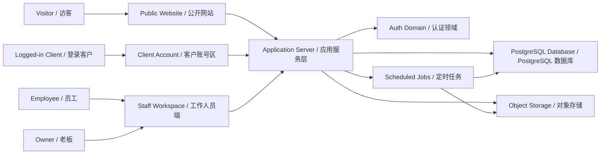
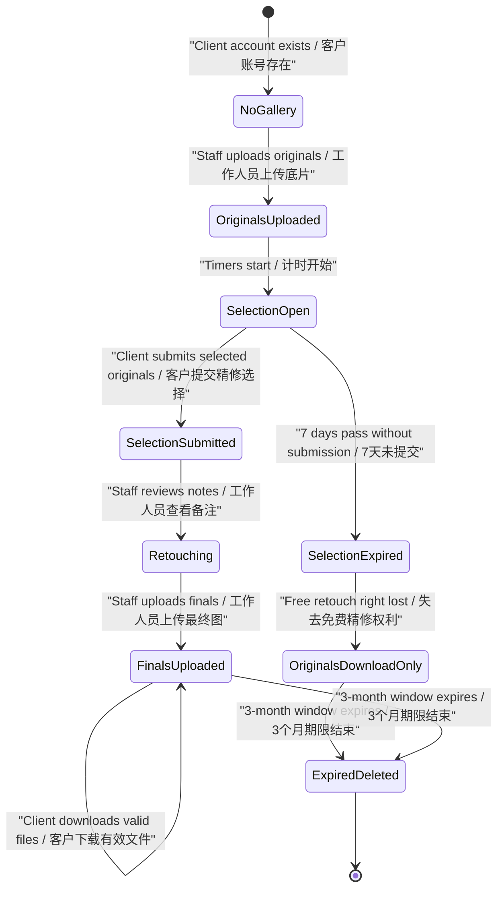

# Technical Architecture Draft / 技术架构草案

## Document Purpose / 文档目的

This document proposes a first technical architecture direction for the future DARIA STUDIO platform. It translates the product scope, role model, user flows, user stories, acceptance criteria, content model, and data model draft into an implementation-oriented plan.

本文档为未来 DARIA STUDIO 正式平台提出第一版技术架构方向。它把产品范围、角色模型、用户流程、用户故事、验收标准、内容模型和数据模型草案转化为面向实现的规划。

This is still a draft. It should guide stack selection and private-repository development, but it is not production code and does not finalize every provider, table, API route, or deployment detail.

本文档仍然是草案。它用于指导技术选型和私有仓库开发，但不是生产代码，也不最终锁定每一个服务商、数据表、API 路由或部署细节。

## Architecture Status / 架构状态

Confirmed:

已确认：

- The public showcase repository remains for wiki, prototypes, public sample assets, and GitHub Pages deployment.
- Real application code belongs in the private `daria-studio-platform` repository.
- The product has one customer-facing website and one staff-facing workspace.
- Staff roles are fixed as `owner` and `employee`.
- Client accounts and staff accounts are separate concepts.
- Customer-facing and staff-facing UI should support Simplified Chinese and English.
- Public pricing only estimates price and generates a read-only copyable inquiry summary.
- Online booking, payment, deposit, and calendar scheduling are out of scope for now.
- Client photo delivery is part of the later product design and must be accounted for architecturally.
- Production deployment should use Tencent Cloud. The exact Tencent Cloud server product is not selected yet.
- The frontend stack is confirmed as Next.js + React with light TypeScript.
- The backend stack is confirmed as Python FastAPI using a front-end/back-end separated architecture.
- The authentication implementation is confirmed as FastAPI-managed email/password auth with server-side cookie sessions.

- 公开展示仓库继续用于 wiki、原型、公开样片素材和 GitHub Pages 部署。
- 真实应用代码应放在私有仓库 `daria-studio-platform`。
- 产品包含一个客户端网站和一个工作人员端。
- 工作人员角色固定为 `owner` 和 `employee`。
- 客户账号与工作人员账号是分离概念。
- 客户端和工作人员端界面都应支持简体中文和英文。
- 公开价格页目前只做估价和只读咨询信息一键复制。
- 在线预约、付款、定金和日历排期暂不做。
- 客户照片交付属于后续产品设计，但架构阶段必须预留。
- 生产部署使用腾讯云。具体使用哪一种腾讯云服务器产品暂未确定。
- 前端技术栈已确认为 Next.js + React + 轻量 TypeScript。
- 后端技术栈已确认为 Python FastAPI，并采用前后端分离架构。
- 认证实现已确认为 FastAPI 管理的邮箱密码认证和服务端 cookie 会话。

Recommended, but still replaceable:

推荐方向，但仍可替换：

- Next.js + React frontend with light TypeScript for public pages, client account pages, and staff workspace.
- Python FastAPI backend for a front-end/back-end separated architecture.
- Tencent Cloud as the production cloud provider.
- Managed PostgreSQL for relational business data.
- Tencent Cloud COS or another private object storage layer for client originals, final retouched photos, and generated download packages.
- Scheduled background jobs for expiration, cleanup, and download package maintenance.

- 使用 Next.js + React + 轻量 TypeScript 前端承载公开页面、客户账号页面和工作人员端。
- 使用 Python FastAPI 后端，并采用前后端分离架构。
- 生产云服务商使用腾讯云。
- 使用托管 PostgreSQL 存储关系型业务数据。
- 使用腾讯云 COS 或其他私有对象存储保存客户底片、最终精修图和生成的下载压缩包。
- 使用定时后台任务处理过期、清理和下载压缩包维护。

## Architecture Principles / 架构原则

- Keep prototype code and production code separate.
- Keep public website content, client gallery delivery data, authentication data, and staff operations as separate domains.
- Store business rules as canonical values, then localize display.
- Enforce permissions on the server, not only in the UI.
- Make every private file access temporary, permission-checked, and auditable.
- Derive countdowns and expiry behavior from server timestamps.
- Prefer managed infrastructure for the first version so the studio can ship and maintain the product with less operational burden.
- Avoid implementing online booking, payment, or calendar features until they become explicit scope.

- 保持原型代码与生产代码分离。
- 将公开网站内容、客户相册交付数据、认证数据和工作人员操作分为不同领域。
- 业务规则保存为标准值，再做本地化展示。
- 权限必须在服务端执行，不能只依赖前端隐藏按钮。
- 私有文件访问必须是临时的、经过权限校验的，并可审计。
- 倒计时和过期行为从服务端时间戳推导。
- 第一版优先使用托管基础设施，降低工作室上线和维护负担。
- 在线预约、付款和日历功能在明确进入范围前不实现。

## Recommended System Shape / 推荐系统形态

The future platform should be one private application with multiple route groups rather than several unrelated apps.

未来正式平台建议是一套私有应用，内部用多个路由分组承载不同使用端，而不是拆成多个互不相干的应用。

Primary frontend route groups:

主要前端路由分组：

| Route Group | Purpose |
| --- | --- |
| `/` | Customer-facing public website |
| `/account` | Logged-in client account and future photo delivery |
| `/staff` | Staff workspace for employee and owner |
| `/api/*` | Frontend API proxy or typed client boundary if needed |

| 路由分组 | 用途 |
| --- | --- |
| `/` | 客户可见公开网站 |
| `/account` | 登录客户账号区和后续照片交付 |
| `/staff` | 员工和老板使用的工作人员端 |
| `/api/*` | 如有需要，用作前端 API 代理或类型化客户端边界 |

## Repository Boundary / 仓库边界

`daria-studio-showcase`:

`daria-studio-showcase`：

- Product documentation.
- High-fidelity prototypes.
- Public sample assets that are safe to show.
- GitHub Pages or prototype deployment configuration.
- No production authentication, database, storage, API, CMS, or staff workspace implementation.

- 产品文档。
- 高保真原型。
- 可以公开展示的样片素材。
- GitHub Pages 或原型部署配置。
- 不放生产认证、数据库、文件存储、API、CMS 或工作人员端实现。

`daria-studio-platform`:

`daria-studio-platform`：

- Production customer-facing website.
- Production client account area.
- Production staff workspace.
- Python FastAPI backend APIs.
- Database schema and migrations.
- Authentication integration.
- Private file storage integration.
- Background jobs and deployment configuration.

- 正式客户端网站。
- 正式客户账号区。
- 正式工作人员端。
- Python FastAPI 后端 API。
- 数据库结构和迁移。
- 认证集成。
- 私有文件存储集成。
- 后台任务和部署配置。

## Candidate Technology Stack / 候选技术栈

Recommended first implementation stack:

第一版推荐实现栈：

| Layer | Recommended Direction | Reason |
| --- | --- | --- |
| Frontend | Next.js + React with light TypeScript | Confirmed direction for public pages, client account pages, and staff workspace |
| Backend | Python FastAPI | Confirmed direction for APIs, file processing, zip generation, and scheduled jobs |
| Database | TencentDB for PostgreSQL, TDSQL-C for PostgreSQL, or another managed PostgreSQL option | Fits relational content, users, roles, galleries, selections, and audit records |
| ORM or query layer | SQLAlchemy or SQLModel | Fits the confirmed Python backend direction |
| Auth | FastAPI-managed email/password authentication with server-side cookie sessions | Supports client self-registration, staff login, backend authorization, and Tencent Cloud deployment |
| Object storage | Tencent Cloud COS or another private S3-compatible storage layer | Supports originals, finals, generated zip packages, signed URLs, and deletion jobs |
| Background jobs | Backend scheduled job, Tencent Cloud SCF timer trigger, or worker queue | Needed for 7-day status updates, 3-month deletion, and zip generation cleanup |
| Hosting / compute | Tencent Cloud; exact server type TBD, such as Lighthouse, CVM, container service, or serverless | Must match backend runtime, background jobs, storage, and maintenance needs |
| Testing | Unit, integration, end-to-end, and permission tests | Needed because permissions and file access are core risk areas |

| 层级 | 推荐方向 | 原因 |
| --- | --- | --- |
| 前端 | Next.js + React + 轻量 TypeScript | 已确认用于公开页面、客户账号页和工作人员端 |
| 后端 | Python FastAPI | 已确认用于 API、文件处理、压缩包生成和定时任务 |
| 数据库 | TencentDB for PostgreSQL、TDSQL-C for PostgreSQL 或其他托管 PostgreSQL | 适合内容、用户、角色、相册、选片和审计等关系型数据 |
| ORM 或查询层 | SQLAlchemy 或 SQLModel | 符合已确认的 Python 后端方向 |
| 认证 | FastAPI 管理的邮箱密码认证和服务端 cookie 会话 | 支持客户自主注册、工作人员登录、后端授权和腾讯云部署 |
| 对象存储 | 腾讯云 COS 或其他私有 S3 兼容存储 | 支持底片、最终图、压缩包、临时签名链接和删除任务 |
| 后台任务 | 后端定时任务、腾讯云 SCF 定时触发或 worker 队列 | 用于 7 天状态更新、3 个月删除和压缩包清理 |
| 部署 / 计算 | 腾讯云；具体服务器类型待定，例如 Lighthouse、CVM、容器服务或 Serverless | 需要匹配后端运行时、后台任务、存储和维护需求 |
| 测试 | 单元、集成、端到端和权限测试 | 权限和文件访问是核心风险点 |

With Tencent Cloud and Python FastAPI confirmed, the most practical MVP candidate is to keep compute, database, object storage, and scheduled jobs inside Tencent Cloud where possible. The exact server product should be selected after confirming traffic expectations, budget, maintenance preference, and how the FastAPI service, frontend build, and background jobs will be deployed.

在已经确认腾讯云和 Python FastAPI 后端方向后，第一版 MVP 最实际的候选方案，是尽量让计算、数据库、对象存储和定时任务都留在腾讯云体系内。具体服务器产品应在确认访问量预期、预算、维护偏好，以及 FastAPI 服务、前端构建产物和后台任务如何部署后再决定。

## Front-end / Back-end Separation Boundary / 前后端分离边界

The confirmed implementation direction separates the frontend application from the backend API service.

已确认的实现方向是前端应用与后端 API 服务分离。

Frontend responsibilities:

前端职责：

- Render the public website, client account area, and staff workspace.
- Manage page-level interaction state, such as pricing selections and active language.
- Display server-provided gallery, pricing, account, and delivery data.
- Show live countdowns based on server timestamps.
- Call FastAPI endpoints for authenticated data and mutations.
- Never make final permission or expiry decisions by itself.

- 渲染公开网站、客户账号区和工作人员端。
- 管理页面级交互状态，例如价格选择和当前语言。
- 展示服务端返回的作品、价格、账号和交付数据。
- 根据服务端时间戳显示实时倒计时。
- 调用 FastAPI 接口获取认证数据并执行写操作。
- 不独自做最终权限或过期判断。

Backend responsibilities:

后端职责：

- Own business rules, permission checks, account boundaries, and lifecycle decisions.
- Serve resource-oriented APIs to the frontend.
- Validate pricing content mutations, gallery mutations, file limits, retouch quotas, and note length.
- Manage database reads and writes.
- Issue scoped upload and download access for private files.
- Generate or coordinate zip packages.
- Run or coordinate scheduled expiry and deletion jobs.
- Record audit events for sensitive staff and file operations.

- 负责业务规则、权限校验、账号边界和生命周期判断。
- 向前端提供面向资源的 API。
- 校验价格内容修改、相册修改、文件限制、精修数量和备注长度。
- 管理数据库读写。
- 为私有文件签发受限上传和下载访问。
- 生成或协调压缩包。
- 运行或协调定时过期和删除任务。
- 记录敏感工作人员操作和文件操作审计事件。

## Application Domains / 应用领域划分

The application should be organized by business domains instead of only by page names.

应用内部建议按业务领域组织，而不是只按页面名称组织。

| Domain | Owns |
| --- | --- |
| `public-content` | Gallery categories, public gallery images, studio shoot display sets, page copy, publish state |
| `pricing` | Service areas, service types, schools, scene types, packages, add-ons, estimate rules |
| `localization` | Fixed copy keys, localized content fields, formatting helpers |
| `accounts` | Client profiles, staff profiles, sessions, password recovery, role checks |
| `client-galleries` | Gallery records, original photos, retouch selections, notes, final photos |
| `storage` | Upload validation, object references, signed URLs, generated packages, deletion |
| `audit` | Content changes, staff gallery operations, download events, deletion events |

| 领域 | 负责内容 |
| --- | --- |
| `public-content` | 作品分类、公开作品图片、棚拍展示集、页面文案、发布状态 |
| `pricing` | 服务地区、服务类型、学校、场景类型、套餐、加购项、估价规则 |
| `localization` | 固定文案键、本地化内容字段、格式化工具 |
| `accounts` | 客户资料、工作人员资料、会话、密码找回、角色校验 |
| `client-galleries` | 客户相册、底片、精修选择、修图备注、最终精修图 |
| `storage` | 上传校验、对象引用、签名链接、压缩包、删除 |
| `audit` | 内容修改、工作人员相册操作、下载事件、删除事件 |

## Authentication Architecture / 认证架构

Client registration should be self-service by email. Staff accounts should not be self-service; they should be created or enabled through the owner/admin path.

客户注册应通过邮箱自主完成。工作人员账号不应自主注册，应通过老板或管理员路径创建或启用。

Recommended model:

推荐模型：

- Use one FastAPI-managed auth identity model, but keep separate profile records for clients and staff.
- A user with a client profile does not automatically gain staff access.
- A staff profile has one fixed role: `owner` or `employee`.
- Role permissions are hard-coded in the first product scope, with no permission editor.
- Staff login routes must reject users that only have client profiles.
- Password hashes are stored only in auth identity records.
- Browser login uses backend-managed opaque server-side sessions.
- Session cookies must be Secure, HTTP-only, and SameSite.
- Cookie-authenticated state-changing requests must use CSRF protection.
- Password reset and email verification tokens are hashed, single-use, and time-limited.
- Owner bootstrap should be a one-time deployment or admin operation, then owner can manage employee accounts.

- 使用同一个由 FastAPI 管理的认证身份模型，但客户资料和工作人员资料分开保存。
- 拥有客户资料的用户不会自动获得工作人员端权限。
- 工作人员资料只有一个固定角色：`owner` 或 `employee`。
- 第一阶段角色权限写成固定规则，不提供权限编辑器。
- 工作人员登录路由必须拒绝只有客户资料的用户。
- 密码哈希只保存在认证身份记录中。
- 浏览器登录使用后端管理的不透明服务端会话。
- 会话 cookie 必须使用 Secure、HTTP-only 和 SameSite。
- 使用 cookie 认证的写操作必须使用 CSRF 防护。
- 密码重置和邮箱验证 token 必须哈希存储、一次性使用，并有时间限制。
- 老板账号初始化应作为一次性部署或管理操作完成，之后由老板管理员工账号。

Server-side checks:

服务端校验：

- Every staff route verifies authenticated user, staff profile, and fixed role.
- Every owner-only mutation verifies `role = owner`.
- Every employee delivery mutation verifies `role in [employee, owner]`.
- Every client gallery read verifies the gallery belongs to the logged-in client.
- Every private file download request verifies account, role, gallery ownership, expiry, and file status before issuing a temporary link.

- 每个工作人员端路由都校验认证用户、工作人员资料和固定角色。
- 每个仅老板可执行的写操作都校验 `role = owner`。
- 每个员工交付类写操作都校验 `role in [employee, owner]`。
- 每个客户相册读取都校验相册属于当前登录客户。
- 每个私有文件下载请求在签发临时链接前，都校验账号、角色、相册归属、过期时间和文件状态。

## Authorization Matrix / 权限矩阵

| Capability | Visitor | Client | Employee | Owner |
| --- | --- | --- | --- | --- |
| Browse public website | Yes | Yes | Yes | Yes |
| Use pricing estimate and copy inquiry summary | Yes | Yes | Yes | Yes |
| Register client account | Yes | No | No | No |
| View own client galleries | No | Own only | Delivery minimum | All |
| Upload or edit original photos | No | No | Yes | Yes |
| View submitted retouch notes | No | Own submitted | Yes | Yes |
| Upload final retouched photos | No | No | Yes | Yes |
| Edit public website content | No | No | No | Yes |
| Manage staff accounts | No | No | No | Yes |
| Configure custom permissions | No | No | No | No |

| 能力 | 访客 | 客户 | 员工 | 老板 |
| --- | --- | --- | --- | --- |
| 浏览公开网站 | 是 | 是 | 是 | 是 |
| 使用估价和复制咨询信息 | 是 | 是 | 是 | 是 |
| 注册客户账号 | 是 | 否 | 否 | 否 |
| 查看自己的客户相册 | 否 | 仅自己 | 交付所需最少信息 | 全部 |
| 上传或编辑底片 | 否 | 否 | 是 | 是 |
| 查看已提交修图备注 | 否 | 自己已提交内容 | 是 | 是 |
| 上传最终精修图 | 否 | 否 | 是 | 是 |
| 编辑公开网站内容 | 否 | 否 | 否 | 是 |
| 管理工作人员账号 | 否 | 否 | 否 | 是 |
| 配置自定义权限 | 否 | 否 | 否 | 否 |

## Data Architecture / 数据架构

The production database should start from the entities defined in `content-model.md` and `data-model-draft.md`, then convert them into a real schema only after the technical stack is chosen.

生产数据库应从 `content-model.md` 和 `data-model-draft.md` 已定义的实体出发，在技术栈确定后再转换为真实数据库结构。

Core data groups:

核心数据组：

- Public content: gallery categories, public gallery images, studio shoot display sets, public page copy.
- Pricing content: service areas, service types, schools, reusable scene types, packages, add-on groups, add-on items.
- Accounts: client profiles, staff profiles, role values, account status.
- Client delivery: client galleries, original photos, retouch selections, retouch notes, final retouched photos, generated download packages.
- System records: audit logs, content change logs, storage deletion logs, background job runs.

- 公开内容：作品分类、公开作品图片、棚拍展示集、公开页面文案。
- 价格内容：服务地区、服务类型、学校、可复用场景类型、套餐、加购分组、加购项。
- 账号：客户资料、工作人员资料、角色值、账号状态。
- 客户交付：客户相册、底片、精修选择、修图备注、最终精修图、生成的下载压缩包。
- 系统记录：审计日志、内容变更日志、存储删除日志、后台任务运行记录。

Important field rules:

重要字段规则：

- Customer-visible editable text stores Simplified Chinese and English values.
- Shared fields such as price, photo count, sort order, status, deadline, and file reference are not duplicated by language.
- Package included original photo count is numeric when applicable.
- Package included retouched photo count is numeric and drives the client retouch selection limit.
- Add-on retouch count is optional and only needed when an add-on changes retouch quota automatically.
- Scene type is a reusable general entity and can be linked to schools.
- Client gallery uses an internal identifier; title does not need to be displayed to the client.
- Client gallery does not have a completed status.

- 客户可见的可编辑文本保存简体中文和英文值。
- 价格、照片数量、排序、状态、截止时间和文件引用等共享字段不按语言重复。
- 如适用，套餐包含底片数量使用数字字段。
- 套餐包含精修数量使用数字字段，并驱动客户可选精修数量上限。
- 加购项精修数量是可选字段，仅在加购项会自动改变精修额度时需要。
- 场景类型是可复用通用实体，可以关联学校。
- 客户相册使用内部识别信息，不需要向客户显示标题。
- 客户相册不设置已完成状态。

## Storage Architecture / 文件存储架构

Storage should use separate buckets or clear prefixes for public assets and private delivery assets.

文件存储应使用独立 bucket 或清晰前缀区分公开素材和私有交付素材。

Storage groups:

存储分组：

| Group | Access | Examples |
| --- | --- | --- |
| Public gallery assets | Public or CDN-readable after publish | Public portfolio images, studio shoot display images |
| Private originals | Staff write, client read own valid files | Uploaded original photos |
| Private finals | Staff write, client read own valid files | Final retouched photos |
| Generated packages | Server write, client read own valid files | Zip packages for originals and finals |
| Temporary processing | Server-only | Upload staging, thumbnail generation, package building |

| 分组 | 访问方式 | 示例 |
| --- | --- | --- |
| 公开作品素材 | 发布后公开或 CDN 可读 | 公开作品图片、棚拍展示图 |
| 私有底片 | 工作人员写入，客户读取自己有效文件 | 已上传底片 |
| 私有最终图 | 工作人员写入，客户读取自己有效文件 | 最终精修图 |
| 已生成压缩包 | 服务端写入，客户读取自己有效文件 | 底片和最终图压缩包 |
| 临时处理区 | 仅服务端访问 | 上传暂存、缩略图生成、压缩包构建 |

Storage rules:

存储规则：

- Public gallery assets may be CDN-served after owner publish.
- Client originals, finals, and generated packages must not be public.
- Browser uploads should use scoped temporary upload links or server-mediated uploads.
- Browser downloads should use short-lived signed URLs or server-streamed files.
- File metadata in the database should store logical references, not hard-coded public URLs.
- Deletion must remove private originals, finals, and generated packages from product storage after the 3-month window.
- Audit records may keep non-file metadata such as gallery ID, staff actor, deletion time, and file count.

- 老板发布后的公开作品素材可以通过 CDN 访问。
- 客户底片、最终图和已生成压缩包不能公开访问。
- 浏览器上传应使用有范围限制的临时上传链接，或由服务端中转上传。
- 浏览器下载应使用短期签名链接或服务端文件流。
- 数据库中的文件元数据应保存逻辑引用，而不是硬编码公开 URL。
- 3 个月期限结束后，必须从产品存储中删除私有底片、最终图和已生成压缩包。
- 审计记录可以保留非文件元数据，例如相册 ID、操作员工、删除时间和文件数量。

## Photo Delivery Lifecycle / 照片交付生命周期

The client photo delivery system should be designed now even if it is not fully implemented in the first login-only milestone.

即使第一阶段只实现基础登录，也应现在就设计客户照片交付系统。

Lifecycle rules:

生命周期规则：

- The 7-day free retouch selection window starts when originals are uploaded and made available under the product rule.
- The 3-month download and deletion window starts from the same original photo timing source.
- The UI may show live countdowns, but server-side rules decide whether a selection or download is still valid.
- After retouch selection submission, the client cannot edit or unlock the selection.
- If staff edits an original gallery after submission, the staff workspace should show a confirmation message before applying the change.
- Final retouched photos use the same 3-month storage window as originals.
- When the 3-month window expires, originals, finals, and generated packages are deleted together from product storage.

- 7 天免费精修选择期从产品规则定义的底片上传并可用时间开始。
- 3 个月下载和删除期使用同一个底片时间来源开始计算。
- UI 可以实时显示倒计时，但是否还能选片或下载必须由服务端规则决定。
- 客户提交精修选择后，不能再修改，也不能通过产品流程解锁。
- 如果工作人员在客户提交后编辑底片相册，工作人员端应在应用修改前显示确认提示。
- 最终精修图与底片使用同一个 3 个月存储窗口。
- 3 个月期限结束时，底片、最终精修图和已生成压缩包一起从产品存储中删除。

## Background Jobs and Expiration / 后台任务与过期处理

Scheduled jobs are required because the product has time-based rules that must work even when no user is actively browsing.

产品存在基于时间的规则，即使没有用户正在浏览也必须执行，因此需要定时任务。

Required jobs:

必要任务：

| Job | Frequency | Responsibility |
| --- | --- | --- |
| Retouch selection expiry check | At least daily | Mark galleries where the 7-day selection window has passed without submission |
| Storage expiry deletion | At least daily | Delete originals, finals, and generated packages after the 3-month window |
| Zip cleanup | At least daily | Remove stale generated packages and failed processing artifacts |
| Reminder job | Optional later | Send deadline reminders if email notifications become in scope |

| 任务 | 频率 | 责任 |
| --- | --- | --- |
| 精修选择过期检查 | 至少每天一次 | 标记 7 天内未提交精修选择的相册 |
| 存储过期删除 | 至少每天一次 | 3 个月后删除底片、最终图和压缩包 |
| 压缩包清理 | 至少每天一次 | 清理陈旧压缩包和失败处理产物 |
| 提醒任务 | 后续可选 | 如果邮件提醒进入范围，则发送截止提醒 |

Job rules:

任务规则：

- Jobs must be idempotent, so re-running them does not duplicate side effects.
- Jobs should process records in small batches.
- Deletion jobs should record success, failure, and retry state.
- The UI should read current state from the database, not assume a client-side countdown completed the workflow.
- Product storage deletion should not depend only on storage-provider lifecycle rules; the application should also mark records expired and deleted.

- 任务必须是幂等的，重复运行不会造成重复副作用。
- 任务应小批量处理记录。
- 删除任务应记录成功、失败和重试状态。
- UI 应从数据库读取当前状态，不能假设前端倒计时完成就代表流程完成。
- 产品存储删除不能只依赖存储服务商生命周期规则；应用也应标记记录已过期并删除。

## Localization Architecture / 多语言架构

The architecture should implement the confirmed three-layer model.

架构应实现已确认的三层多语言模型。

Layer 1: fixed interface copy.

第一层：固定界面文案。

- Store as translation files or typed dictionaries in the codebase.
- Every key must have Simplified Chinese and English before release.
- Staff workspace and customer-facing UI both use this layer.

- 存为代码库中的翻译文件或类型化字典。
- 每个 key 发布前必须有简体中文和英文。
- 工作人员端和客户端 UI 都使用这一层。

Layer 2: editable business content.

第二层：可编辑业务内容。

- Store customer-visible editable text in bilingual fields.
- Use shared IDs and shared sort order across languages.
- Owner edits content through the staff workspace.
- Employees cannot edit this content.
- Publishing should warn or block when required translations are missing.

- 客户可见的可编辑文本存为双语字段。
- 不同语言共享 ID 和排序。
- 老板通过工作人员端编辑内容。
- 员工不能编辑这些内容。
- 必填翻译缺失时，发布应提醒或阻止。

Layer 3: localized formatting and display rules.

第三层：本地化格式和展示规则。

- Store canonical values for price, date, count, deadline, and status.
- Format values at render time based on selected language.
- Customer-entered notes are preserved as entered and are not auto-translated.
- Language switching keeps current page, selections, and notes.

- 价格、日期、数量、截止时间和状态存为标准值。
- 展示时根据当前语言格式化。
- 客户填写的备注保留原文，不自动翻译。
- 切换语言时保留当前页面、选择和备注。

## Public Content Management / 公开内容管理

Owner content management should be data-driven instead of hard-coded.

老板内容管理应数据驱动，而不是继续硬编码。

Owner capabilities:

老板能力：

- Manage gallery categories.
- Manage normal gallery images, with 0 to 20 images per normal category.
- Show selected-language empty copy when a normal category has 0 images.
- Manage the special studio shoot category with 0 to many display sets.
- Manage 1 to 9 images per published studio shoot display set.
- Reorder all public gallery images and studio shoot set images.
- Manage service areas, service types, schools, reusable scene types, packages, add-on groups, add-on items, sort order, price, and availability.
- Manage bilingual names, descriptions, details, alt text, and customer-visible helper copy.

- 管理作品分类。
- 管理普通作品分类图片，每个普通分类 0 到 20 张。
- 普通分类 0 张图片时显示当前语言的空状态文案。
- 管理特殊的棚拍分类，棚拍分类可有 0 到多个展示集。
- 每个已发布棚拍展示集管理 1 到 9 张图片。
- 调整所有公开作品图片和棚拍展示集图片顺序。
- 管理服务地区、服务类型、学校、可复用场景类型、套餐、加购分组、加购项、排序、价格和可用状态。
- 管理双语名称、说明、详情、图片替代文本和客户可见辅助文案。

Employee limitations:

员工限制：

- Employees cannot edit public website content.
- Employees cannot edit pricing content.
- Employees cannot publish, hide, reorder, or delete public gallery categories or public display images.

- 员工不能编辑公开网站内容。
- 员工不能编辑价格内容。
- 员工不能发布、隐藏、排序或删除公开作品分类和公开展示图片。

## Pricing and Inquiry Architecture / 价格与咨询信息架构

The pricing page should behave as a public calculator, not a booking or payment flow.

价格页应作为公开估价工具，而不是预约或付款流程。

Architecture rules:

架构规则：

- Pricing options are loaded from editable business content.
- Selections are held in client-side page state and can be represented in the URL only if privacy-safe.
- The estimated total is calculated from canonical price values and selected add-ons.
- The inquiry summary is generated from selected content, formatted values, and optional client notes.
- The summary text area is read-only and cannot be manually edited.
- Copy action copies the current generated summary.
- Login is not required for estimate or copy.
- No booking record is created from this public flow unless a future explicit booking feature is added.

- 价格选项从可编辑业务内容读取。
- 用户选择保存在前端页面状态中，只有在不涉及隐私时才可表达在 URL 中。
- 估算总价根据标准价格值和已选加购项计算。
- 咨询信息汇总由已选内容、格式化值和客户可选备注生成。
- 汇总文本框只读，不能手动编辑。
- 复制操作复制当前生成的汇总内容。
- 估价和复制不需要登录。
- 除非未来明确加入预约功能，否则公开价格流程不创建预约记录。

## API Boundary / API 边界

The first API contract should be resource-oriented and aligned with the user stories, but the exact routes can be drafted after this architecture document.

第一版 API 契约应面向资源，并与用户故事保持一致；具体路由可以在本技术架构文档之后再草拟。

Expected API groups:

预期 API 分组：

| Group | Examples |
| --- | --- |
| Public content read APIs | Gallery categories, gallery images, studio shoot sets, public page copy |
| Pricing read APIs | Service areas, service types, schools, scene types, packages, add-ons |
| Client account APIs | Registration, login state, own galleries, own downloads |
| Staff gallery APIs | Client list, gallery creation, original upload, final upload, status reads |
| Owner content APIs | Public content management, pricing management, staff account management |
| Storage APIs | Upload intent, download link creation, zip generation, deletion status |
| System APIs | Audit reads, job status, health checks |

| 分组 | 示例 |
| --- | --- |
| 公开内容读取 API | 作品分类、作品图片、棚拍展示集、公开页面文案 |
| 价格读取 API | 服务地区、服务类型、学校、场景类型、套餐、加购项 |
| 客户账号 API | 注册、登录状态、自己的相册、自己的下载 |
| 工作人员相册 API | 客户列表、创建相册、上传底片、上传最终图、读取状态 |
| 老板内容 API | 公开内容管理、价格管理、员工账号管理 |
| 存储 API | 上传意图、下载链接生成、压缩包生成、删除状态 |
| 系统 API | 审计读取、任务状态、健康检查 |

API design rules:

API 设计规则：

- Public read APIs may be cached.
- Authenticated APIs must use server-side session checks.
- Mutations must validate role, payload, ownership, lifecycle status, and file limits.
- Client retouch selection submission must be atomic.
- Retouch notes must enforce the 500-character limit and accepted text requirements.
- Staff gallery edits after client submission must require a confirmation flag.
- Download link generation must check the 3-month window every time.
- Deleted or expired file records must never generate download links.

- 公开读取 API 可以缓存。
- 认证 API 必须使用服务端会话校验。
- 写操作必须校验角色、请求数据、归属关系、生命周期状态和文件数量限制。
- 客户提交精修选择必须是原子操作。
- 修图备注必须校验 500 字限制和允许文本要求。
- 客户提交后工作人员编辑相册，必须要求确认标记。
- 生成下载链接时，每次都必须校验 3 个月有效期。
- 已删除或已过期的文件记录绝不能生成下载链接。

## Security and Privacy / 安全与隐私

The highest-risk areas are staff access, private file access, and long-lived photo storage.

最高风险区域是工作人员访问、私有文件访问和长期照片存储。

Security requirements:

安全要求：

- Use HTTPS everywhere.
- Never store plaintext passwords or reversible encrypted passwords.
- Hash passwords with Argon2id where available, with bcrypt only as a fallback.
- Send browser sessions through Secure, HTTP-only, SameSite cookies.
- Require CSRF protection for cookie-authenticated mutations.
- Keep production secrets outside the repository.
- Use environment variables or managed secret storage.
- Never expose service-role storage keys to the browser.
- Use short-lived signed URLs for private uploads and downloads.
- Validate file type, file size, count limits, and ownership before accepting uploads.
- Store only the minimum client information employees need for delivery.
- Log owner content changes and staff gallery file operations.
- Rate-limit login, registration, password reset, upload intent, and download link endpoints.
- Keep deleted file content out of application backups where practical by storing photos in object storage, not inside the database.

- 全站使用 HTTPS。
- 永远不保存明文密码或可逆加密密码。
- 密码哈希优先使用 Argon2id；仅在无法使用时以 bcrypt 作为备选。
- 浏览器会话通过 Secure、HTTP-only、SameSite cookie 传输。
- 使用 cookie 认证的写操作必须具备 CSRF 防护。
- 生产密钥不进入仓库。
- 使用环境变量或托管密钥存储。
- 永远不要把 service-role 存储密钥暴露给浏览器。
- 私有上传和下载使用短期签名链接。
- 接受上传前校验文件类型、大小、数量限制和归属关系。
- 员工只看到交付所需的最少客户信息。
- 记录老板内容修改和工作人员相册文件操作。
- 对登录、注册、密码重置、上传意图和下载链接接口做限流。
- 尽量避免把照片文件放入数据库备份，照片应存在对象存储中。

Privacy notes:

隐私说明：

- Public sample images need authorization review before production use.
- Client gallery files are private client assets, not public content.
- Staff audit logs should store who did what and when, without exposing unnecessary client personal data.
- Expired private files should be inaccessible immediately after product expiry, even if physical deletion is retried asynchronously.

- 公开样片在生产使用前需要授权复核。
- 客户相册文件是私有客户资产，不是公开内容。
- 工作人员审计日志应记录谁在何时做了什么，但不要暴露不必要的客户个人信息。
- 私有文件到期后应立即不可访问，即使物理删除需要异步重试。

## Deployment and Environments / 部署与环境

Production deployment direction:

生产部署方向：

- Tencent Cloud is the confirmed production cloud provider.
- The exact Tencent Cloud server product is not selected yet.
- The architecture should avoid assumptions that only work on Vercel, Cloudflare, Supabase hosting, or another non-Tencent deployment platform.
- Tencent Cloud COS is the preferred object storage candidate for production private photo assets.
- TencentDB for PostgreSQL or TDSQL-C for PostgreSQL should be evaluated as managed database candidates.
- Tencent Cloud SCF can be evaluated for scheduled jobs or isolated file-processing tasks, but does not need to be the primary web server in the first version.

- 腾讯云是已经确认的生产云服务商。
- 具体使用哪一种腾讯云服务器产品暂未确定。
- 架构不应依赖只有 Vercel、Cloudflare、Supabase Hosting 或其他非腾讯云部署平台才成立的能力。
- 腾讯云 COS 是生产私有照片资产的优先对象存储候选。
- TencentDB for PostgreSQL 或 TDSQL-C for PostgreSQL 应作为托管数据库候选进行评估。
- 腾讯云 SCF 可用于评估定时任务或独立文件处理任务，但第一版不必作为主 Web 服务。

Tencent Cloud server options:

腾讯云服务器选项：

| Option | Best Fit | Tradeoff |
| --- | --- | --- |
| Lighthouse | Early MVP, lower traffic, simpler operation, one small server running frontend/backend through Docker or process manager | Easiest to start, but less flexible than CVM for advanced networking and scaling |
| CVM | More controlled production server, Docker Compose, Nginx, separate frontend/backend processes, stronger upgrade path | More system administration responsibility |
| Container service | Later scaling, more formal deployment pipeline, multiple services and workers | More infrastructure complexity than the first version needs |
| SCF / Serverless | Scheduled cleanup, file processing, small isolated tasks | Useful as a helper layer, but not necessarily the simplest primary app runtime |

| 选项 | 适合场景 | 取舍 |
| --- | --- | --- |
| Lighthouse 轻量应用服务器 | 早期 MVP、访问量较低、运维更简单，一台小服务器通过 Docker 或进程管理运行前后端 | 启动最容易，但高级网络和扩展能力不如 CVM 灵活 |
| CVM 云服务器 | 更可控的生产服务器、Docker Compose、Nginx、前后端独立进程、更好的升级路径 | 需要承担更多系统运维责任 |
| 容器服务 | 后续扩展、更正式的部署流水线、多服务和 worker | 对第一版来说基础设施复杂度更高 |
| SCF / Serverless | 定时清理、文件处理、小型独立任务 | 适合作为辅助层，但不一定是第一版主应用运行时的最简单选择 |

Current recommendation:

当前建议：

- If the first production version is intentionally small, start with Tencent Cloud Lighthouse plus Tencent Cloud COS and managed PostgreSQL.
- If the first production version needs more control, use Tencent Cloud CVM plus Tencent Cloud COS and managed PostgreSQL.
- Keep client photo files in COS instead of storing them on the server disk.
- Use the server disk only for temporary processing, cache, logs, and deploy artifacts.

- 如果第一版生产环境刻意保持小而简单，优先考虑腾讯云 Lighthouse + 腾讯云 COS + 托管 PostgreSQL。
- 如果第一版生产环境需要更高控制力，使用腾讯云 CVM + 腾讯云 COS + 托管 PostgreSQL。
- 客户照片文件应放在 COS 中，不应长期存放在服务器磁盘。
- 服务器磁盘只用于临时处理、缓存、日志和部署产物。

Recommended environments:

推荐环境：

| Environment | Purpose |
| --- | --- |
| Local | Developer implementation and automated test runs |
| Preview or staging | Review real app behavior before production |
| Production | Live customer and staff use |

| 环境 | 用途 |
| --- | --- |
| Local | 开发实现和自动化测试 |
| Preview 或 Staging | 上线前检查真实应用行为 |
| Production | 客户和工作人员正式使用 |

Deployment rules:

部署规则：

- The public showcase repo can continue deploying prototypes or documentation separately.
- The private platform repo should own production deployment.
- Each environment should have separate database, storage buckets, auth settings, and secrets.
- Production deployment should require successful build, type check, lint, tests, and migration validation.
- Migrations should be reviewed before production deployment.
- Background jobs must be enabled only for the intended environment.

- 公开展示仓库可以继续独立部署原型或文档。
- 私有平台仓库负责生产部署。
- 每个环境应有独立数据库、存储 bucket、认证设置和密钥。
- 生产部署前应通过构建、类型检查、lint、测试和迁移校验。
- 数据迁移在进入生产前应经过复核。
- 后台任务只应在目标环境启用。

## Observability and Operations / 可观测性与运维

The studio needs operational visibility even for a small first version.

即使第一版规模较小，工作室也需要基本运维可见性。

Recommended tracking:

建议跟踪：

- Application errors.
- Failed uploads.
- Failed downloads.
- Failed zip generation.
- Failed deletion attempts.
- Login and password reset anomalies.
- Staff content and gallery operations.
- Background job duration and retry count.

- 应用错误。
- 上传失败。
- 下载失败。
- 压缩包生成失败。
- 删除失败。
- 登录和密码重置异常。
- 工作人员内容和相册操作。
- 后台任务耗时和重试次数。

## Testing Strategy / 测试策略

Testing should focus first on business-critical rules and privacy boundaries.

测试应优先覆盖业务关键规则和隐私边界。

Required test areas:

必要测试范围：

- Bilingual display and language switching.
- Pricing estimate calculation and read-only inquiry summary generation.
- Owner-only public content management.
- Employee restrictions on public website content.
- Client self-registration and login.
- Staff login and role rejection for client-only accounts.
- Client gallery ownership enforcement.
- Photo count limits for public galleries and studio shoot display sets.
- Original photo upload, edit, reorder, and delete rules.
- Retouch selection quota and 500-character note validation.
- Submission locking.
- 7-day retouch expiry behavior.
- 3-month download expiry and storage deletion behavior.
- Signed URL generation refusal after expiry or deletion.

- 双语展示和切换语言。
- 估价计算和只读咨询信息汇总生成。
- 仅老板可管理公开内容。
- 员工不能编辑公开网站内容。
- 客户自主注册和登录。
- 工作人员登录，以及仅客户账号访问工作人员端时被拒绝。
- 客户相册归属校验。
- 普通作品和棚拍展示集照片数量限制。
- 底片上传、编辑、排序和删除规则。
- 精修选择数量和 500 字备注校验。
- 提交后锁定。
- 7 天精修选择过期行为。
- 3 个月下载过期和存储删除行为。
- 过期或删除后拒绝生成签名链接。

## Implementation Phases / 实现阶段

The detailed product MVP release sequence is defined in `wiki/product/mvp-roadmap.md`. This section remains a technical architecture summary.

详细产品 MVP 发布顺序见 `wiki/product/mvp-roadmap.md`。本节保留为技术架构摘要。

Phase 0: Architecture confirmation.

阶段 0：确认架构。

- Confirm framework, database, auth implementation, storage provider, hosting, and background job provider.
- Create or prepare the private `daria-studio-platform` implementation workspace.
- Convert content model and data model draft into real schema planning.

- 确认框架、数据库、认证实现、存储服务、部署平台和后台任务方案。
- 创建或准备私有 `daria-studio-platform` 实现工作区。
- 将内容模型和数据模型草案转换为真实 schema 规划。

Phase 1: Public website and login MVP.

阶段 1：公开网站与登录 MVP。

- Build bilingual public website from editable business content.
- Build pricing estimate and read-only copyable inquiry summary.
- Build client self-registration and login.
- Build staff login and fixed role checks.
- Build owner-only public content management foundation.
- Keep photo delivery data model prepared, even if not fully active.

- 基于可编辑业务内容构建双语公开网站。
- 构建估价和只读咨询信息一键复制。
- 构建客户自主注册和登录。
- 构建工作人员登录和固定角色校验。
- 构建仅老板可用的公开内容管理基础。
- 预留照片交付数据模型，即使暂不完整启用。

Phase 2: Staff delivery workflow.

阶段 2：工作人员交付流程。

- Build client list with minimum delivery-needed client information.
- Build client gallery creation and original photo upload.
- Build employee gallery editing at any time.
- Build client gallery viewing and original download package.
- Build 7-day retouch selection countdown and submission lock.

- 构建只显示交付所需最少信息的客户列表。
- 构建客户相册创建和底片上传。
- 构建员工随时编辑底片相册。
- 构建客户查看相册和底片压缩包下载。
- 构建 7 天精修选择倒计时和提交锁定。

Phase 3: Final retouched delivery and deletion.

阶段 3：最终精修图交付与删除。

- Build staff upload for final retouched photos.
- Build client final photo viewing and download package.
- Build 3-month live countdown display.
- Build scheduled deletion for originals, finals, and generated packages.
- Build deletion audit and retry handling.

- 构建工作人员上传最终精修图。
- 构建客户查看最终图和压缩包下载。
- 构建 3 个月实时倒计时展示。
- 构建底片、最终图和压缩包的定时删除。
- 构建删除审计和失败重试处理。

## Open Technical Decisions / 待确认技术决策

- Which Tencent Cloud server product should production use first: Lighthouse, CVM, container service, or serverless?
- Should the database use TencentDB for PostgreSQL, TDSQL-C for PostgreSQL, or another managed PostgreSQL option?
- Which ORM or query layer should be used after database provider selection?
- What maximum upload size, file type list, and image processing requirements should production support?
- Should generated zip packages be built synchronously for small galleries, or always through a background worker?
- What is the exact backup retention policy for database metadata and storage audit logs?
- Should public content publishing use save-and-publish, or a draft-review-publish workflow?
- Which email delivery provider should send account verification and password reset emails, and should deadline reminders and delivery completion emails be included in the first release?
- What exact operational runbook should bootstrap the first owner account securely?

- 生产环境应优先使用哪一种腾讯云服务器产品：Lighthouse、CVM、容器服务，还是 Serverless？
- 数据库应使用 TencentDB for PostgreSQL、TDSQL-C for PostgreSQL，还是其他托管 PostgreSQL 方案？
- 数据库服务商确认后，应选择哪一种 ORM 或查询层？
- 生产环境需要支持的最大上传大小、文件类型列表和图片处理需求是什么？
- 生成压缩包时，小相册是否可同步生成，还是全部走后台 worker？
- 数据库元数据和存储审计日志的具体备份保留策略是什么？
- 公开内容发布流程使用保存即发布，还是草稿-复核-发布？
- 哪个邮件发送服务商负责账号验证和密码重置邮件，截止提醒和交付完成邮件是否进入第一版？
- 第一个老板账号应使用哪份具体运维流程安全初始化？

## External Technical References / 外部技术参考

These references support the feasibility of the draft, but they do not finalize vendor choice.

以下参考资料用于确认草案可行性，但不最终决定服务商选择。

- Next.js App Router: https://nextjs.org/docs/app
- FastAPI: https://fastapi.tiangolo.com/
- Tencent Cloud Lighthouse: https://intl.cloud.tencent.com/zh/products/lighthouse
- Tencent Cloud CVM overview: https://intl.cloud.tencent.com/document/product/1226/76565?lang=en
- Tencent Cloud COS: https://intl.cloud.tencent.com/zh/products/cos
- TencentDB for PostgreSQL: https://cloud.tencent.com/product/postgres
- Tencent Cloud SCF: https://cloud.tencent.com/document/product/583
- Tencent Cloud COS lifecycle configuration: https://www.tencentcloud.com/document/product/436/14605
- OWASP Password Storage Cheat Sheet: https://cheatsheetseries.owasp.org/cheatsheets/Password_Storage_Cheat_Sheet.html
- OWASP Session Management Cheat Sheet: https://cheatsheetseries.owasp.org/cheatsheets/Session_Management_Cheat_Sheet.html
- OWASP CSRF Prevention Cheat Sheet: https://cheatsheetseries.owasp.org/cheatsheets/Cross-Site_Request_Forgery_Prevention_Cheat_Sheet.html
