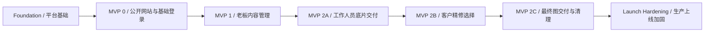

# MVP Roadmap / MVP 分期与开发路线图

## Document Purpose / 文档目的

This document defines the recommended MVP release sequence for the DARIA STUDIO platform. It turns the confirmed product scope, roles, user flows, user stories, acceptance criteria, architecture drafts, API contract, database schema draft, and ADRs into a practical development roadmap.

本文档定义 DARIA STUDIO 平台推荐的 MVP 发布顺序。它把已确认的产品范围、角色、用户流程、用户故事、验收标准、架构草案、API 契约、数据库 Schema 草案和 ADR 转换为可执行的开发路线图。

This is not a calendar schedule. It defines sequence, dependencies, scope boundaries, and release gates.

本文档不是日历排期。它定义开发顺序、依赖关系、范围边界和发布闸门。

## Roadmap Principles / 路线图原则

- Each MVP phase should be usable and testable by itself.
- Customer-facing and staff-facing interfaces remain bilingual from the first implementation.
- The public website can ship before the full photo delivery system, but its data model must not block later delivery work.
- Authentication and role boundaries must be implemented before any private client gallery or staff workspace feature.
- Owner website editing can ship after the public website first works with seeded content.
- Photo delivery should be built in smaller slices because it combines private files, deadlines, staff operations, client choices, and deletion rules.
- Online booking, online payment, deposit workflow, calendar scheduling, configurable staff permissions, and retouch selection unlock are not part of the current roadmap.

- 每一个 MVP 阶段都应能独立使用和测试。
- 客户端和工作人员端界面从第一版实现开始就保持中英双语。
- 公开网站可以早于完整照片交付系统上线，但其数据模型不能阻碍后续交付功能。
- 任何私有客户相册或工作人员端功能上线前，都必须先实现认证和角色边界。
- 公开网站可以先使用种子内容运行，老板网站编辑功能可以随后上线。
- 照片交付应拆成更小切片，因为它同时涉及私有文件、截止时间、工作人员操作、客户选择和删除规则。
- 在线预约、在线支付、定金流程、日历排期、可配置工作人员权限和精修选择解锁，不进入当前路线图。

## Phase Summary / 阶段总览

| Phase | Release Name | Main Goal | Primary Users | Related Stories |
| --- | --- | --- | --- | --- |
| Foundation | Platform Foundation | Prepare private implementation workspace, core app shell, database migration base, auth base, and deployment path | Developer, owner reviewer | ADR-001 to ADR-009 |
| MVP 0 | Public Website and Basic Login | Make the public website usable, support inquiry copy, and allow clients/staff to log in | Visitor, client, employee, owner | US-001 to US-013 |
| MVP 1 | Owner Content Management | Let the owner manage public website content and pricing without code changes | Owner, employee as restricted staff user | US-014 to US-017 |
| MVP 2A | Staff Original Delivery | Let staff create client galleries and upload/manage original photos | Employee, owner, client | US-018 to US-020, part of US-022, US-023, US-027 |
| MVP 2B | Client Retouch Selection | Let clients view originals, select included retouches, add notes, and submit once | Client, employee, owner | US-024 to US-028 |
| MVP 2C | Final Delivery and Cleanup | Let staff upload finals, clients download valid packages, and the system enforce 3-month deletion | Client, employee, owner | US-021, US-023, US-027, US-029 |
| Launch Hardening | Production Readiness | Strengthen security, operations, monitoring, backups, and failure recovery before real launch | Owner, developer, staff | Cross-cutting |

| 阶段 | 发布名称 | 主要目标 | 主要用户 | 相关用户故事 |
| --- | --- | --- | --- | --- |
| Foundation | 平台基础 | 准备私有实现仓库、核心应用壳、数据库迁移基础、认证基础和部署路径 | 开发者、老板审核者 | ADR-001 到 ADR-009 |
| MVP 0 | 公开网站与基础登录 | 让公开网站可用，支持咨询信息复制，并允许客户和工作人员登录 | 访客、客户、员工、老板 | US-001 到 US-013 |
| MVP 1 | 老板内容管理 | 让老板无需改代码即可管理公开网站内容和价格信息 | 老板，员工作为受限工作人员用户 | US-014 到 US-017 |
| MVP 2A | 工作人员底片交付 | 让工作人员创建客户相册并上传/管理底片 | 员工、老板、客户 | US-018 到 US-020，US-022、US-023、US-027 的一部分 |
| MVP 2B | 客户精修选择 | 让客户查看底片、选择套餐包含的精修、填写备注并提交一次 | 客户、员工、老板 | US-024 到 US-028 |
| MVP 2C | 最终图交付与清理 | 让工作人员上传最终图，客户下载有效压缩包，系统执行 3 个月删除 | 客户、员工、老板 | US-021、US-023、US-027、US-029 |
| Launch Hardening | 生产上线加固 | 正式上线前加强安全、运维、监控、备份和失败恢复 | 老板、开发者、工作人员 | 跨功能 |

## Foundation: Platform Foundation / Foundation：平台基础

### Goal / 目标

Create the private implementation base so later features do not have to be rebuilt.

创建私有实现基础，避免后续功能反复推倒重来。

### In Scope / 范围内

- Create or prepare the private `daria-studio-platform` repository as the real product codebase.
- Set up Next.js + React frontend with light TypeScript.
- Set up Python FastAPI backend.
- Set up front-end/back-end separation and local development workflow.
- Set up managed PostgreSQL direction with migration tooling.
- Create the first database migration skeleton from the schema draft.
- Implement the three-layer localization foundation: fixed UI copy, editable business content fields, and localized formatting helpers.
- Implement the auth foundation from ADR-009: `auth_identities`, sessions, password hashing, cookie session transport, and CSRF pattern.
- Prepare environment configuration and secret handling.
- Prepare a simple deployment path on Tencent Cloud, even if the exact production server product is still replaceable.
- Create baseline automated tests for health checks, localization loading, auth session creation, and role rejection.

- 创建或准备私有 `daria-studio-platform` 仓库作为真实产品代码库。
- 搭建 Next.js + React + 轻量 TypeScript 前端。
- 搭建 Python FastAPI 后端。
- 搭建前后端分离和本地开发流程。
- 按托管 PostgreSQL 方向准备数据库迁移工具。
- 基于 Schema 草案创建第一版数据库迁移骨架。
- 实现三层多语言基础：固定界面文案、可编辑业务内容字段、本地化格式化工具。
- 按 ADR-009 实现认证基础：`auth_identities`、会话、密码哈希、cookie 会话传输和 CSRF 模式。
- 准备环境配置和密钥管理。
- 准备腾讯云上的简单部署路径，即使具体生产服务器产品后续仍可替换。
- 创建健康检查、多语言加载、认证会话创建和角色拒绝的基础自动化测试。

### Not In Scope / 范围外

- Complete visual polish of all public pages.
- Owner content management UI.
- Real client photo delivery workflow.
- Production monitoring and full operations runbook.

- 完成所有公开页面的视觉打磨。
- 老板内容管理 UI。
- 真实客户照片交付流程。
- 生产监控和完整运维手册。

### Done Criteria / 完成标准

- Local frontend and backend run together.
- The database can migrate from empty state.
- A seeded owner account can log in.
- A client account can be created in development.
- Staff-only endpoints reject client-only accounts.
- Bilingual UI copy can be loaded from stable keys.
- A basic deployment smoke test can reach the app.

- 本地前端和后端可以一起运行。
- 数据库可以从空状态执行迁移。
- 种子老板账号可以登录。
- 开发环境可以创建客户账号。
- 工作人员接口会拒绝仅客户账号。
- 双语界面文案可以通过稳定 key 加载。
- 基础部署冒烟测试可以访问应用。

## MVP 0: Public Website and Basic Login / MVP 0：公开网站与基础登录

### Goal / 目标

Let visitors understand the studio, browse work, estimate pricing, copy inquiry information, and let clients/staff log in. This phase proves the customer-facing surface and account boundary.

让访客了解工作室、浏览作品、估算价格、复制咨询信息，并让客户和工作人员登录。此阶段验证客户可见界面和账号边界。

### In Scope / 范围内

- Bilingual public site shell based on the high-fidelity prototype direction.
- Language switching without losing current page, selections, or notes.
- Public gallery browsing.
- Normal gallery categories with 0 to 20 images.
- Empty state when a normal category has 0 images.
- Studio shoot category display.
- Studio shoot display sets with custom names.
- Studio shoot modal layout with up to 3 by 3 images, centered regardless of image count.
- Pricing flow with service area, service type, package, add-ons, and optional notes.
- Estimated total display.
- Read-only inquiry summary that updates with user choices and can be copied with one action.
- Client email self-registration, login, logout, and current session display.
- Staff login with fixed owner/employee role detection.
- Client-only accounts rejected from staff workspace.
- Basic `/account` empty state for clients with no galleries yet.
- Basic `/staff` empty state or dashboard shell for owner/employee after login.
- Public content can be loaded from seed data or admin seed scripts before the owner editor exists.

- 基于高保真原型方向实现双语公开网站壳。
- 切换语言时不丢失当前页面、选择或备注。
- 公开作品浏览。
- 普通作品分类支持 0 到 20 张图片。
- 普通分类 0 张图片时显示空状态。
- 棚拍分类展示。
- 棚拍展示集支持自定义名称。
- 棚拍展示弹窗最多 3 乘 3 排列，并且无论图片数量多少都居中。
- 价格流程支持服务地区、服务类型、套餐、加购项和可选备注。
- 展示估算总价。
- 只读咨询信息汇总随用户选择变化，并支持一键复制。
- 客户邮箱自主注册、登录、退出和当前会话显示。
- 工作人员登录，并识别固定老板/员工角色。
- 仅客户账号访问工作人员端时被拒绝。
- 客户 `/account` 区域在暂无相册时显示基础空状态。
- 老板/员工登录后看到基础 `/staff` 空状态或仪表盘壳。
- 老板编辑器上线前，公开内容可以先通过种子数据或管理种子脚本加载。

### Not In Scope / 范围外

- Owner UI for editing website content.
- Staff upload of client photos.
- Client retouch selection.
- Zip package generation for real client files.
- Automated 7-day or 3-month delivery timers.

- 老板编辑网站内容的 UI。
- 工作人员上传客户照片。
- 客户选择精修。
- 真实客户文件的压缩包生成。
- 自动 7 天或 3 个月交付计时。

### Done Criteria / 完成标准

- A visitor can complete public browsing and copy a complete inquiry summary without logging in.
- A client can register, log in, log out, and see an account empty state.
- A staff account can log in and reach the staff shell.
- A client-only account cannot access staff endpoints or staff pages.
- Public website copy, labels, and validation messages work in Simplified Chinese and English.
- The pricing summary field cannot be manually edited.
- Tests cover language switching, pricing summary generation, registration/login, and staff route rejection.

- 访客无需登录即可完成公开浏览并复制完整咨询信息。
- 客户可以注册、登录、退出，并看到账号空状态。
- 工作人员账号可以登录并进入工作人员端壳。
- 仅客户账号不能访问工作人员接口或工作人员页面。
- 公开网站文案、标签和校验提示支持简体中文和英文。
- 价格汇总文本框不能手动编辑。
- 测试覆盖语言切换、价格汇总生成、注册/登录和工作人员路由拒绝。

## MVP 1: Owner Content Management / MVP 1：老板内容管理

### Goal / 目标

Let the owner manage customer-facing website content and pricing content without developer edits. This phase turns the public website from seeded content into real managed content.

让老板无需开发者改代码即可管理客户可见网站内容和价格内容。此阶段把公开网站从种子内容变成真实可管理内容。

### In Scope / 范围内

- Owner-only access to public content management.
- Employee access to staff workspace remains allowed, but employees cannot edit customer-facing content.
- Add, edit, delete, and reorder normal gallery categories.
- Add, edit, delete, reorder, and publish/hide public gallery images.
- Enforce 0 to 20 images per normal gallery category.
- Show empty content state for published normal categories with 0 images.
- Manage the special studio shoot category.
- Add, edit, delete, and reorder studio shoot display sets.
- Add, delete, and reorder 1 to 9 images inside each published studio shoot display set.
- Edit custom names for studio shoot display sets.
- Manage service areas.
- Manage service types inside service areas.
- Manage schools and reusable scene types where needed for pricing.
- Manage packages, package details, add-on groups, add-on items, prices, availability, and sort order.
- Provide Chinese and English fields for customer-facing editable content.
- Show missing translation warnings before publishing.
- Audit owner content changes.
- Owner management of employee accounts if not already completed in Foundation or MVP 0.

- 仅老板可以访问公开内容管理。
- 员工仍可访问工作人员端，但不能编辑客户可见内容。
- 添加、编辑、删除和排序普通作品分类。
- 添加、编辑、删除、排序和发布/隐藏公开作品图片。
- 普通作品分类限制 0 到 20 张图片。
- 已发布普通分类 0 张图片时显示暂无内容状态。
- 管理特殊棚拍分类。
- 添加、编辑、删除和排序棚拍展示集。
- 每个已发布棚拍展示集内支持添加、删除、排序 1 到 9 张图片。
- 编辑棚拍展示集自定义名称。
- 管理服务地区。
- 管理服务地区下的服务类型。
- 按价格需要管理学校和可复用场景类型。
- 管理套餐、套餐详情、加购分组、加购项、价格、可用状态和排序。
- 客户可见可编辑内容提供中文和英文字段。
- 发布前提示缺失翻译。
- 记录老板内容修改审计。
- 如果 Foundation 或 MVP 0 未完成，则在本阶段实现老板管理员工账号。

### Not In Scope / 范围外

- Employee editing of public website content.
- Client gallery delivery.
- Real photo storage lifecycle for private customer galleries.
- Draft-review-publish workflow unless later confirmed.

- 员工编辑公开网站内容。
- 客户相册交付。
- 私有客户相册的真实照片存储生命周期。
- 草稿-复核-发布流程，除非后续确认。

### Done Criteria / 完成标准

- Owner can change gallery and pricing content from the staff workspace.
- Public site reflects published owner changes without code changes.
- Employee accounts cannot access owner-only content mutation APIs.
- Normal category and studio shoot image count rules are enforced by backend validation.
- Reordering works for categories, images, service areas, service types, packages, and add-ons.
- Missing required bilingual content blocks publishing or shows an explicit owner-facing warning according to the final publish rule.
- Tests cover owner-only edits, employee denial, image count limits, reordering, and bilingual editable fields.

- 老板可以从工作人员端修改作品和价格内容。
- 公开网站无需改代码即可展示老板发布的变更。
- 员工账号不能访问仅老板可用的内容修改 API。
- 普通分类和棚拍图片数量规则由后端校验。
- 作品分类、图片、服务地区、服务类型、套餐和加购项都可以排序。
- 缺失必要双语内容时，按最终发布规则阻止发布或向老板明确警告。
- 测试覆盖仅老板可编辑、员工被拒绝、图片数量限制、排序和双语可编辑字段。

## MVP 2A: Staff Original Delivery / MVP 2A：工作人员底片交付

### Goal / 目标

Start the private photo delivery workflow by letting staff create client galleries and upload/manage original photos. This phase begins the delivery lifecycle but does not yet require the client retouch selection workflow to be complete.

通过允许工作人员创建客户相册并上传/管理底片，启动私有照片交付流程。此阶段开始交付生命周期，但不要求客户精修选择流程已经完整。

### In Scope / 范围内

- Staff client list visible to all employees and owner, with only minimum delivery-needed client information.
- Staff lookup of client accounts by email.
- Create client gallery linked to an existing client account.
- Assign package or retouch quota metadata to the client gallery.
- Upload original photos to private object storage.
- Store original photo metadata in the database.
- Reorder original photos.
- Delete or replace original photos for delivery operations.
- Employees can edit original galleries at any time.
- If a client has already submitted retouch selections, staff original-gallery edits require a confirmation message before applying the change.
- Original upload starts the 7-day retouch selection clock and 3-month storage/download clock.
- Client account can view own gallery metadata and original photos if enabled for viewing.
- Generate or request original photo zip package within the valid 3-month window.
- Backend refuses private file access if account, ownership, status, or expiry checks fail.

- 所有员工和老板可以看到客户列表，但只显示交付所需最少客户信息。
- 工作人员可以通过邮箱查找客户账号。
- 创建关联到已有客户账号的客户相册。
- 为客户相册关联套餐或精修额度元数据。
- 上传底片到私有对象存储。
- 在数据库中保存底片元数据。
- 底片可排序。
- 为交付工作删除或替换底片。
- 员工可以随时编辑底片相册。
- 如果客户已提交精修选择，工作人员编辑底片相册前必须显示确认提示。
- 底片上传开始计算 7 天精修选择期和 3 个月存储/下载期。
- 客户账号可以在启用后查看自己的相册元数据和底片。
- 在有效 3 个月窗口内生成或请求底片压缩包。
- 如果账号、归属、状态或过期校验失败，后端拒绝私有文件访问。

### Not In Scope / 范围外

- Client retouch selection submission.
- Staff final retouched photo upload.
- Final retouched photo download package.
- Automated hard deletion job as a finished production process, though expiry fields should already exist.
- Staff-created client accounts unless a later decision changes client self-registration.

- 客户提交精修选择。
- 工作人员上传最终精修图。
- 最终精修图压缩包下载。
- 完整生产级自动硬删除任务，但过期字段应已存在。
- 工作人员创建客户账号，除非后续决策改变客户自主注册规则。

### Done Criteria / 完成标准

- Staff can find an existing client and create a gallery.
- Staff can upload, reorder, delete, and replace original photos.
- Private original photo files are not publicly reachable.
- Client can only access their own gallery.
- 7-day and 3-month timestamps are created from original availability time.
- Staff edits after client submission require explicit confirmation if a submitted selection exists.
- Tests cover staff access, client ownership, private file access denial, upload validation, reorder, delete, and timer creation.

- 工作人员可以找到已有客户并创建相册。
- 工作人员可以上传、排序、删除和替换底片。
- 私有底片文件不能被公开访问。
- 客户只能访问自己的相册。
- 7 天和 3 个月时间戳从底片可用时间生成。
- 如果已存在客户提交的精修选择，工作人员编辑时必须明确确认。
- 测试覆盖工作人员访问、客户归属、私有文件拒绝、上传校验、排序、删除和计时创建。

## MVP 2B: Client Retouch Selection / MVP 2B：客户精修选择

### Goal / 目标

Let clients choose the included free retouched photos, write per-photo retouch notes, and submit once within the 7-day window.

让客户在 7 天窗口内选择套餐包含的免费精修照片，为每张照片填写修图备注，并且只提交一次。

### In Scope / 范围内

- Client gallery page for own galleries.
- Live 7-day retouch selection countdown based on server timestamps.
- Live 3-month storage/download countdown based on server timestamps.
- Retouch quota driven by package or gallery metadata.
- Client can select up to the included free retouch quota.
- One optional or required note per selected original, according to final UX copy.
- Retouch note maximum 500 characters.
- Retouch notes accept Simplified Chinese, Traditional Chinese, English, mixed text, and corresponding punctuation.
- Client can submit selection once.
- Submitted selection is locked and cannot be edited or unlocked.
- 7-day countdown disappears after successful retouch submission.
- If 7 days expire without submission, client loses free retouch right.
- Staff can view submitted selected originals and notes.

- 客户相册页展示自己的相册。
- 基于服务端时间戳实时显示 7 天精修选择倒计时。
- 基于服务端时间戳实时显示 3 个月存储/下载倒计时。
- 精修额度由套餐或相册元数据驱动。
- 客户最多选择套餐包含的免费精修数量。
- 每张已选底片一条可选或必填备注，具体按最终 UX 文案决定。
- 修图备注最多 500 字。
- 修图备注接受简体、繁体、英文、混合文本和对应标点符号。
- 客户只能提交一次精修选择。
- 提交后选择锁定，不能修改，也不能解锁。
- 精修提交成功后，7 天倒计时消失。
- 如果 7 天过期且未提交，客户失去免费精修权利。
- 工作人员可以查看客户提交的已选底片和备注。

### Not In Scope / 范围外

- Unlocking or editing a submitted retouch selection.
- Paid extra retouch checkout.
- Staff changing the client's submitted notes.
- Final retouched photo upload and download.

- 解锁或编辑已提交的精修选择。
- 付费加购精修结账。
- 工作人员修改客户已提交备注。
- 最终精修图上传和下载。

### Done Criteria / 完成标准

- Client cannot submit more selected photos than the retouch quota.
- Client cannot submit after the 7-day window closes.
- Client cannot edit after submitting.
- Client sees no 7-day countdown after successful submission.
- Staff can read submitted selections and notes.
- Note length and accepted text rules are validated.
- Tests cover quota limits, 500-character notes, submission lock, deadline expiry, countdown visibility, and staff read access.

- 客户不能提交超过精修额度的照片。
- 7 天窗口关闭后客户不能提交。
- 客户提交后不能修改。
- 成功提交后客户不再看到 7 天倒计时。
- 工作人员可以读取已提交选择和备注。
- 备注长度和允许文本规则被校验。
- 测试覆盖额度限制、500 字备注、提交锁定、截止过期、倒计时可见性和工作人员读取。

## MVP 2C: Final Delivery and Cleanup / MVP 2C：最终图交付与清理

### Goal / 目标

Complete the photo delivery lifecycle: staff upload final retouched photos, clients download valid files, and the system deletes private assets after the 3-month window.

完成照片交付生命周期：工作人员上传最终精修图，客户下载有效文件，系统在 3 个月窗口后删除私有资产。

### In Scope / 范围内

- Staff review of submitted retouch selections.
- Staff upload of final retouched photos mapped to selected originals.
- Final retouched photo metadata and private storage objects.
- Client can view final retouched photos within the valid 3-month window.
- Client can download final retouched photos as a compressed package.
- Original photos, final retouched photos, and generated packages share the same 3-month timing source.
- 3-month countdown remains visible until storage expiry.
- Private file access is refused immediately after expiry.
- Scheduled deletion job removes originals, finals, and generated packages from product storage after the 3-month window.
- Audit records keep non-file metadata such as gallery ID, staff actor, deletion time, and file count.
- Deletion retries and failure logs for storage cleanup.

- 工作人员查看客户已提交的精修选择。
- 工作人员上传与已选底片一一对应的最终精修图。
- 保存最终精修图元数据和私有存储对象。
- 客户可以在有效 3 个月窗口内查看最终精修图。
- 客户可以一键下载最终精修图压缩包。
- 底片、最终精修图和已生成压缩包使用同一个 3 个月计时来源。
- 3 个月倒计时持续显示到存储过期。
- 过期后立即拒绝私有文件访问。
- 定时删除任务在 3 个月窗口后从产品存储中删除底片、最终图和已生成压缩包。
- 审计记录保留非文件元数据，例如相册 ID、操作员工、删除时间和文件数量。
- 存储清理具备删除重试和失败日志。

### Not In Scope / 范围外

- Restoring files after the 3-month expiry.
- Extending download windows manually.
- Unlocking expired free retouch rights.
- Full customer CRM beyond delivery-needed information.

- 3 个月过期后恢复文件。
- 手动延长下载期。
- 解锁已过期免费精修权利。
- 超出交付所需信息的完整客户 CRM。

### Done Criteria / 完成标准

- Staff can upload final retouched photos against selected originals.
- Client can download final photo package within the 3-month window.
- Expired files do not receive download links.
- Scheduled cleanup deletes originals, finals, and generated packages together.
- Deletion failures are visible to staff/admin operations through logs or status records.
- Tests cover final upload mapping, final package download, expiry refusal, cleanup job, and audit/deletion records.

- 工作人员可以为已选底片上传对应最终精修图。
- 客户可以在 3 个月窗口内下载最终图压缩包。
- 已过期文件不会获得下载链接。
- 定时清理会一起删除底片、最终图和已生成压缩包。
- 删除失败可以通过日志或状态记录被工作人员/管理员运维发现。
- 测试覆盖最终图映射上传、最终图压缩包下载、过期拒绝、清理任务和审计/删除记录。

## Launch Hardening / 生产上线加固

### Goal / 目标

Make the product safe enough for real clients, real staff, and real private photos.

让产品安全到可以服务真实客户、真实工作人员和真实私有照片。

### In Scope / 范围内

- HTTPS-only production configuration.
- Secure cookie settings for production domains.
- CSRF validation confirmed against actual frontend/backend domain setup.
- Login, registration, password reset, upload intent, and download link rate limiting.
- Email delivery provider selected for verification and password reset.
- Operational runbook for first owner bootstrap.
- Backup and restore plan for database metadata.
- Object storage lifecycle and deletion retry plan.
- Monitoring for failed background jobs, failed deletions, auth spikes, and storage errors.
- Staff-facing operational status for failed uploads, failed packages, and failed deletions.
- Privacy review of client information shown to employees.
- Public image authorization review before production use.

- 生产环境仅 HTTPS。
- 根据生产域名设置安全 cookie。
- 按真实前后端域名确认 CSRF 校验。
- 对登录、注册、密码重置、上传意图和下载链接做限流。
- 选择用于邮箱验证和密码重置的邮件发送服务商。
- 制定第一个老板账号初始化运维流程。
- 制定数据库元数据备份和恢复方案。
- 制定对象存储生命周期和删除重试方案。
- 监控后台任务失败、删除失败、认证异常峰值和存储错误。
- 工作人员端能看到上传失败、压缩包失败和删除失败等运维状态。
- 复核员工可见客户信息是否最小化。
- 生产使用公开样片前完成授权复核。

### Done Criteria / 完成标准

- A production-like environment can run the full smoke test suite.
- A test client gallery can move through original upload, selection, final upload, download, expiry refusal, and deletion in a shortened test window.
- Owner and employee permissions pass end-to-end tests.
- No private file can be downloaded without authenticated, authorized, unexpired access.
- The owner has a clear operational path for account setup, failed jobs, and storage deletion failures.

- 类生产环境可以运行完整冒烟测试套件。
- 测试客户相册可以在缩短测试窗口内完成底片上传、选片、最终图上传、下载、过期拒绝和删除。
- 老板和员工权限通过端到端测试。
- 没有私有文件可以在未认证、未授权或已过期时被下载。
- 老板拥有清晰的账号设置、失败任务和存储删除失败处理路径。

## Dependency Gates / 依赖闸门

### Before MVP 0 / MVP 0 之前

- Private implementation repository is ready.
- Framework stack is accepted.
- Authentication implementation decision is accepted.
- Seed content format is agreed.
- Public prototype content can be used as initial test data.

- 私有实现仓库已准备。
- 技术栈已接受。
- 认证实现方式已接受。
- 种子内容格式已确认。
- 公开原型内容可以作为初始测试数据。

### Before MVP 1 / MVP 1 之前

- Owner-only permission boundary is implemented.
- Editable content data model is stable enough for galleries and pricing.
- Image upload storage path for public images is selected.
- Publish behavior is confirmed: save-and-publish or draft-review-publish.

- 仅老板可用的权限边界已实现。
- 作品和价格的可编辑内容数据模型足够稳定。
- 公开图片上传存储路径已选择。
- 发布行为已确认：保存即发布，或草稿-复核-发布。

### Before MVP 2A / MVP 2A 之前

- Private object storage integration is ready.
- Client account lookup policy is confirmed.
- Product decision is confirmed for whether a gallery can be created only for an existing self-registered client account, or whether a pending client shell by email is allowed.
- Upload file type and size limits are confirmed.
- Staff client list minimum fields are confirmed.

- 私有对象存储集成已准备。
- 客户账号查找策略已确认。
- 产品决策已确认：相册只能为已自主注册客户账号创建，还是允许按邮箱创建待激活客户壳。
- 上传文件类型和大小限制已确认。
- 员工客户列表最少字段已确认。

### Before MVP 2B / MVP 2B 之前

- Retouch quota source is stable.
- Original photo thumbnail or preview strategy is ready.
- Deadline rules are implemented server-side.
- The exact note validation rule is confirmed against Simplified Chinese, Traditional Chinese, English, mixed text, and punctuation.

- 精修额度来源已稳定。
- 底片缩略图或预览策略已准备。
- 截止时间规则已在服务端实现。
- 简体、繁体、英文、混合文本和标点的备注校验规则已确认。

### Before MVP 2C / MVP 2C 之前

- Final photo upload mapping is stable.
- Zip package generation strategy is selected.
- Scheduled jobs are deployed.
- Deletion audit and retry behavior are implemented.
- Storage expiry behavior is tested in a shortened test window.

- 最终图上传映射关系已稳定。
- 压缩包生成策略已选择。
- 定时任务已部署。
- 删除审计和重试行为已实现。
- 存储过期行为已在缩短测试窗口内测试。

## Phase Ownership by Role / 各角色阶段能力

| Role | MVP 0 | MVP 1 | MVP 2A | MVP 2B | MVP 2C |
| --- | --- | --- | --- | --- | --- |
| Visitor | Browse public site, estimate price, copy inquiry summary | Same, now from owner-managed content | Same | Same | Same |
| Client | Register, log in, see empty account state | Same | See own gallery/originals when enabled | Select retouches and submit notes | Download final package within valid window |
| Employee | Log in, see staff shell, no public content edits | Still cannot edit public content | Manage client list and originals | View submitted selections and notes | Upload finals and monitor delivery |
| Owner | Log in as admin role | Manage public website, pricing, and staff accounts | Same as employee plus oversight | Same plus oversight | Same plus operational oversight |

| 角色 | MVP 0 | MVP 1 | MVP 2A | MVP 2B | MVP 2C |
| --- | --- | --- | --- | --- | --- |
| 访客 | 浏览公开网站、估价、复制咨询信息 | 同前，但内容来自老板管理 | 同前 | 同前 | 同前 |
| 客户 | 注册、登录、看到账号空状态 | 同前 | 启用后查看自己的相册/底片 | 选择精修并提交备注 | 有效期内下载最终图压缩包 |
| 员工 | 登录、看到工作人员端壳、不能编辑公开内容 | 仍不能编辑公开内容 | 管理客户列表和底片 | 查看已提交选择和备注 | 上传最终图并监控交付 |
| 老板 | 以管理员角色登录 | 管理公开网站、价格和员工账号 | 具备员工能力并监督 | 具备监督能力 | 具备运维监督能力 |

## Recommended Ticket Order / 推荐开发 Ticket 顺序

1. Repository and environment setup.
2. Frontend route groups: public, account, staff.
3. Backend app skeleton and health checks.
4. Database migration base.
5. Localization foundation.
6. Auth identity, session, password hashing, CSRF.
7. Client registration/login/logout.
8. Staff login and role gate.
9. Public website display from seed content.
10. Pricing estimate and read-only inquiry summary.
11. Owner content management data APIs.
12. Owner content management UI.
13. Public image upload and publish rules.
14. Pricing content management UI.
15. Staff client list and minimum data view.
16. Client gallery creation.
17. Original photo upload and private storage.
18. Original gallery reorder/delete/replace.
19. Client gallery view.
20. Retouch selection and per-photo notes.
21. Submission locking and 7-day expiry.
22. Staff retouch review.
23. Final retouched photo upload.
24. Download package generation.
25. 3-month expiry refusal and deletion jobs.
26. Production monitoring, backup, and launch hardening.

1. 仓库和环境搭建。
2. 前端路由组：公开网站、客户账号、工作人员端。
3. 后端应用骨架和健康检查。
4. 数据库迁移基础。
5. 多语言基础。
6. 认证身份、会话、密码哈希、CSRF。
7. 客户注册/登录/退出。
8. 工作人员登录和角色闸门。
9. 从种子内容展示公开网站。
10. 估价和只读咨询信息汇总。
11. 老板内容管理数据 API。
12. 老板内容管理 UI。
13. 公开图片上传和发布规则。
14. 价格内容管理 UI。
15. 员工客户列表和最少信息视图。
16. 客户相册创建。
17. 底片上传和私有存储。
18. 底片相册排序/删除/替换。
19. 客户相册查看。
20. 精修选择和每张照片备注。
21. 提交锁定和 7 天过期。
22. 工作人员查看精修选择。
23. 最终精修图上传。
24. 下载压缩包生成。
25. 3 个月过期拒绝和删除任务。
26. 生产监控、备份和上线加固。

## Out of Current Roadmap / 当前路线图外

- Online booking.
- Online payment.
- Deposit workflow.
- Calendar scheduling.
- Configurable staff permissions.
- Staff editing of customer-facing public website content.
- Unlocking submitted retouch selections.
- Restoring files after the 3-month storage window.
- Native mobile apps.
- Third-party authentication provider migration.

- 在线预约。
- 在线支付。
- 定金流程。
- 日历排期。
- 可配置工作人员权限。
- 员工编辑客户可见公开网站内容。
- 解锁已提交精修选择。
- 3 个月存储窗口后恢复文件。
- 原生移动 App。
- 迁移到第三方认证服务。

## Related Documents / 相关文档

- `wiki/product/product-scope.md`
- `wiki/product/roles-and-permissions.md`
- `wiki/product/user-journey.md`
- `wiki/user-stories/stories-by-epic.md`
- `wiki/acceptance-criteria/criteria-by-story.md`
- `wiki/architecture/technical-architecture-draft.md`
- `wiki/architecture/api-contract-draft.md`
- `wiki/architecture/database-schema-draft.md`
- `wiki/decisions/decision-log.md`
