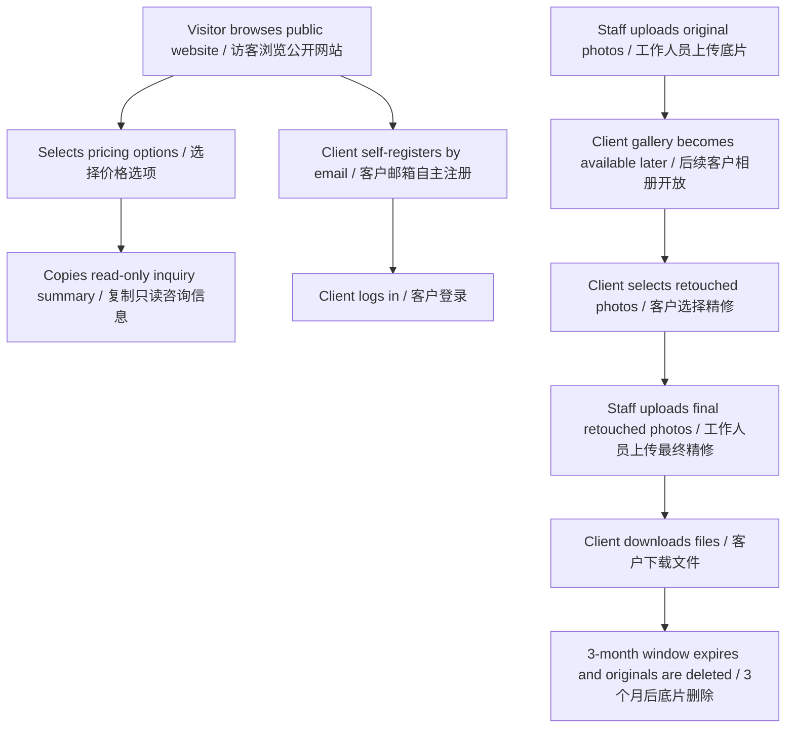
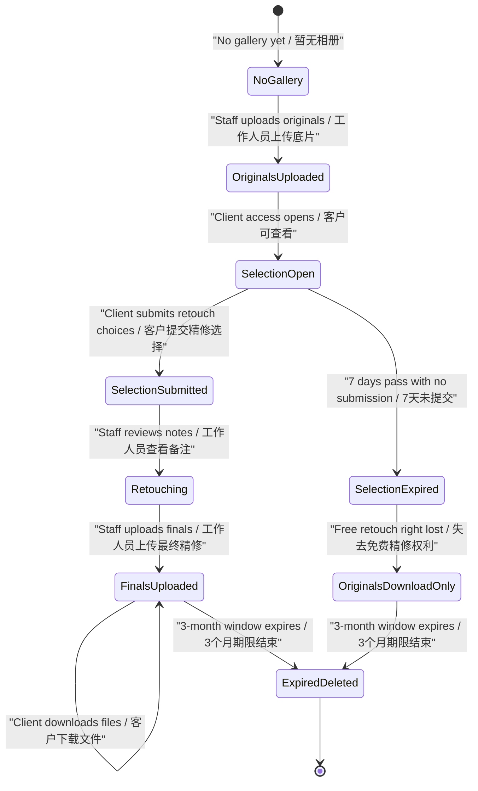

# User Flows / 用户流程

## Document Purpose / 文档目的

This document describes the main user flows for the DARIA STUDIO product. It connects the product scope, role permissions, and future photo delivery workflow into step-by-step journeys.

本文档描述 DARIA STUDIO 产品的主要用户流程，用于把产品范围、角色权限和后续照片交付流程串成可理解、可拆分的步骤。

This is a product flow document, not an implementation plan. It should guide user stories, acceptance criteria, prototype design, and later system design.

本文档是产品流程文档，不是技术实现方案。它应指导后续用户故事、验收标准、原型设计和系统设计。

## Flow Principles / 流程原则

- The public website should remain usable without login.
- Login should add account-based photo delivery features, not block public browsing.
- Pricing pages should support estimated pricing and one-click inquiry summary copying, but not online booking or payment for now.
- Customer-facing public content is managed by the owner, not employees.
- Employees can handle client gallery delivery work and edit original photo galleries at any time.
- Employees can see the full client list, but only with the minimum information needed for delivery.
- Submitted client retouch selections are locked and cannot be edited or unlocked.
- Original photos should be deleted from all product storage locations after the 3-month window expires.
- Final retouched photos should be deleted at the same time as original photos.
- The website should show a live countdown for the 7-day retouch selection window until retouch selections are submitted.
- The website should show a live countdown for the 3-month download and deletion window.
- Customer-facing and staff-facing interfaces should both support Simplified Chinese and English.

- 公开网站无需登录也应可用。
- 登录只增加基于账号的照片交付功能，不阻断公开浏览。
- 价格页目前支持估价和一键复制咨询信息，但不做在线预约或支付。
- 客户可见公开内容由老板管理，员工不可编辑。
- 员工可以处理客户相册交付工作，并可随时编辑底片相册。
- 员工可以看到完整客户列表，但只能看到交付所需的最少信息。
- 客户提交后的精修选择锁定，不能修改，也不能解锁。
- 3 个月期限结束后，底片应从产品内所有存储位置删除。
- 最终精修图应与底片同时删除。
- 网站应在精修选择提交前实时显示 7 天精修选择倒计时。
- 网站应实时显示 3 个月下载和删除倒计时。
- 客户端和工作人员端都应支持简体中文和英文双语。

## Flow Scope / 流程范围

MVP flows:

第一阶段 MVP 流程：

- Visitor public browsing flow.
- Visitor pricing and inquiry summary copy flow.
- Client email registration and login flow.
- Owner content management flow for customer-facing content.
- Employee staff workspace login and delivery workspace entry flow.

- 访客公开浏览流程。
- 访客价格选择与咨询信息复制流程。
- 客户邮箱注册和登录流程。
- 老板客户可见内容管理流程。
- 员工登录工作人员端和进入交付工作区流程。

Later photo delivery flows:

后续照片交付流程：

- Staff original photo upload flow.
- Client original photo viewing and download flow.
- Client free retouch selection and note submission flow.
- Staff retouch review and final retouched photo upload flow.
- Client final retouched photo download flow.
- Expiration and deletion flow.

- 工作人员底片上传流程。
- 客户底片查看和下载流程。
- 客户免费精修选择和修图备注提交流程。
- 工作人员查看精修选择并上传最终精修图流程。
- 客户最终精修图下载流程。
- 过期和删除流程。

## High-Level Flow Map / 高层流程图

## Visitor Public Browsing Flow / 访客公开浏览流程

Goal:

目标：

- Let a visitor understand the studio's work, service types, and general pricing options without needing an account.
- 让访客无需账号即可了解工作室作品、服务类型和大致价格选项。

Main path:

主流程：

1. Visitor opens the public website.
2. System displays the public home/gallery experience in the current language.
3. Visitor switches language if needed.
4. System keeps the visitor on the same page and refreshes fixed UI copy, editable business content, and localized display text.
5. Visitor browses gallery categories.
6. Visitor selects a gallery category.
7. System displays images for that category.
8. If a normal gallery category has 0 images, system displays the empty state.
9. If the selected category is studio shoot, visitor can view custom studio shoot display sets.
10. Visitor opens a studio shoot display set.
11. System displays the set in a centered modal layout with up to 3 by 3 images.
12. Visitor can move to pricing flow or continue browsing.

1. 访客打开公开网站。
2. 系统按当前语言展示公开首页和作品展示体验。
3. 访客按需切换语言。
4. 系统保留当前页面，并刷新固定界面文案、可编辑业务内容和本地化展示文本。
5. 访客浏览作品分类。
6. 访客选择某个作品分类。
7. 系统展示该分类下的图片。
8. 如果普通作品分类有 0 张图片，系统展示空状态。
9. 如果选择的是棚拍分类，访客可以查看自定义棚拍展示集。
10. 访客打开某个棚拍展示集。
11. 系统以居中的弹窗布局展示该展示集，最多 3 乘 3 图片。
12. 访客可以进入价格流程，也可以继续浏览。

Key rules:

关键规则：

- Public browsing does not require login.
- Gallery content is customer-facing business content and is edited only by the owner.
- Language switching should preserve current browsing position where practical.

- 公开浏览无需登录。
- 作品展示内容属于客户可见业务内容，仅老板可以编辑。
- 切换语言时应尽量保留当前浏览位置。

## Pricing and Inquiry Summary Flow / 价格选择与咨询信息复制流程

Goal:

目标：

- Let a visitor or logged-in client choose service options, see an estimated total, and copy a structured inquiry summary.
- 让访客或登录客户选择服务选项、查看估算总价，并复制结构化咨询信息。

Main path:

主流程：

1. User opens the pricing page.
2. System displays service area options.
3. User selects a service area.
4. System displays available service types for that area.
5. User selects a service type.
6. System displays the next relevant options based on the selected service type.
7. For graduation photography, user selects school, scene type, package, and optional add-ons.
8. For registry or proposal coverage, user selects a package, optional extra location notes, and optional add-ons.
9. For ID photo or studio package flows, system displays the relevant fixed package and optional add-ons.
10. User adds optional notes where available.
11. System calculates the estimated total from selected package, add-ons, and applicable rules.
12. System generates a read-only inquiry summary at the bottom of the flow.
13. User copies the inquiry summary.

1. 用户打开价格页。
2. 系统展示服务地区选项。
3. 用户选择服务地区。
4. 系统展示该地区下可用的服务类型。
5. 用户选择服务类型。
6. 系统根据所选服务类型展示后续相关选项。
7. 对于毕业照，用户选择学校、场景类型、套餐和可选加购项。
8. 对于注册或求婚跟拍，用户选择套餐、可选额外地点备注和可选加购项。
9. 对于证件照或棚拍套餐流程，系统展示对应固定套餐和可选加购项。
10. 用户在可用位置填写可选备注。
11. 系统根据已选套餐、加购项和适用规则计算估算总价。
12. 系统在流程底部生成只读咨询信息汇总。
13. 用户复制咨询信息汇总。

Key rules:

关键规则：

- The inquiry summary is read-only and cannot be manually edited.
- The inquiry summary updates automatically when selected options or notes change.
- Customer-entered notes are preserved exactly as entered and are not automatically translated.
- Pricing flow does not create a booking or payment.
- The copied summary should use the currently selected language for labels while preserving user-entered notes.

- 咨询信息汇总是只读内容，不能手动修改。
- 已选选项或备注变化时，咨询信息汇总自动更新。
- 客户填写的备注保留原文，不自动翻译。
- 价格流程不创建预约，也不创建支付。
- 复制的汇总信息应使用当前语言的标签，同时保留用户填写的备注原文。

## Client Email Registration and Login Flow / 客户邮箱注册与登录流程

Goal:

目标：

- Let clients create and access their own account by email.
- 让客户通过邮箱创建并访问自己的账号。

MVP main path:

第一阶段主流程：

1. Visitor chooses to register or log in.
2. System displays email-based authentication entry.
3. Visitor enters email and required credentials.
4. System creates or authenticates the client account.
5. System confirms the logged-in state.
6. Logged-in client can still use all public browsing and inquiry-copy features.
7. If no photo galleries are available yet, system should show an appropriate empty state.

1. 访客选择注册或登录。
2. 系统展示邮箱认证入口。
3. 访客输入邮箱和必要认证信息。
4. 系统创建或认证客户账号。
5. 系统确认登录状态。
6. 登录客户仍可使用所有公开浏览和咨询信息复制功能。
7. 如果暂时没有可用照片相册，系统应展示合适的空状态。

Key rules:

关键规则：

- Client accounts are self-registered by clients.
- Client accounts are separate from staff accounts.
- Client account access never grants staff workspace access.
- Public browsing remains available without login.

- 客户账号由客户自主注册。
- 客户账号与工作人员账号分离。
- 客户账号绝不授予工作人员端访问权限。
- 公开浏览仍然无需登录。

## Staff Workspace Login Flow / 工作人员端登录流程

Goal:

目标：

- Let employees and owner enter the staff workspace with their fixed role.
- 让员工和老板按固定角色进入工作人员端。

Main path:

主流程：

1. Staff user opens the staff workspace.
2. System requires login.
3. Staff user logs in with a staff account.
4. System identifies the staff role as employee or owner.
5. System displays staff workspace navigation based on fixed role permissions.
6. Employee sees delivery-related areas.
7. Owner sees delivery areas, website content management areas, and employee account management areas.

1. 工作人员打开工作人员端。
2. 系统要求登录。
3. 工作人员使用工作人员账号登录。
4. 系统识别工作人员角色为员工或老板。
5. 系统根据固定角色权限展示工作人员端导航。
6. 员工看到交付相关区域。
7. 老板看到交付区域、网站内容管理区域和员工账号管理区域。

Key rules:

关键规则：

- Staff workspace is bilingual in Simplified Chinese and English.
- Staff accounts are separate from client accounts.
- Employees cannot edit customer-facing website content.
- Permissions are fixed and not configurable in the first product scope.

- 工作人员端支持简体中文和英文双语。
- 工作人员账号与客户账号分离。
- 员工不可编辑客户可见网站内容。
- 第一阶段权限固定，不做可配置权限。

## Owner Website Content Management Flow / 老板网站内容管理流程

Goal:

目标：

- Let the owner manage customer-facing website content without changing production code.
- 让老板无需修改正式代码即可管理客户可见网站内容。

Main path:

主流程：

1. Owner logs in to the staff workspace.
2. Owner opens content management.
3. Owner chooses a content area, such as gallery, studio shoot display sets, service areas, service types, packages, schools, scene types, add-ons, or page copy.
4. System displays editable Chinese and English fields for customer-facing text.
5. Owner adds, edits, deletes, hides, publishes, or reorders content as allowed by the content type.
6. System displays missing translation warnings where customer-facing text is incomplete.
7. Owner reviews the content.
8. Owner publishes or saves changes according to the content workflow.
9. Public website uses the updated content.

1. 老板登录工作人员端。
2. 老板进入内容管理。
3. 老板选择内容区域，例如作品展示、棚拍展示集、服务地区、服务类型、套餐、学校、场景类型、加购项或页面文案。
4. 系统为客户可见文本展示中文和英文字段。
5. 老板根据内容类型新增、编辑、删除、隐藏、发布或排序内容。
6. 系统在客户可见文本不完整时展示缺失翻译提醒。
7. 老板复核内容。
8. 老板根据内容工作流发布或保存更改。
9. 公开网站使用更新后的内容。

Key rules:

关键规则：

- Owner can manage customer-facing website content.
- Employees cannot manage customer-facing website content.
- Shared business values such as price, sort order, availability, image reference, and timing rules should not be duplicated per language.
- Customer-facing required names should have both Chinese and English values before publishing.

- 老板可以管理客户可见网站内容。
- 员工不能管理客户可见网站内容。
- 价格、排序、可用状态、图片引用和计时规则等共享业务值不应按语言重复。
- 客户可见必填名称在发布前应同时具备中文和英文。

## Employee Client Gallery Delivery Flow / 员工客户相册交付流程

Goal:

目标：

- Let employees handle original photo and final retouched photo delivery without editing public website content.
- 让员工处理底片和最终精修图交付，同时不能编辑公开网站内容。

Main path:

主流程：

1. Employee logs in to the staff workspace.
2. Employee opens the client list.
3. System displays the full client list with only minimum delivery-needed client information.
4. Employee selects a client or client gallery.
5. Employee views gallery delivery status.
6. Employee uploads original photos.
7. Employee can add, replace, remove, or reorder original photos at any time for delivery operations.
8. If the client has already submitted retouch selections, system shows a confirmation message before applying original gallery edits.
9. Employee confirms the edit if they still want to proceed.
10. Employee reviews uploaded originals.
11. System makes originals available to the client when the gallery is ready according to the later delivery workflow.
12. Employee later views submitted retouch selections and per-photo notes.
13. Employee uploads final retouched photos corresponding to selected originals.
14. System makes final retouched photos available for client download during the valid window.

1. 员工登录工作人员端。
2. 员工打开客户列表。
3. 系统展示完整客户列表，但只显示交付所需的最少客户信息。
4. 员工选择客户或客户相册。
5. 员工查看相册交付状态。
6. 员工上传底片。
7. 员工可以为了交付工作随时新增、替换、移除或调整底片顺序。
8. 如果客户已经提交精修选择，系统在应用底片相册编辑前显示确认提示消息。
9. 如果员工仍要继续，员工确认该修改。
10. 员工复核已上传底片。
11. 在后续交付流程中，相册准备好后系统向客户开放底片。
12. 员工后续查看客户已提交的精修选择和每张照片备注。
13. 员工上传与客户已选底片对应的最终精修图。
14. 系统在有效期内向客户开放最终精修图下载。

Key rules:

关键规则：

- Employees can see all clients, but only minimum delivery-needed information.
- Employees can edit original photo galleries at any time.
- If original photo gallery edits happen after client retouch submission, system should show a confirmation message before applying the change.
- Employees cannot edit public website content, packages, prices, gallery categories, or public gallery images.
- Employees cannot unlock submitted retouch selections.
- Employee responsibility or assignment labels, if added later, are operational coordination labels rather than first-stage permission boundaries.

- 员工可以看到全部客户，但只能看到交付所需的最少信息。
- 员工可以随时编辑底片相册。
- 如果员工在客户提交精修选择后编辑底片相册，系统应在应用修改前显示确认提示消息。
- 员工不能编辑公开网站内容、套餐、价格、作品分类或公开作品图片。
- 员工不能解锁已提交的精修选择。
- 如果后续增加员工负责人或分配标签，它们是运营协作标签，不是第一阶段权限边界。

## Client Photo Delivery Flow / 客户照片交付流程

Goal:

目标：

- Let a logged-in client view originals, select included free retouched photos, submit notes, and download final photos.
- 让登录客户查看底片、选择套餐包含的免费精修、提交备注，并下载最终照片。

Later-scope main path:

后续阶段主流程：

1. Client logs in.
2. Client opens own gallery area.
3. If no galleries are available, system displays an empty state.
4. When staff uploads and releases originals, system displays the client gallery.
5. System starts the 7-day free retouch selection window from the original photo upload time.
6. System starts the 3-month download and storage window.
7. Website displays a live 7-day retouch selection countdown.
8. Website displays a live 3-month download and deletion countdown.
9. Client views original photos.
10. Client downloads original photos as a compressed package if desired.
11. Client selects included free retouched photos within the valid 7-day window.
12. Client adds one note per selected photo, up to 500 characters.
13. Client submits retouch selections.
14. System locks the submitted selection.
15. System hides the 7-day retouch selection countdown after successful submission.
16. Client waits for staff to upload final retouched photos.
17. Client views final retouched photos after upload.
18. Client downloads final retouched photos as a compressed package during the valid download window.

1. 客户登录。
2. 客户打开自己的相册区域。
3. 如果没有可用相册，系统展示空状态。
4. 工作人员上传并开放底片后，系统展示客户相册。
5. 系统从底片上传时间开始计算 7 天免费精修选择期。
6. 系统开始计算 3 个月下载和存储期。
7. 网站实时显示 7 天精修选择倒计时。
8. 网站实时显示 3 个月下载和删除倒计时。
9. 客户查看底片。
10. 客户按需下载底片压缩包。
11. 客户在有效 7 天窗口内选择套餐包含的免费精修照片。
12. 客户为每张已选照片填写一条备注，最多 500 字。
13. 客户提交精修选择。
14. 系统锁定已提交选择。
15. 成功提交后，系统隐藏 7 天精修选择倒计时。
16. 客户等待工作人员上传最终精修图。
17. 最终精修图上传后，客户查看最终精修图。
18. 客户在有效下载期内下载最终精修图压缩包。

Key rules:

关键规则：

- Client can only access own galleries.
- Client cannot view another client's gallery.
- Client can submit retouch selection once.
- Submitted retouch selection cannot be edited or unlocked.
- If the client does not submit within 7 days, the included free retouch selection right is lost.
- The 7-day retouch selection countdown is shown until the client submits retouch selections.
- The 7-day retouch selection countdown disappears after retouch selections are submitted.
- The 3-month download and deletion countdown is shown while the gallery remains within the valid window.
- Notes support Simplified Chinese, Traditional Chinese, English, mixed text, and matching punctuation.
- Customer-entered notes are not automatically translated.
- Original photos are deleted from all product storage locations after the 3-month window expires.
- Final retouched photos are deleted at the same time as original photos.

- 客户只能访问自己的相册。
- 客户不能查看其他客户的相册。
- 客户只能提交一次精修选择。
- 已提交精修选择不能修改，也不能解锁。
- 如果客户 7 天内未提交，则失去套餐包含的免费精修选择权。
- 7 天精修选择倒计时在客户提交精修选择前显示。
- 客户提交精修选择后，7 天精修选择倒计时消失。
- 相册仍在有效期内时，网站显示 3 个月下载和删除倒计时。
- 备注支持简体、繁体、英文、混合文本和对应标点符号。
- 客户填写的备注不自动翻译。
- 3 个月期限结束后，底片从产品内所有存储位置删除。
- 最终精修图与底片同时删除。

## Photo Delivery State Flow / 照片交付状态流程

State rules:

状态规则：

- "No gallery yet" is a normal empty state for a logged-in client.
- "Selection open" allows the client to choose included free retouched photos.
- "Selection submitted" locks the client's choices and notes.
- "Selection expired" means the client loses the included free retouch selection right.
- "Finals uploaded" enables final retouched photo viewing and download.
- "Expired/deleted" means original photos and final retouched photos are deleted from all product storage locations.

- “暂无相册”是登录客户的正常空状态。
- “精修选择开放中”允许客户选择套餐包含的免费精修照片。
- “精修已提交”会锁定客户选择和备注。
- “精修选择已过期”表示客户失去套餐包含的免费精修选择权。
- “最终精修图已上传”开放最终精修图查看和下载。
- “已过期/已删除”表示底片和最终精修图已从产品内所有存储位置删除。

## Expiration and Deletion Flow / 过期与删除流程

Goal:

目标：

- Enforce the 7-day free retouch selection window and 3-month original photo storage rule.
- 执行 7 天免费精修选择期和 3 个月底片存储规则。

Main path:

主流程：

1. Staff uploads original photos.
2. System records the workflow timestamp used for timing.
3. System calculates the 7-day free retouch selection deadline.
4. System calculates the 3-month download and storage deadline.
5. System shows a live countdown for the 7-day free retouch selection deadline.
6. System shows a live countdown for the 3-month download and deletion deadline.
7. If client submits retouch selections before the 7-day deadline, system locks the submission and hides the 7-day countdown.
8. If client does not submit before the 7-day deadline, system marks the included free retouch selection right as lost.
9. Until the 3-month deadline, client can download available originals and final retouched photos according to their own gallery access.
10. When the 3-month deadline expires, system removes client download access.
11. System deletes original photos from all product storage locations.
12. System deletes final retouched photos from all product storage locations.
13. System deletes generated original-photo and final-photo compressed packages.
14. System does not keep normal owner-only manual archive access to expired original photos.

1. 工作人员上传底片。
2. 系统记录用于计时的流程时间。
3. 系统计算 7 天免费精修选择截止时间。
4. 系统计算 3 个月下载和存储截止时间。
5. 系统实时显示 7 天免费精修选择截止倒计时。
6. 系统实时显示 3 个月下载和删除截止倒计时。
7. 如果客户在 7 天截止前提交精修选择，系统锁定提交并隐藏 7 天倒计时。
8. 如果客户未在 7 天截止前提交，系统标记套餐包含的免费精修选择权失效。
9. 在 3 个月截止前，客户可按自己的相册权限下载可用底片和最终精修图。
10. 3 个月截止后，系统移除客户下载权限。
11. 系统从产品内所有存储位置删除底片。
12. 系统从产品内所有存储位置删除最终精修图。
13. 系统删除已生成的底片和最终照片压缩包。
14. 系统不保留正常产品流程下仅老板可用的过期底片人工归档访问。

## Out of Scope / 当前不做

- Online booking flow.
- Online payment flow.
- Deposit flow.
- Calendar scheduling flow.
- Retouch revision flow.
- Unlock flow for submitted retouch selections.
- Configurable employee permission flow.
- Production authentication, database, API, storage, or deployment implementation in the public showcase repository.

- 在线预约流程。
- 在线支付流程。
- 定金流程。
- 日历排期流程。
- 精修返修流程。
- 已提交精修选择的解锁流程。
- 可配置员工权限流程。
- 在公开展示仓库中实现生产级认证、数据库、API、存储或部署。

## Resolved Decisions / 已确认补充决策

The following items were previously open questions and are now confirmed:

以下内容此前是待确认问题，现已确认：

- The website should show a live 7-day retouch selection countdown.
- The 7-day retouch selection countdown should disappear after the client submits retouch selections.
- The website should show a live 3-month download and deletion countdown.
- Final retouched photos should be deleted at the same time as original photos.
- When employees edit original photo galleries after the client has submitted retouch selections, the product should only show a confirmation message before applying the change.

- 网站应实时显示 7 天精修选择倒计时。
- 客户提交精修选择后，7 天精修选择倒计时应消失。
- 网站应实时显示 3 个月下载和删除倒计时。
- 最终精修图应与底片同时删除。
- 客户提交精修选择后，员工编辑底片相册时，产品只需要在应用修改前显示确认提示消息。
